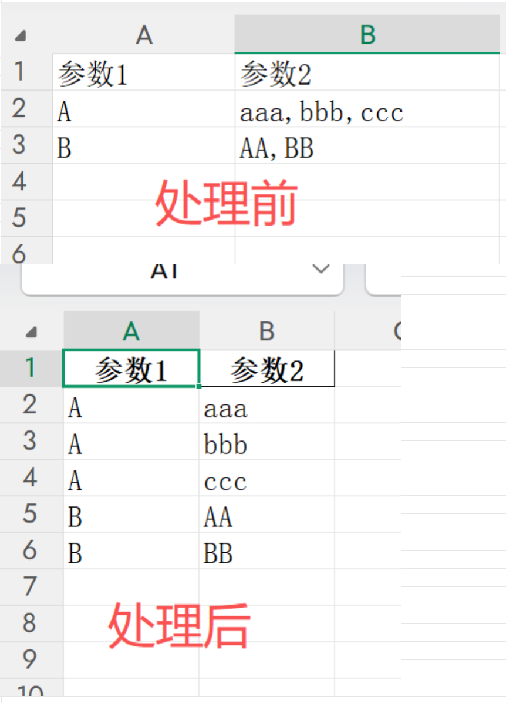
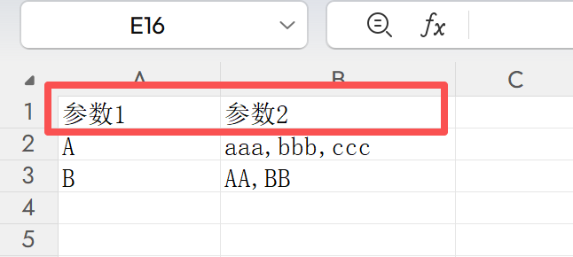
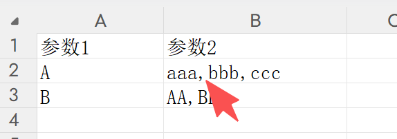
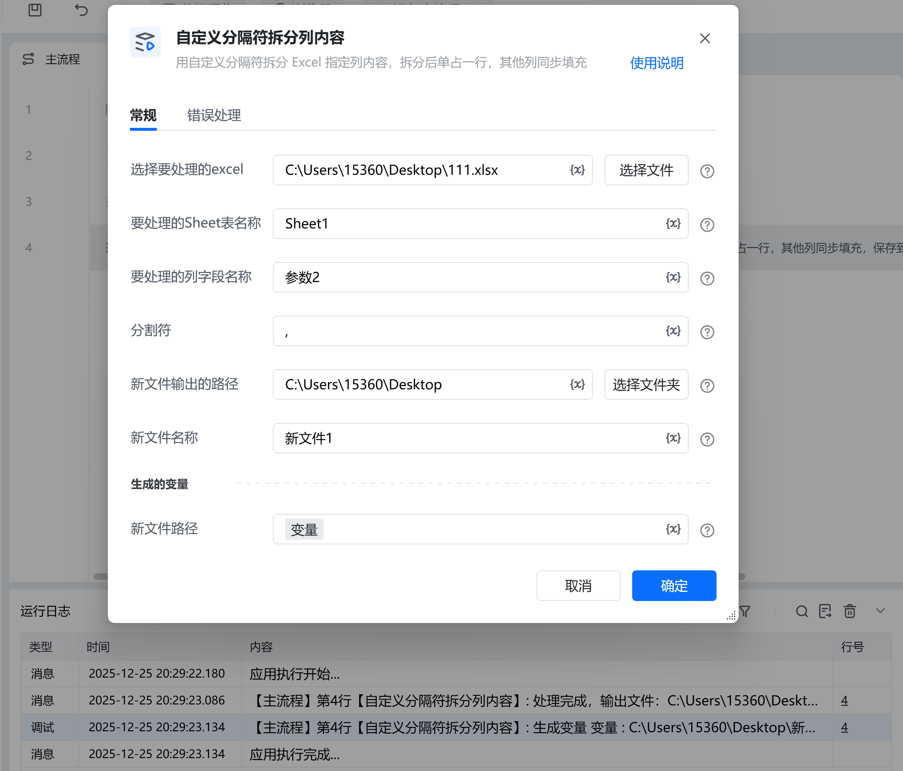

# 描述

用自定义分隔符拆分 Excel 指定列内容，拆分后单占一行，其他列同步填充

# 配置说明
## 输入

<strong>选择要处理的excel:</strong>

选择需要处理的excel

<strong>要处理的Sheet表名称:</strong>

要处理的Sheet表名称，如：Sheet1

<strong>要处理的列字段名称:</strong>

要处理的列表头字段名称，例如：参数2

<strong>分割符:</strong>

分割为多行的分隔符，例如示例中为，

<strong>新文件输出的路径:</strong>

选择新文件输出的路径

<strong>新文件名称:</strong>

自定义新文件名称
## 输出

<strong>新文件路径:</strong>

输出新文件的完整路径
## 使用示例

<Info>
  使用指令过程中遇到问题？前往 [八爪鱼RPA 开发者社区问答板块](https://rpa.bazhuayu.com/community/questions) 提问，获取官方与社区帮助。
</Info>
