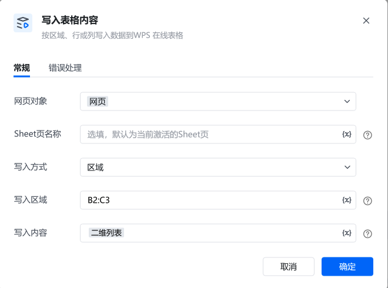
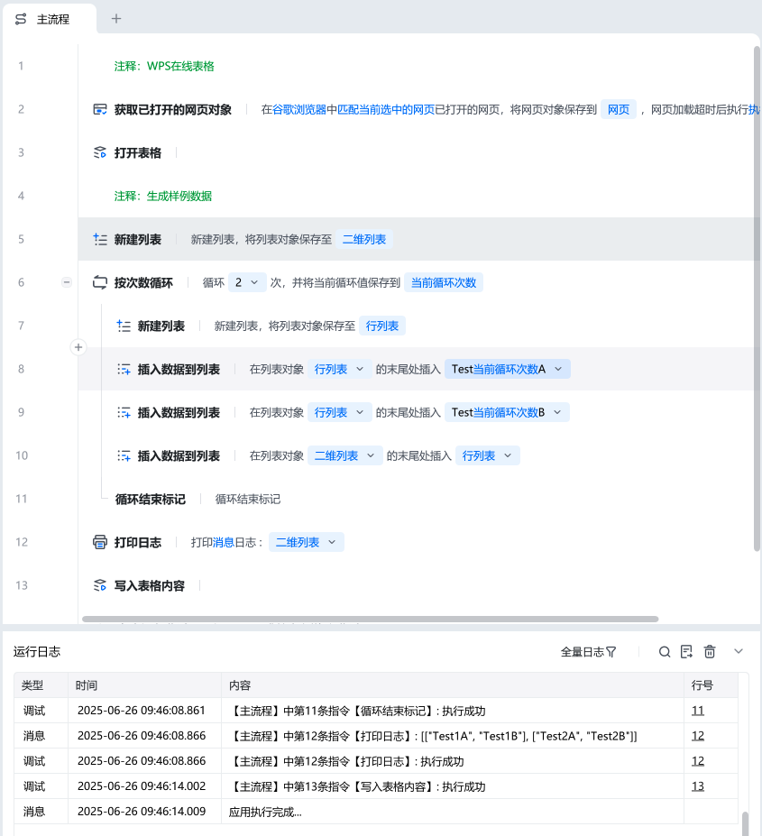

## 指令说明

本指令用于按区域、行或列向 WPS 在线表格写入数据。通过配置对应参数，可将指定内容精准写入目标单元格位置，实现 WPS 在线表格数据的自动化录入，适用于数据批量填充、内容更新等场景。

常规
<strong>网页对象</strong>
需关联已获取的 WPS 在线表格所在网页对象（如 “获取已打开的网页对象” 指令生成），用于定位操作表格

<strong>Sheet页名称</strong>
若要指定写入的 Sheet 页，填写对应名称；不填则默认写入当前激活 Sheet 页

<strong>写入方式</strong>
按需选择，“区域” 模式下需配合 “写入区域” 参数，明确数据写入的表格范围；选 “行”“列” 则按对应维度写入

<strong>写入区域</strong>
当写入方式为 “区域” 时填写，用表格行列标识（如 B2:C3 格式 ），指定数据写入的单元格范围

<strong>写入内容</strong>
填写要写入表格的数据，需与写入方式、区域适配，“区域” 写入二维列表格式，保证数据能正确填充到指定位置

## 使用示例

<strong>示例说明</strong>

1、前置准备：通过 “打开表格” 指令，对WPS 在线表格进行初始化。​

2、数据准备：借助新建列表、循环等指令，构建符合写入要求的数据（如示例中通过循环生成二维列表 [["Test1A","Test1B"],["Test2A","Test2B"]] ）。​

3、参数配置：​

按需确定是否填写 “Sheet 页名称”；​
选好 “写入方式”，若为 “区域”，准确填写 “写入区域”；​
设定 “写入内容” 为准备好的数据。

4、执行过程：指令调用后，依据网页对象定位到 WPS 在线表格，按配置的 Sheet 页、写入方式和区域，将 “写入内容” 对应数据填充到表格指定位置，完成数据写入操作，支撑表格数据更新流程。​

5、执行成功后，可在运行日志查看 “写入表格内容” 执行成功提示，同时打开 WPS 在线表格，检查对应 Sheet 页、写入区域的数据是否与 “写入内容” 一致，验证写入效果 。​

关键注意事项​

网页对象有效性：确保 “获取已打开的网页对象” 指令执行成功，生成有效网页对象，否则无法定位表格，写入失败
数据与区域适配性：“写入内容” 格式要与写入方式、区域匹配，如 “区域” 写入用二维列表，且行列数量要适配写入区域，否则可能报错或数据填充异常
异常排查：若运行日志报错，先检查网页对象、网络；再核对 Sheet 页名称、写入区域、数据格式等参数，逐步排查解决

<Info>
  使用指令过程中遇到问题？前往 [八爪鱼RPA 开发者社区问答板块](https://rpa.bazhuayu.com/community/questions) 提问，获取官方与社区帮助。
</Info>
