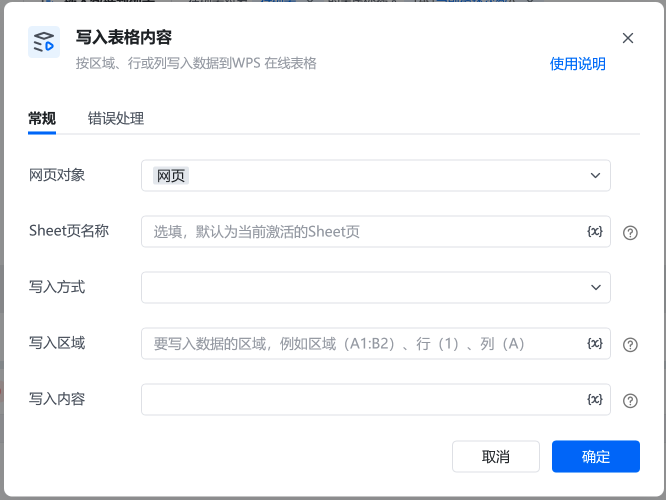
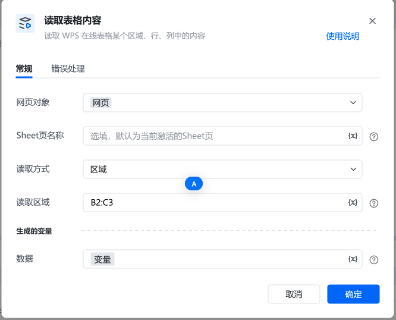
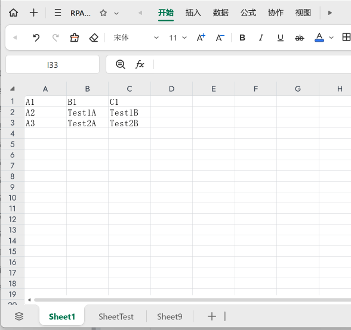
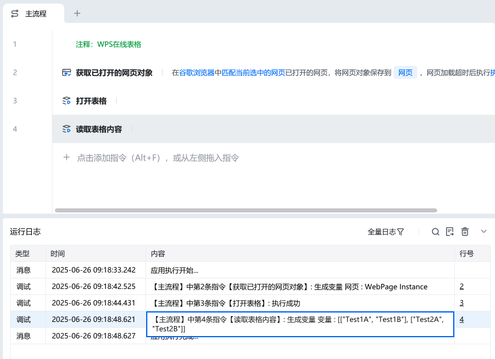

## 指令说明

本指令用于读取 WPS 在线表格中指定区域、行或列的内容，通过配置相关参数，精准获取表格数据并存储为变量，供后续流程使用，适用于自动化处理 WPS 在线表格数据场景 。

参数名称配置示例关键说明网页对象网页需选择已获取的打开网页对象（如通过 “获取已打开的网页对象” 指令生成），用于定位操作的 WPS 在线表格所在网页Sheet 页名称选填（默认当前激活 Sheet 页）若需指定特定 Sheet 页读取数据，填写对应 Sheet 页名称；不填则默认读取当前激活 Sheet 页读取方式区域（或行、列等）根据需求选择，“区域” 模式下需配合 “读取区域” 参数，明确要读取的表格范围；选 “行”“列” 则按对应维度读取读取区域B2:C3当读取方式为 “区域” 时填写，用表格行列标识（如B2:C3 格式 ），指定要读取数据的单元格范围生成的变量变量指令执行后，将读取的表格内容存储到该变量中，后续流程可调用此变量使用数据
## 使用示例

前置准备：先通过 “打开表格” 指令，对 WPS 在线表格进行初始化 。​参数配置：​按需选择是否填写 “Sheet 页名称”，确定读取的 Sheet 页；​选好 “读取方式”，若为 “区域”，准确填写 “读取区域”；​设定 “生成的变量” 名称，用于存储结果。​

3. 执行过程：指令调用后，依据配置的网页对象定位到 WPS 在线表格，按设定的 Sheet 页、读取方式和区域，提取对应表格内容，整理后存入指定变量，完成数据读取与存储，支撑后续自动化流程。​

4. 执行成功后，可在运行日志查看 “生成变量” 相关内容，确认读取的数据格式（如示例中为二维列表形式 [["Test1A","Test1B"],["Test2A","Test2B"]] ），也可在后续流程调用该变量，验证数据是否正确获取和使用 。​
关键注意事项​网页对象有效性：确保 “获取已打开的网页对象” 指令执行成功，生成有效的网页对象，否则无法定位表格，导致指令失败 。​Sheet 页与区域准确性：填写的 Sheet 页名称需存在，读取区域要符合表格行列标识规则，否则可能读取不到数据或报错 。​异常排查：若运行日志报错，先检查网页对象是否有效、网络是否连通；再核对 Sheet 页名称、读取区域等参数配置，逐步排查解决问题 。​
延伸应用场景​数据校验流程：读取表格数据后，结合条件判断指令，对数据格式、内容范围等进行校验，不符合规则时触发提醒或修正流程 。​多 Sheet 页数据整合：循环遍历多个 Sheet 页，通过本指令依次读取各页指定区域数据，汇总存储到一个变量，实现多 Sheet 页数据整合分析 。​自动化报表生成：读取表格数据变量，配合文本处理、格式设置指令，自动填充模板生成报表，如财务报表、业务统计报表等 。

<Info>
  使用指令过程中遇到问题？前往 [八爪鱼RPA 开发者社区问答板块](https://rpa.bazhuayu.com/community/questions) 提问，获取官方与社区帮助。
</Info>
