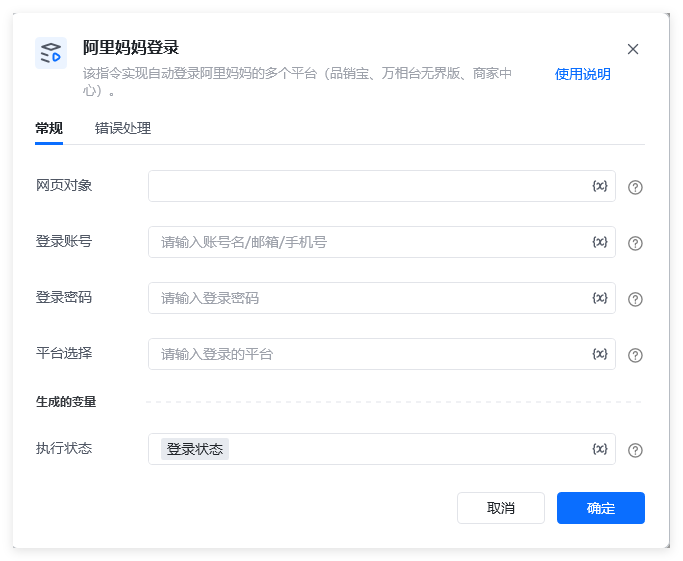
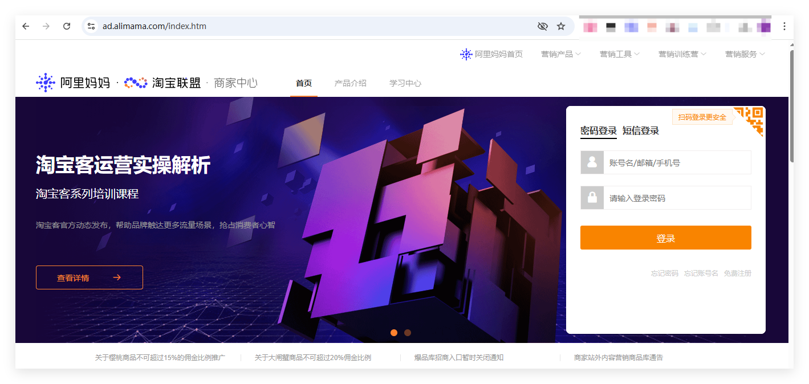
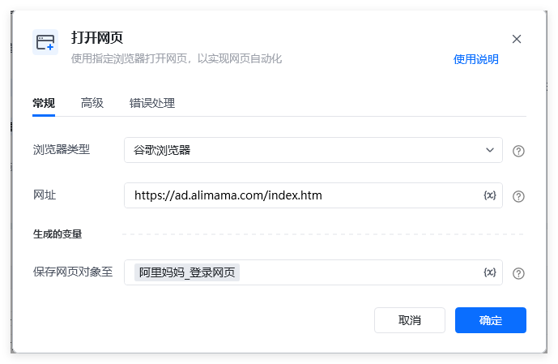
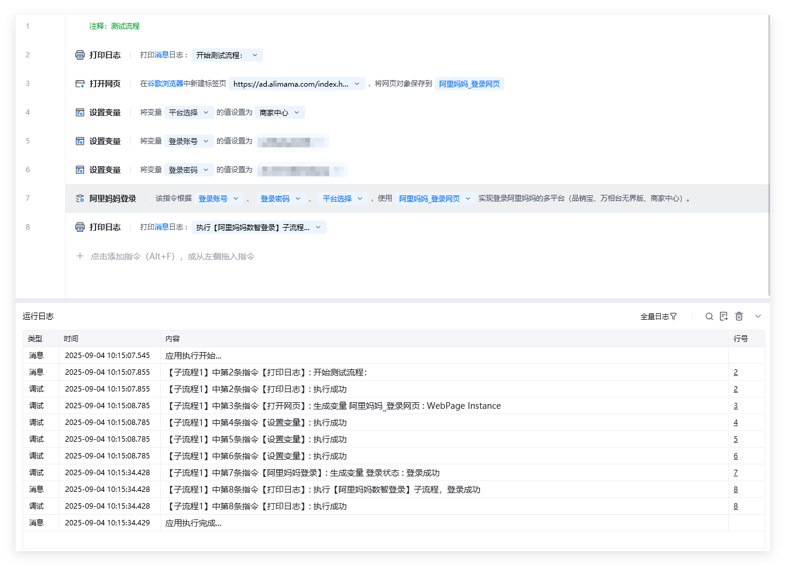
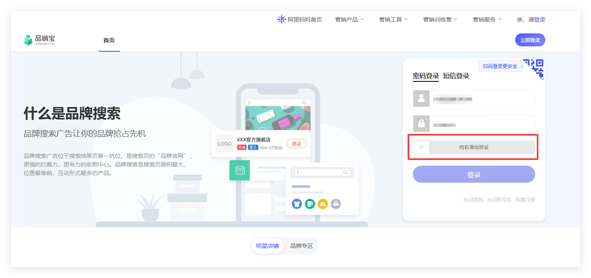
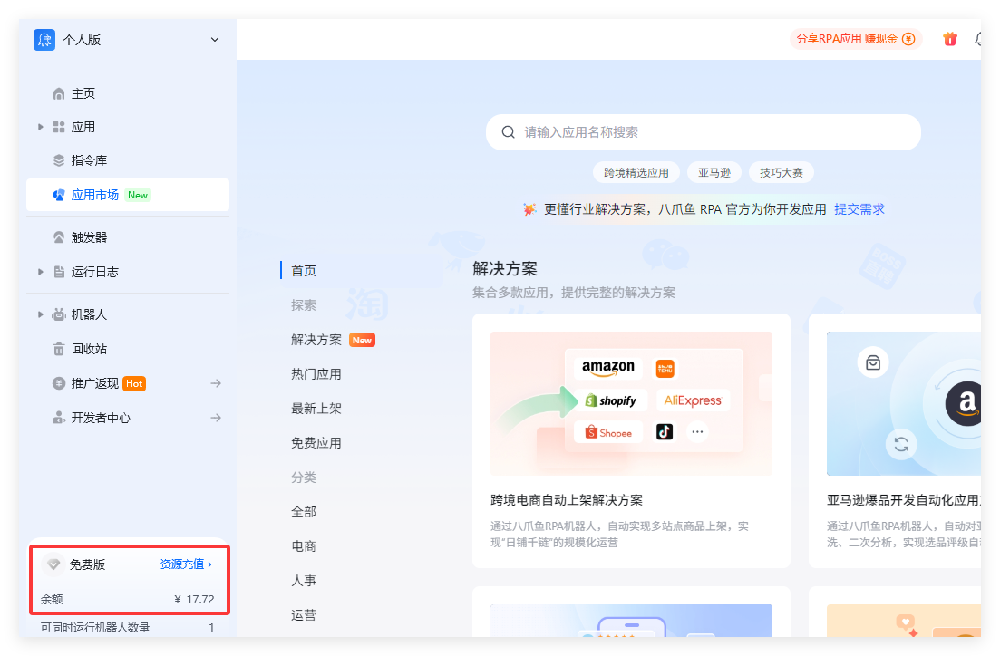

## 指令描述

该指令实现自动登录阿里妈妈的多个平台（品销宝、商家中心、万相台无界版）。

备注：

1、阿里妈妈旗下的直通车、引力魔方、万相台三个平台服务，已迁移到<strong>万相台无界版</strong>平台。

2、【品销宝】登录网址：https://branding.taobao.com/index.action

【商家中心】登录网址：https://ad.alimama.com/index.htm

【万相台无界版】登录网址：https://1bp.taobao.com/index.html

## 配置
### 指令输入

<strong>网页对象: </strong>网页对象，使用【打开网页】或者【获取已打开的网页对象】指令获取<strong>阿里妈妈数智经营</strong>的<strong>登录页面</strong>的返回值（生成变量）

<strong>登录账号: </strong>字符串，账号

<strong>登录密码: </strong>字符串，密码

<strong>平台选择：</strong>选择需要登录的平台名称，必须是【品销宝】、【商家中心】或者【万相台无界版】
### 指令输出

<strong>执行状态：</strong>指令执行结果，用于指示和判断指令执行结果，返回值如下。登录成功返回：登录成功登录失败返回：登录失败，XXXX

备注：XXXX，可能是【账密错误】等提示。

## 使用流程说明

以登录【商家中心】为例：

使用【商家中心】的登录网址（如下图所示）【 https://ad.alimama.com/index.htm】作为参数，

使用【打开网页】指令打开登录网页，

3、示例流程代码和运行结果，如下图所示：

## 注意事项
### 1、关于登录流程，自动处理滑块验证的功能收费说明。

在登录流程中，偶发遇到滑块验证（如下图），本指令集成滑块验证功能，无需人工处理，指令将自动完成滑块验证（尝试20次都失败则退出登录流程）。

该滑块验证功能，是收费功能，每次验证消耗￥0.02元，请注意账号余额情况（如下图中左下角红圈标注）。

<Info>
  使用指令过程中遇到问题？前往 [八爪鱼RPA 开发者社区问答板块](https://rpa.bazhuayu.com/community/questions) 提问，获取官方与社区帮助。
</Info>
