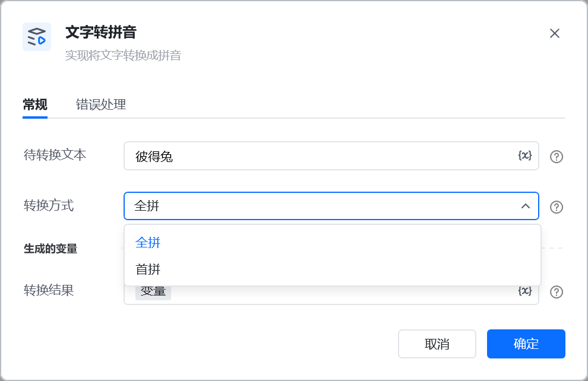
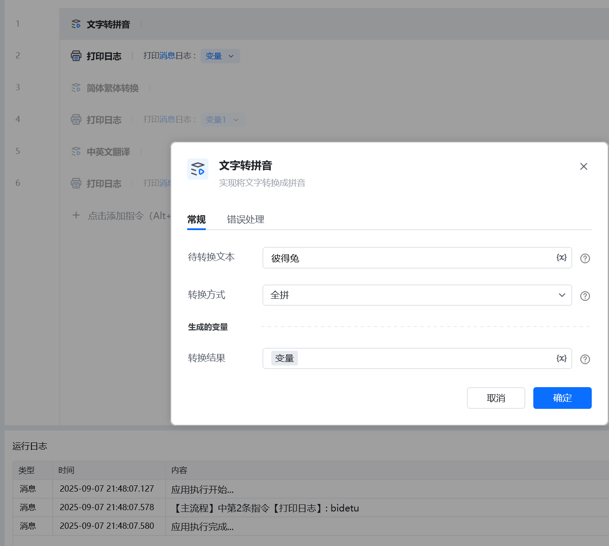

# 文字转拼音
## 描述

实现将文字转换成拼音
## 参数配置

指令输入<strong>带转换文本:</strong> 转换的汉字描述<strong>转换方式:</strong> 有首拼和全拼可供选择
指令输出<strong>转换结果</strong>:  转换后的结果

## 参考示例

<Info>
  使用指令过程中遇到问题？前往 [八爪鱼RPA 开发者社区问答板块](https://rpa.bazhuayu.com/community/questions) 提问，获取官方与社区帮助。
</Info>
