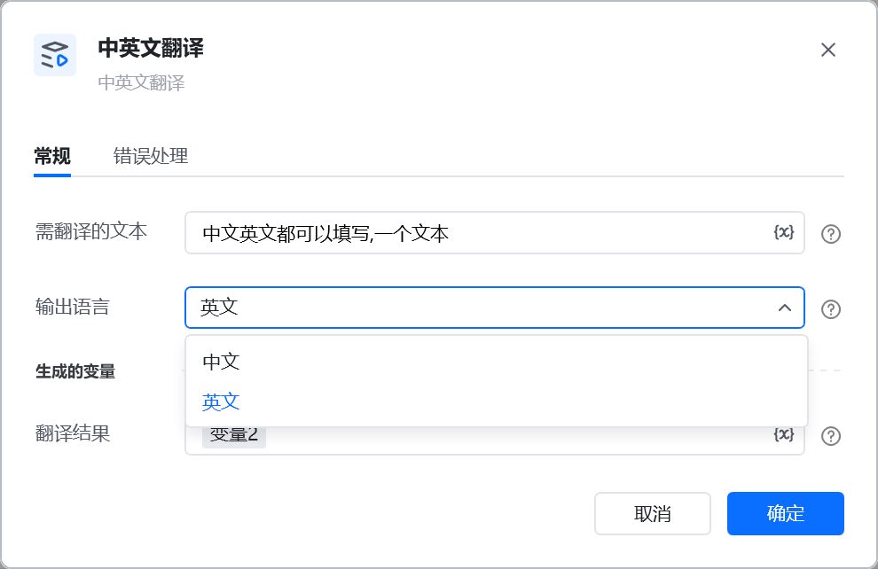
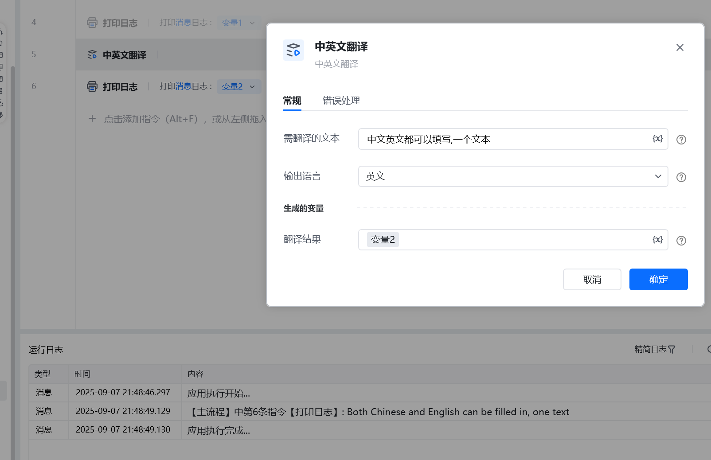

# 中英文翻译
## 描述

中英文翻译
## 参数配置

指令输入<strong>待翻译文本:</strong> 中文英文都可以填写<strong>输出语言</strong>: 中文/英文
指令输出<strong>翻译结果</strong>:  翻译后的结果

## 参考示例

<Info>
  使用指令过程中遇到问题？前往 [八爪鱼RPA 开发者社区问答板块](https://rpa.bazhuayu.com/community/questions) 提问，获取官方与社区帮助。
</Info>
