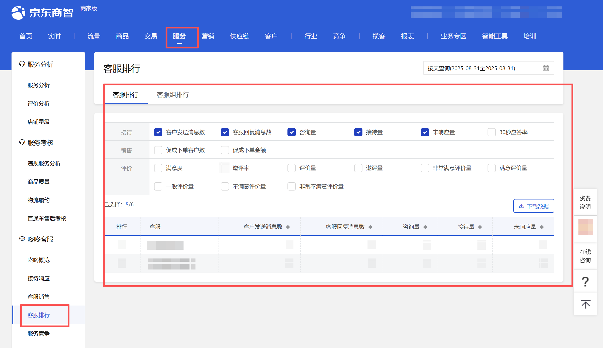
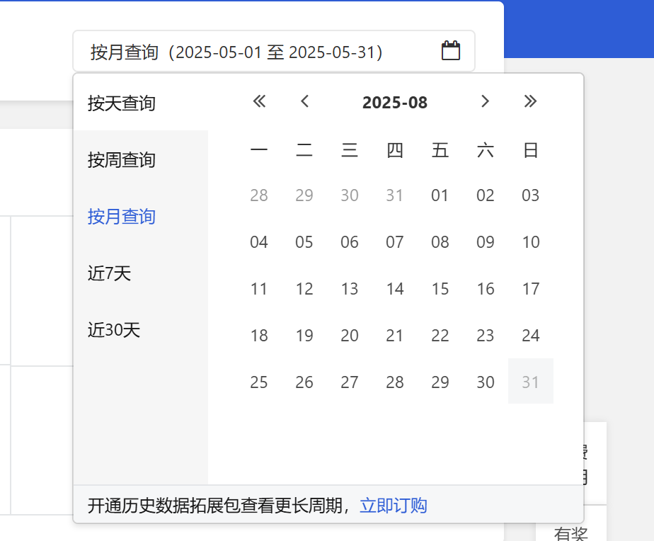
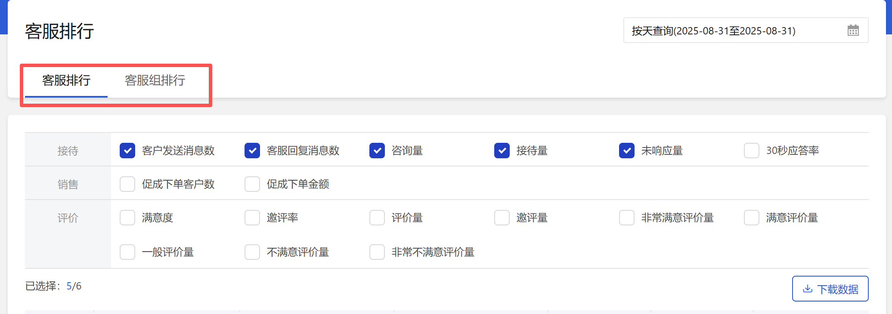
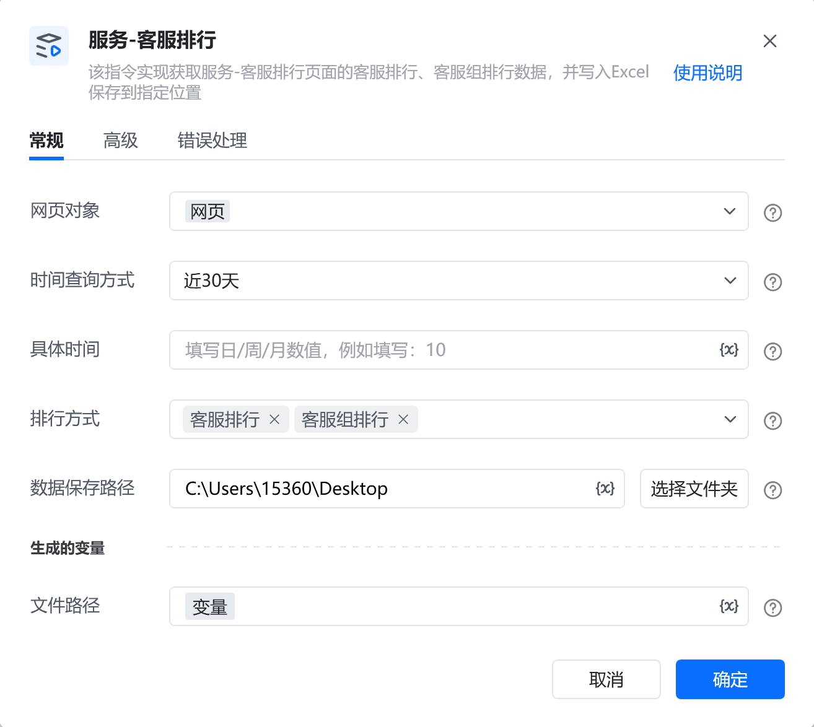
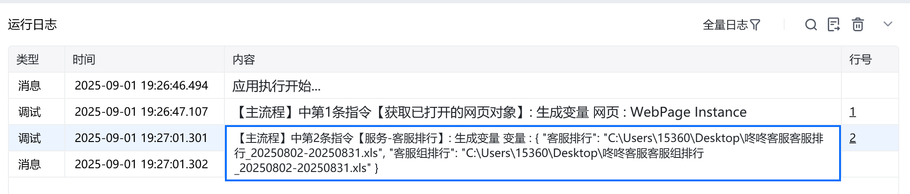
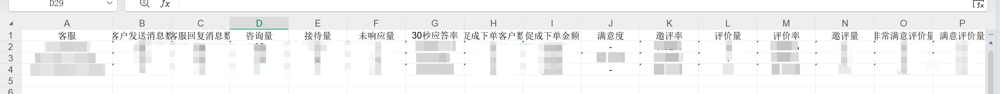

# 描述

该指令实现获取服务-客服排行页面的客服排行、客服组排行数据，并写入Excel保存到指定位置

# 配置说明
## 输入

<strong>网页对象:</strong>

任意一个已登录京东商智商家版后台服务-客服排行页面的网页对象

<strong>时间查询方式：</strong>

下拉框，可选按天查询、按周查询、按月查询、近7天、近30天。选填，若不填则使用平台默认值

<strong>具体时间：</strong>

选择时间查询方式，选填，若不填则使用平台默认值

<strong>排行方式：</strong>

复选框，可选：客服排行、客服组排行，按需勾选

<strong>数据保存路径：</strong>

输入导出excel需要保存的文件夹路径

<strong>自定义文件名：</strong>

填写文件下载的名称。选填，若不填则使用平台默认文件名
## 输出

<strong>文件路径：</strong>

数据类型为字典，输出指令获取的数据保存在本地的文件路径
# 使用示例

# 运行结果

<Info>
  使用指令过程中遇到问题？前往 [八爪鱼RPA 开发者社区问答板块](https://rpa.bazhuayu.com/community/questions) 提问，获取官方与社区帮助。
</Info>
