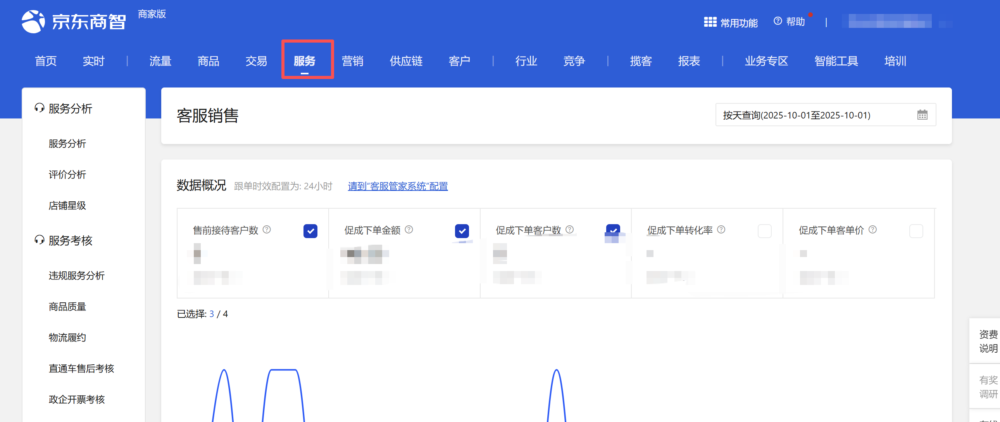
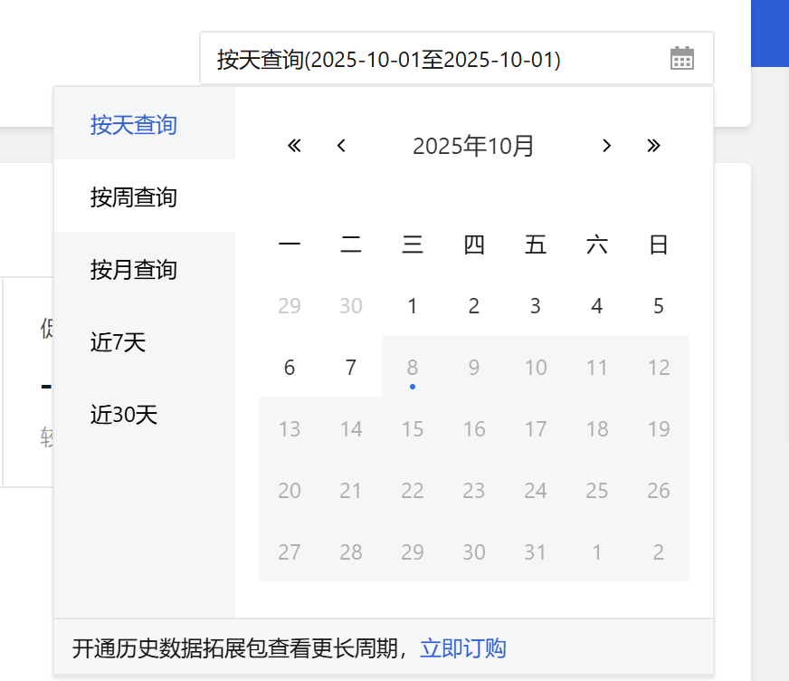

# 描述

该指令实现服务模块部分页面的时间选择功能

# 配置说明
## 输入

<strong>网页对象:</strong>

任意一个已登录京东商智商家版后台的网页对象

<strong>选择处理页面:</strong>

下拉框，可选服务竞争、咚咚服务分析、接待响应、客服排行、客服销售，必填项

<strong>时间查询方式：</strong>

下拉框，可选按天查询、按周查询、按月查询、近7天、近30天。选填，若不填则使用平台默认值

<strong>具体日期：</strong>

<Info>
  使用指令过程中遇到问题？前往 [八爪鱼RPA 开发者社区问答板块](https://rpa.bazhuayu.com/community/questions) 提问，获取官方与社区帮助。
</Info>
