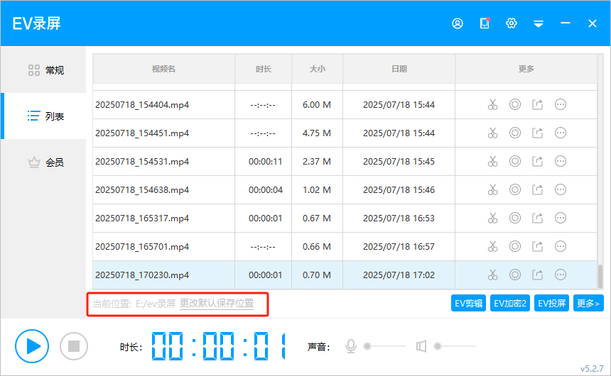

## 一、指令概述

该系列 RPA 指令用于实现对 EV 录屏软件的自动化控制，涵盖软件启动、开始录制、结束录制等核心操作，支持将录屏流程嵌入 RPA 自动化业务场景（如软件操作演示录制、系统异常记录等 ），提升录屏操作的流程化与自动化程度。

## 二、调用参数配置示意

在 RPA 流程设计中，通过 “调用指令” 配置参数执行对应操作，配置界面如下（以单指令调用为例 ）：

[调用指令配置截图占位符，需手动替换为实际截图]

指令名称参数说明EV 录屏 - 软件启动入参：EV 录屏软件安装路径（需准确填写软件可执行文件所在路径，如 C:\Program Files\EV录屏\EV录屏.exe ）；执行后启动 EV 录屏软件主程序EV 录屏 - 开始录制可按需配置录制区域（全屏 / 自定义区域 ）、音频选项（系统声音 / 麦克风 ）等参数（若 RPA 工具支持 ）EV 录屏 - 结束录制无需额外参数，执行后停止当前录屏并保存录制文件
## 三、使用示例

（一）参数配置EV 录屏软件安装路径：C:\Program Files\EV录屏\EV录屏.exe（根据实际安装路径填写 ）指令序列：依次选择 EV 录屏 - 软件启动 → EV 录屏 - 开始录制 → EV 录屏 - 结束录制（可选）EV 录屏 - 开始录制 扩展配置：录制区域设为 “全屏”，音频选项勾选 “系统声音 + 麦克风”
### （二）执行流程

调用指令后，RPA 工具按以下步骤运行：执行 EV 录屏 - 软件启动，根据配置的安装路径启动 EV 录屏软件；执行 EV 录屏 - 开始录制，按配置参数（如全屏、系统声音 + 麦克风 ）开始录屏；（录屏过程中执行其他需录制的操作 ）；执行 EV 录屏 - 结束录制，停止录屏并自动保存录制文件（保存路径通常为 EV 录屏默认路径或 RPA 工具指定路径 ）。
## 四、运行效果

执行成功后，EV 录屏软件会按指令完成启动、录制、停止操作，生成的录屏文件可在对应保存路径中查看（如默认存于 “我的文档 \EV 录屏” ）。效果可通过查看 EV 录屏软件界面状态（启动后显示主界面、录制时显示录制控件、结束后弹出保存提示或直接保存 ）及文件管理器验证，示例效果如下：

[录屏文件 / 软件界面截图占位符，需手动替换为实际截图]

（注：图中显示 EV 录屏软件已生成录制文件，验证指令成功完成录屏流程 ）

五、注意事项<strong>软件预安装与下载</strong>：需确保运行 RPA 流程的设备已安装 EV 录屏软件，若未安装可从 EV 录屏官网[EV 录屏官网](https://www.evrec.com/) （ https://www.ieway.cn/evcapture.html[https://www.ieway.cn/evcapture.html](https://www.ieway.cn/evcapture.html) ）下载最新稳定版。<strong>权限适配</strong>：若 EV 录屏需管理员权限运行，需配置 RPA 工具以管理员身份启动，否则可能启动失败或录制异常。<strong>参数兼容性</strong>：不同 RPA 工具对 EV 录屏的参数支持可能不同，若需自定义录制区域、音频等，需确认 RPA 工具与 EV 录屏的接口适配性。<strong>录制干扰</strong>：录屏过程中避免手动操作 EV 录屏软件界面，防止与 RPA 指令冲突导致录制失败或异常。<strong>录屏保存路径设置如下</strong>

## 六、延伸应用

该指令集可结合多种业务流程，拓展自动化场景：<strong>软件操作教程录制</strong>：搭配软件自动化操作指令，自动录制软件功能演示、操作步骤教程，快速生成标准化教学视频。<strong>系统异常记录</strong>：在监控系统运行状态的 RPA 流程中，遇异常时自动启动录屏，记录异常发生过程，辅助问题排查。<strong>业务流程留痕</strong>：对需合规留痕的业务操作（如金融交易、政务办理 ），自动录制操作全流程，生成可回溯的视频记录。这条消息已经在编辑器中准备就绪。你想如何调整这篇文档？请随时告诉我。

<Info>
  使用指令过程中遇到问题？前往 [八爪鱼RPA 开发者社区问答板块](https://rpa.bazhuayu.com/community/questions) 提问，获取官方与社区帮助。
</Info>
