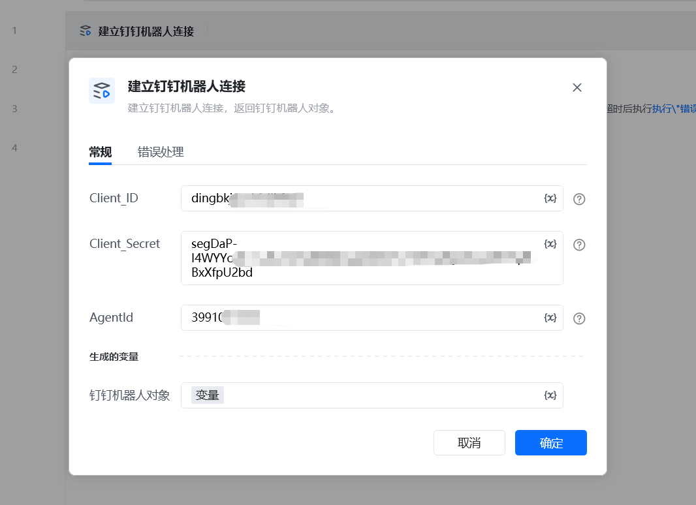
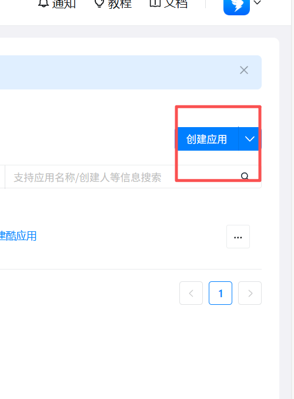
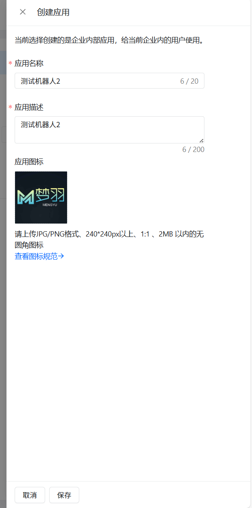
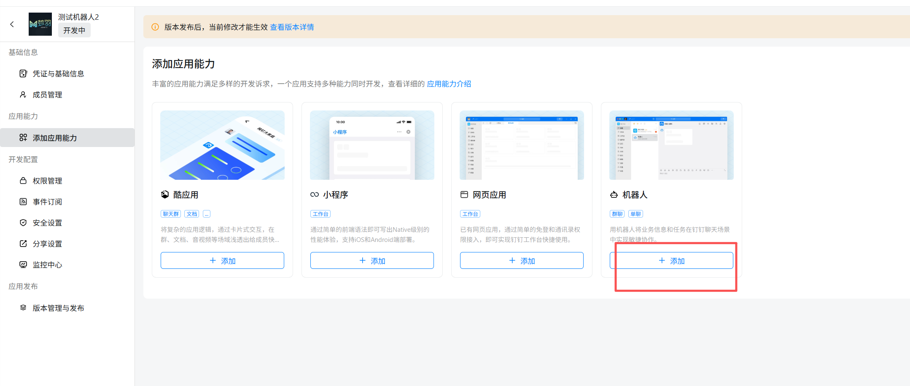
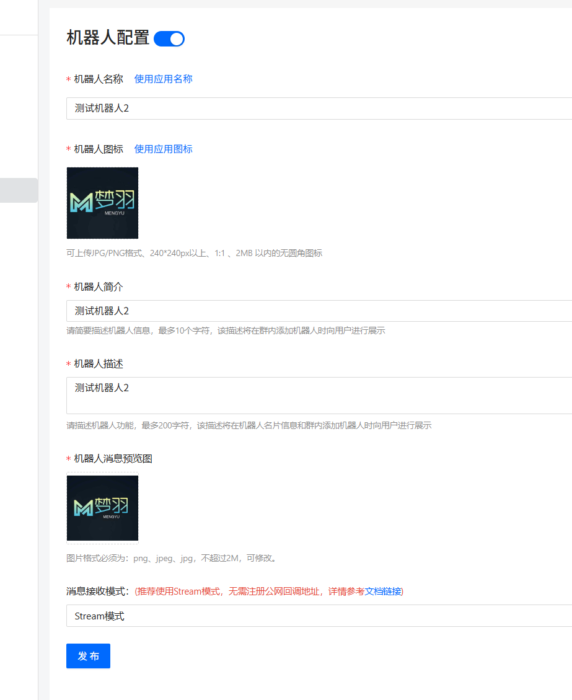
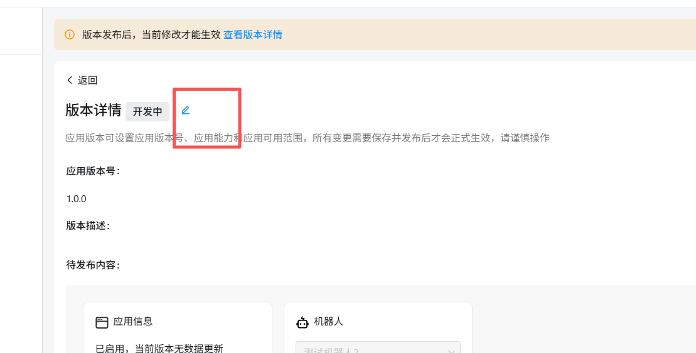

# 建立钉钉机器人连接描述

使用应用连接钉钉机器人

参数配置 指令输入 常规

Client lD：Client ID (原 AppKey 和 SuiteKey)

Client Secret：Client Secret 原 AppSecret 和：应用凭证AppSecret

Agentld：原企业内部应用Agentld

指令输出

钉钉机器人对象：获取一个字典格式的对象。

常见问题

企业内部应用获取 AppKey 和 AppSecret，开通机器人

打开网址https://open-dev.dingtalk.com/fe/app 登录钉钉开发者后台

1.创建企业内部应用

2.填写创建应用相关信息：

3.添加机器人

4.机器人配置并发布机器人

5.需开通一下权限: 成员信息读权限，调用企业API基础权限，企业内机器人发送消息权限，3个权限都需要开通

6.应用发布：

点击查看版本详情

点击编辑标志，把版本信息补充完整

获取 AppKey 和 AppSecret

<Info>
  使用指令过程中遇到问题？前往 [八爪鱼RPA 开发者社区问答板块](https://rpa.bazhuayu.com/community/questions) 提问，获取官方与社区帮助。
</Info>
