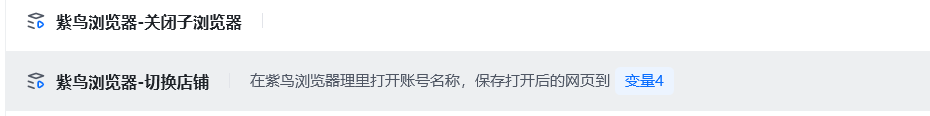
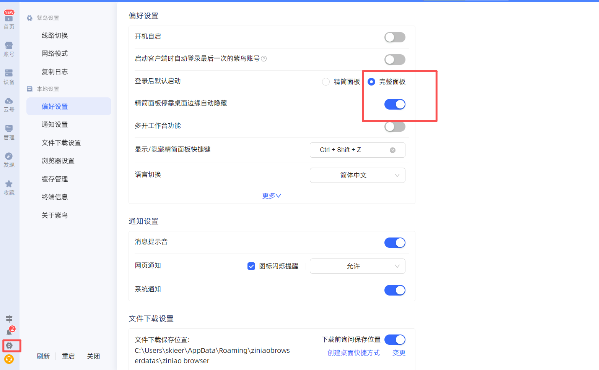
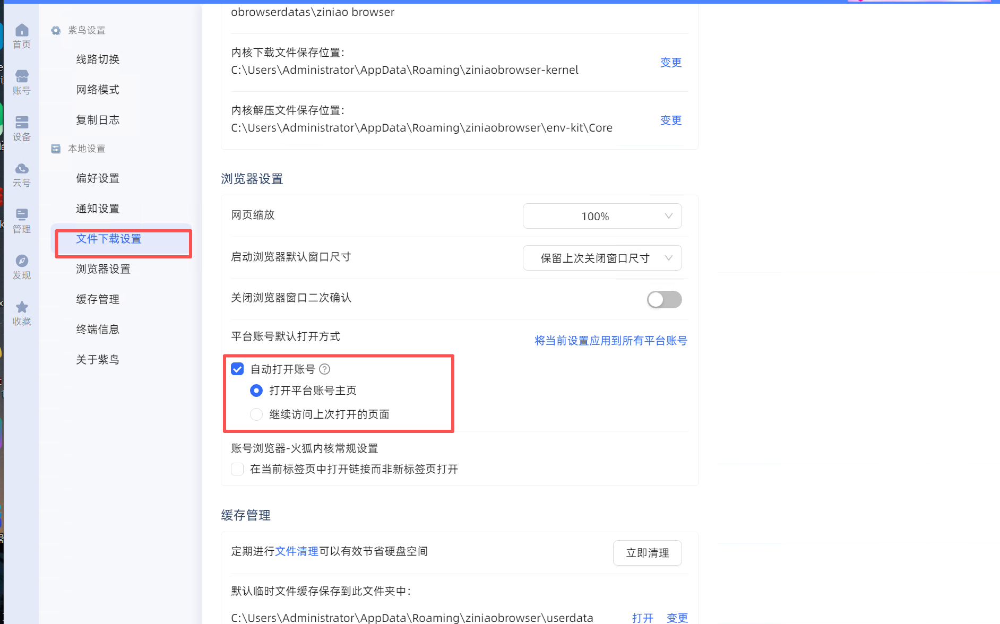
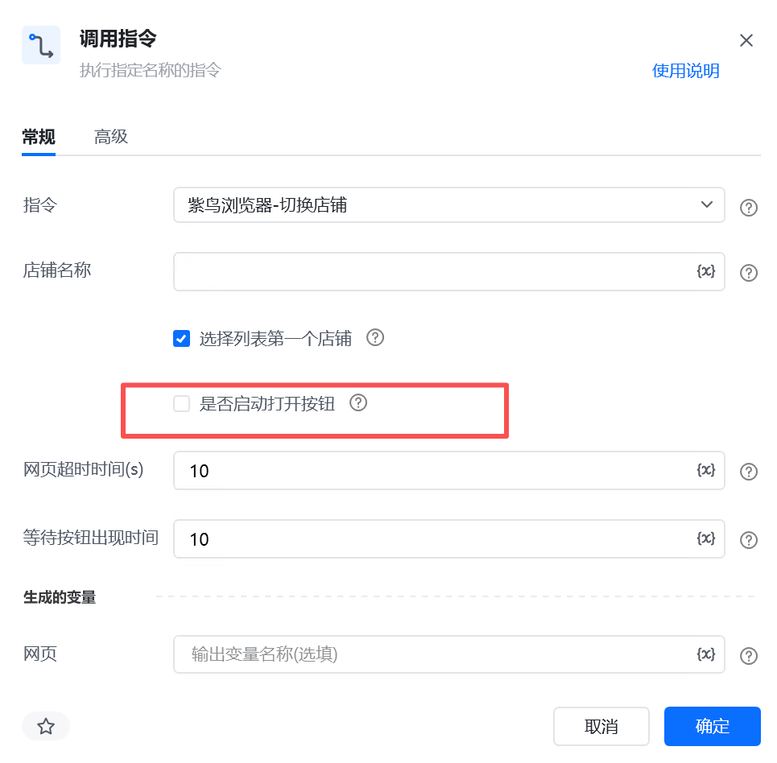

## 一、指令概述

该指令是紫鸟浏览器环境下的多店铺自动化切换指令，核心功能是自动打开指定店铺的浏览器环境，适配常规自动匹配、精准名称匹配、自定义元素兼容三种使用模式。支持选择列表第一个店铺、精准匹配指定店铺名称，同时兼容不同用户环境的界面适配，可有效解决不同设备、不同版本紫鸟浏览器的元素适配问题，最终返回绑定的网页对象变量，是跨境电商多账号自动化场景的基础核心指令，可衔接后续所有店铺页面自动化操作。
## 二、核心参数配置参数分类参数名称说明输入格式 / 规则常规参数店铺名称目标店铺的匹配名称，是精准定位店铺的核心文本依据必填；必须填写与紫鸟浏览器网页店铺列表中完全一致的店铺名称（包含字符、空格、大小写）；所有匹配逻辑均基于该名称执行模糊搜索；勾选「选择列表第一个店铺」则取搜索结果第一个店铺，取消勾选则在模糊搜索结果中精准匹配完全一致的店铺名称。常规参数选择列表第一个店铺控制店铺匹配逻辑，开启后系统通过关键词搜索相似店铺，默认选中搜索结果列表第一个店铺必填；复选框，默认勾选；系统固定先通过填写的店铺名称执行模糊搜索，匹配出所有相似店铺列表，勾选此参数则直接选取搜索结果中的第一个店铺；取消勾选则在模糊搜索结果中筛选、定位与输入名称完全一致的唯一店铺。常规参数是否启动打开按钮控制指令是否主动点击店铺「打开」按钮，默认开启；可适配紫鸟浏览器自带的自动打开账号设置，避免功能冲突必填；复选框，默认勾选；紫鸟浏览器开启「自动打开账号」功能时要取消勾选，防止重复操作报错常规参数网页超时时间 (s)店铺浏览器页面加载的最大等待时长，超时将触发指令报错必填；单位：秒，默认值为10，网络卡顿、页面加载慢可适当延长常规参数等待按钮出现时间等待店铺「打开」按钮加载显示的最大时长，超时未检测到按钮则报错必填；单位：秒，默认值为10，店铺列表加载缓慢可适当延长常规参数生成变量【网页】指令输出结果变量，用于存储绑定店铺环境的网页对象必填；返回可调用的网页对象，用于衔接后续所有页面自动化操作高级参数店铺名称元素自定义店铺定位元素，用于替代系统预设XPath；解决不同用户环境界面变动、预设定位失效的问题，支持用户手动捕获当前环境店铺元素选填；常规稳定环境无需配置；系统默认XPath失效、店铺名称重复、界面改版时，手动捕获店铺名称元素即可生效高级参数打开按钮元素自定义打开按钮触发元素，用于替代系统预设按钮XPath，适配各类环境的按钮界面差异选填；常规稳定环境无需配置；按钮定位失败、界面样式变动时，手动捕获打开按钮元素即可生效
## 三、使用步骤
### 前置准备

1. 确保紫鸟浏览器已正常启动，目标店铺已添加、状态正常且已登录成功；

2. 提前获取紫鸟网页列表中<strong>完整、一致的店铺名称</strong>，两种匹配模式均依赖该名称执行搜索；

3. 若常规定位失效，可提前准备手动捕获元素的环境，用于高级参数配置。
## 四、典型操作示例
### 场景 1：快速切换列表第一个店铺（常规稳定环境）

店铺名称：填写与紫鸟网页列表一致的完整店铺名称

选择列表第一个店铺：勾选 ✅

是否启动打开按钮：勾选 ✅

网页超时时间 (s)：10

等待按钮出现时间：10

高级元素参数：无需配置

输出变量：shop_browser_obj

执行效果：通过填写的店铺名称模糊搜索匹配所有相似店铺，自动选中搜索列表首个店铺，自动点击打开并返回绑定的网页对象，适合多近似店铺场景快速切换。

<strong>如果你在切换店铺时，需要关闭子浏览器，需要自己调用指令《关闭子浏览器》指令，默认关闭所有子浏览器，也可以通过给它店铺名称关闭对应的店铺的子浏览器，控制台不会关闭</strong>

## 五、注意事项
### 1. 前置依赖

紫鸟浏览器必须处于运行状态，目标店铺已添加、无异常、登录正常，否则指令无法定位店铺。

在执行之前要记得先到设置里面设置改一下登录后默认启动<strong>完整面板，默认登录之后是启动精简面板如下图：</strong>

如果在紫鸟浏览器设置里面勾选了自动打开账号按钮如下图：是否启动打开按钮要记得取消勾选

<Info>
  使用指令过程中遇到问题？前往 [八爪鱼RPA 开发者社区问答板块](https://rpa.bazhuayu.com/community/questions) 提问，获取官方与社区帮助。
</Info>
