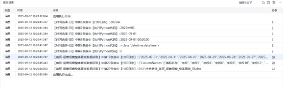
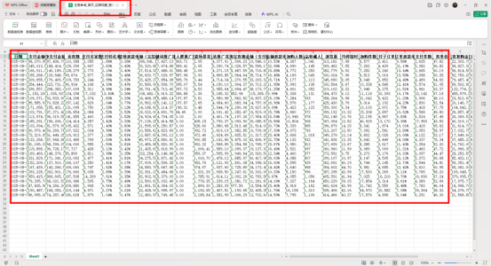

# <strong>首页-运营视窗整体看板数据获取描述</strong>

该指令实现了【生意参谋】->【首页】->【运营视窗】->【整体看板】部分的数据获取，并将数据写入到Excel文件保存到指定路径下；

# <strong>配置说明</strong>
## <strong>适用的浏览器类型</strong>

1. Google Chrome浏览器
## <strong>输入</strong>

保存文件夹：请输入数据文件保存的文件夹路径

网页对象：获取打开的浏览器对象

日期类型：选择想要取数的时间日期类型(日，周，月)
## <strong>输出</strong>

输出文件路径：输出数据文件的路径
## <strong>运行日志</strong>

## <strong>数据展示</strong>

<Info>
  使用指令过程中遇到问题？前往 [八爪鱼RPA 开发者社区问答板块](https://rpa.bazhuayu.com/community/questions) 提问，获取官方与社区帮助。
</Info>
