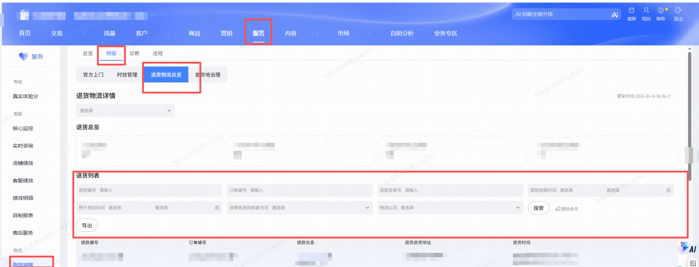
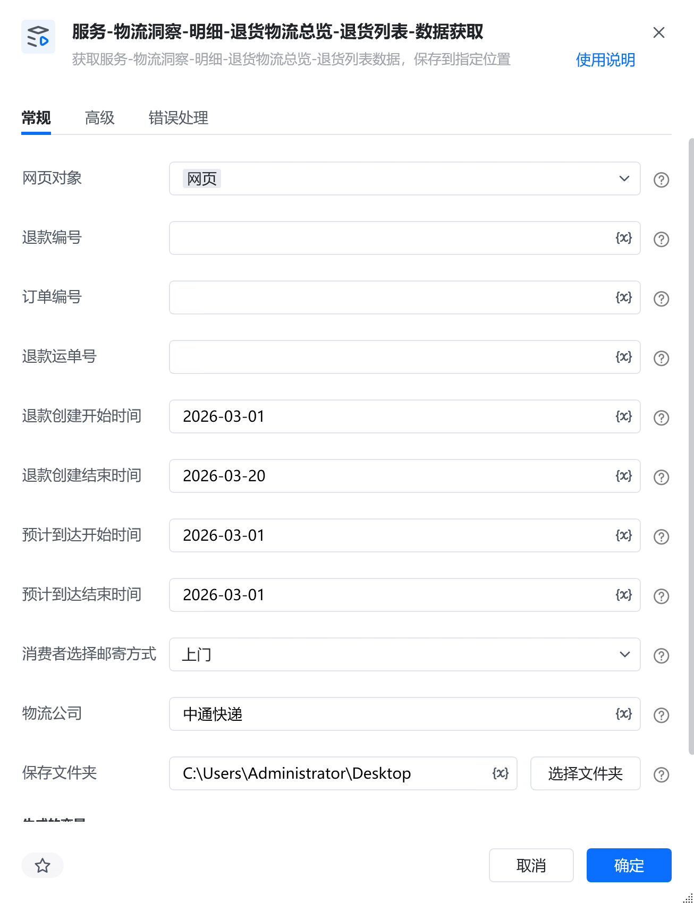
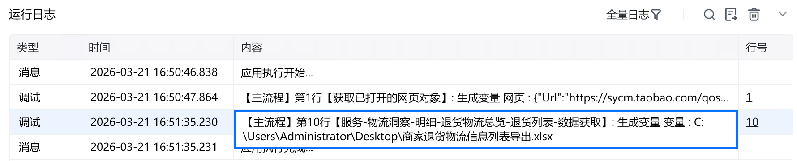

# 描述

获取服务-物流洞察-明细-退货物流总览-退货列表数据，保存到指定位置

# 配置说明
## 输入

<strong>网页对象:</strong>

任意一个已登录生意参谋的网页对象

<strong>退款编号:</strong>

输入退款编号，选填，不填则默认全部

<strong>订单编号:</strong>

填写订单编号，选填，不填则默认全部

<strong>退款运单号:</strong>

填写退款运单号，选填，不填则默认全部

<strong>退款创建开始时间:</strong>

填写退款创建开始时间，格式：YYYY-MM-DD，选填，不填则默认全部

<strong>退款创建结束时间:</strong>

填写退款创建结束时间，格式：YYYY-MM-DD，选填，不填则默认全部

<strong>预计到达开始时间:</strong>

填写预计到达开始时间，格式：YYYY-MM-DD，选填，不填则默认全部

<strong>预计到达结束时间:</strong>

填写预计到达结束时间，格式：YYYY-MM-DD，选填，不填则默认全部

<strong>消费者选择邮寄方式:</strong>

选择消费者邮寄方式，选填，不填则默认全部

<strong>物流公司:</strong>

填写物流公司，选填，不填则默认全部

<strong>保存文件夹：</strong>

选择文件保存路径

<strong>自定义文件名称：</strong>

自定义文件名称，若不填则使用默认文件名
## 输出

<strong>文件路径：</strong>

输出完整的文件路径，文本类型
# 使用示例

# 运行结果

<Info>
  使用指令过程中遇到问题？前往 [八爪鱼RPA 开发者社区问答板块](https://rpa.bazhuayu.com/community/questions) 提问，获取官方与社区帮助。
</Info>
