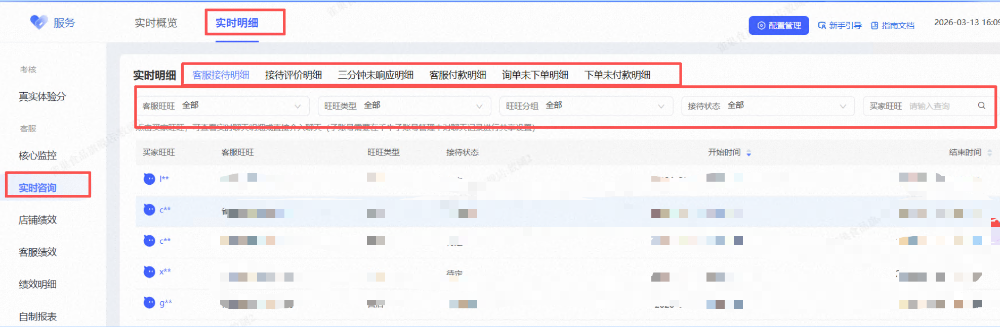
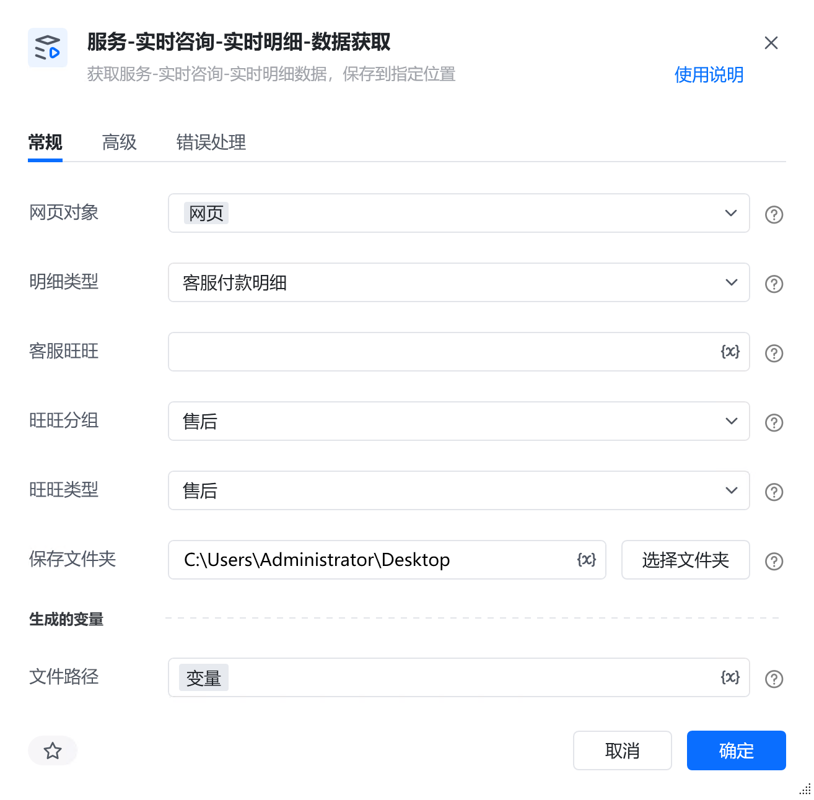
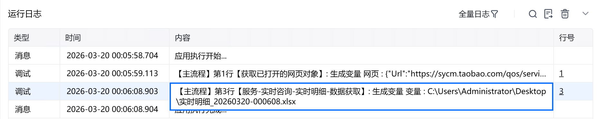

# 描述

获取服务-实时咨询-实时明细数据，保存到指定位置

# 配置说明
## 输入

<strong>网页对象:</strong>

任意一个已登录生意参谋的网页对象

<strong>明细类型:</strong>

选择明细类型

<strong>客服旺旺:</strong>

填写客服旺旺名称，必须与平台名称一致，若不填则默认全部

<strong>旺旺分组:</strong>

选择旺旺分组，默认全部

<strong>旺旺类型:</strong>

选择旺旺类型，默认全部

<strong>评价状态:</strong>

选择评价状态，默认全部

<strong>评价结果:</strong>

选择评价结果

<strong>采集页数:</strong>

输入采集的页数，选填，若不填则默认采集全部

<strong>保存文件夹：</strong>

选择文件保存路径

<strong>自定义文件名称：</strong>

自定义文件名称，若不填则使用默认文件名
## 输出

<strong>文件路径：</strong>

输出完整的文件路径，文本类型
# 使用示例

# 运行结果

<Info>
  使用指令过程中遇到问题？前往 [八爪鱼RPA 开发者社区问答板块](https://rpa.bazhuayu.com/community/questions) 提问，获取官方与社区帮助。
</Info>
