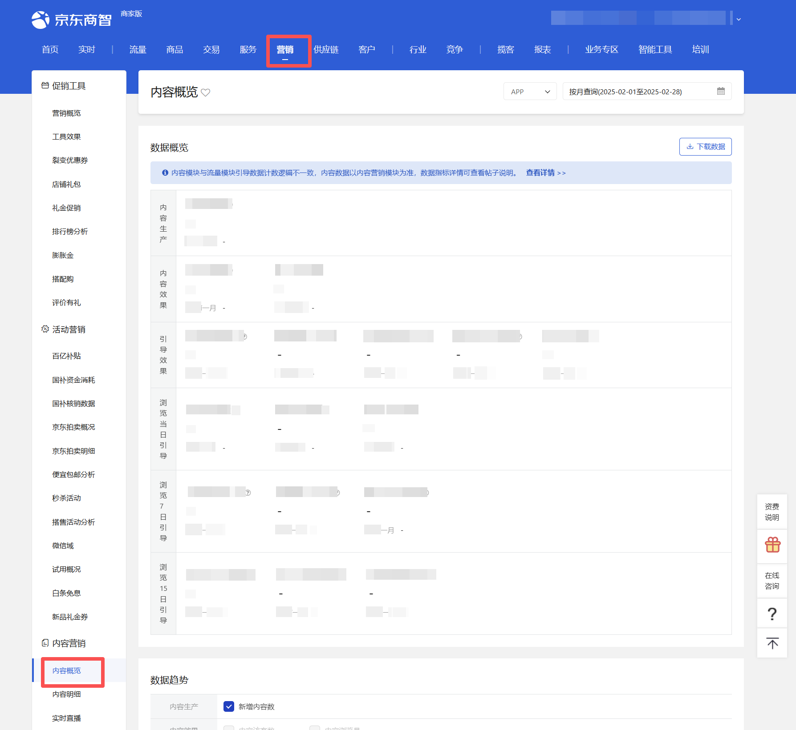
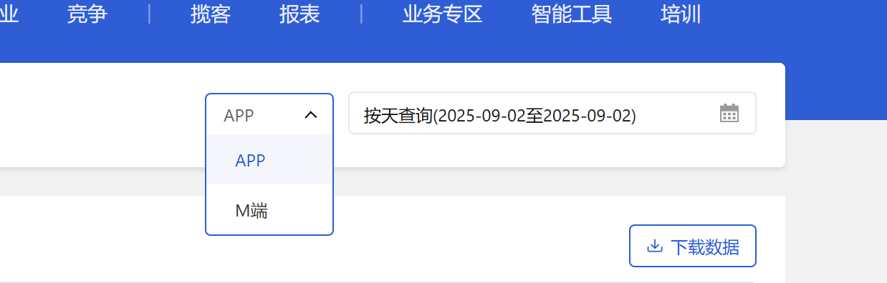
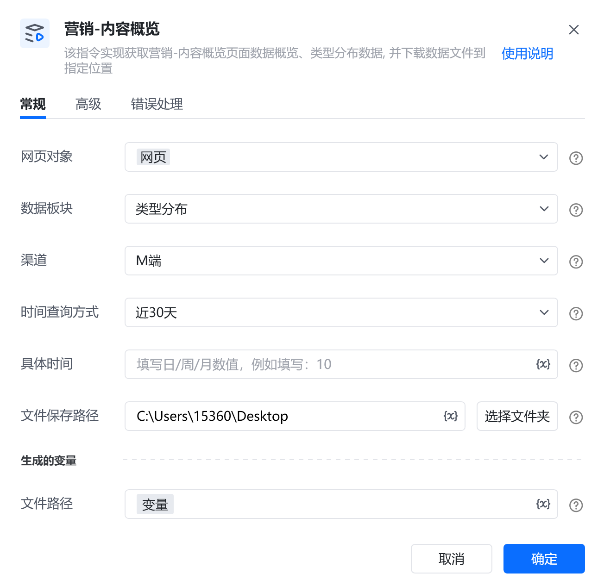
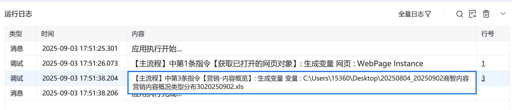
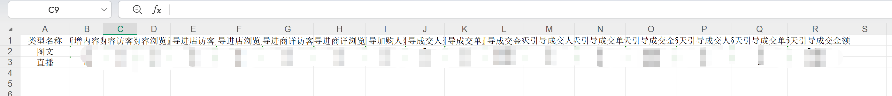

# 描述

该指令实现获取营销-内容概览页面数据概览、类型分布数据, 并下载数据文件到指定位置

# 配置项说明
## 指令输入
#### 网页对象：

任意一个已登录京东商智商家版后台营销-内容概览页面的网页对象

#### 数据板块：

下拉框，可选择：数据概览、类型分布，必填项
#### 渠道：

下拉框，可选：APP、M端，选填，若不填则默认APP

#### 时间查询方式：

下拉框，可选择：按天查询、按周查询、按月查询、近7天、近30天，选填，若不填则使用平台默认值

#### 具体时间：

填写具体时间，格式：YYYY-MM-DD，例如：2025-08-01
#### 文件保存路径：

下载的文件保存的文件夹路径，支持本地文件夹预览和变量传参，必填项
#### 自定义文件名：

下载或生成文件保存的名称，选填，若不填则使用平台默认值
## 指令输出
#### 文件路径：

返回文本类型，完整的文件下载路径
# 使用示例

# 运行结果

<Info>
  使用指令过程中遇到问题？前往 [八爪鱼RPA 开发者社区问答板块](https://rpa.bazhuayu.com/community/questions) 提问，获取官方与社区帮助。
</Info>
