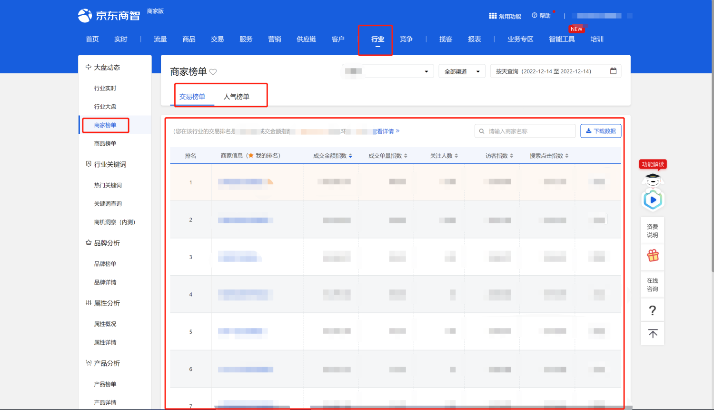
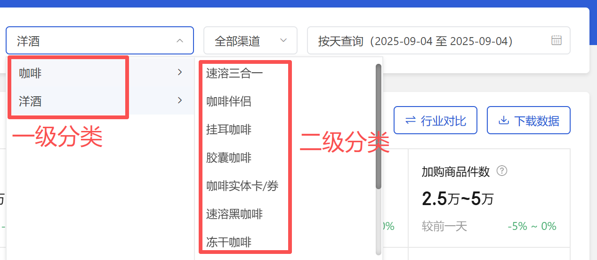
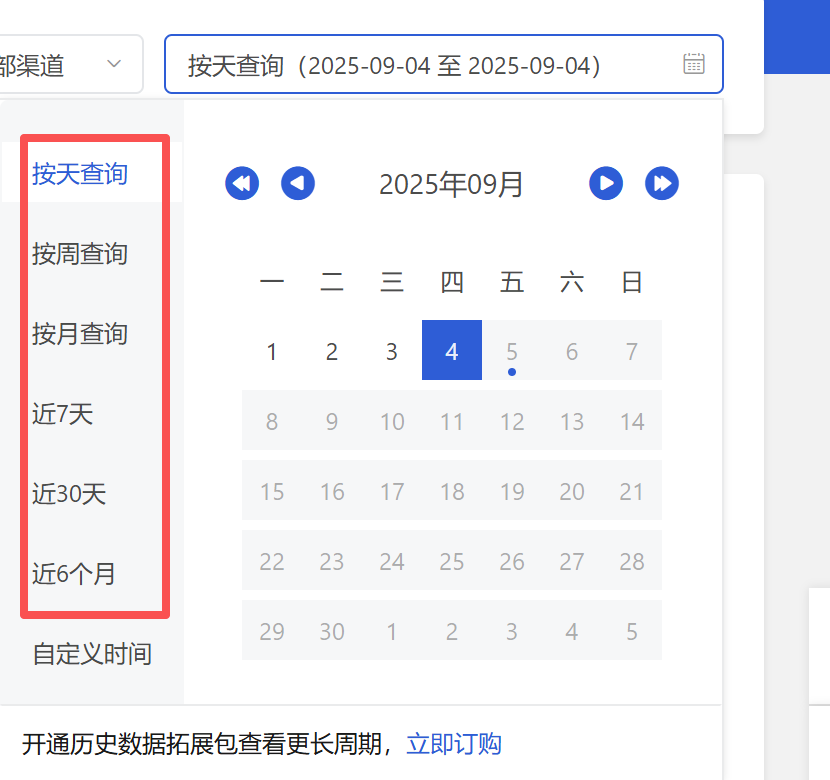
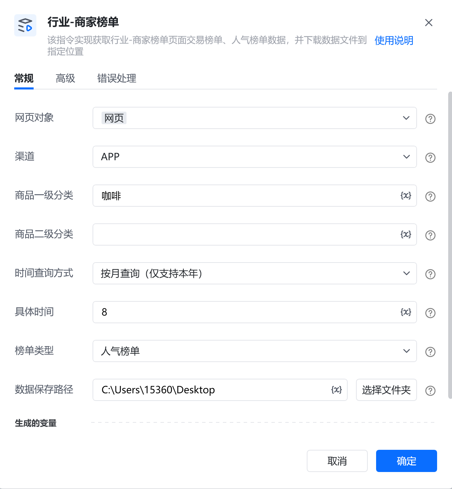
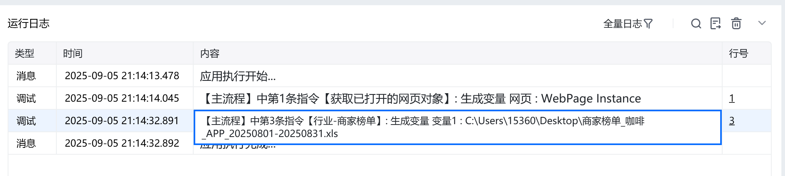
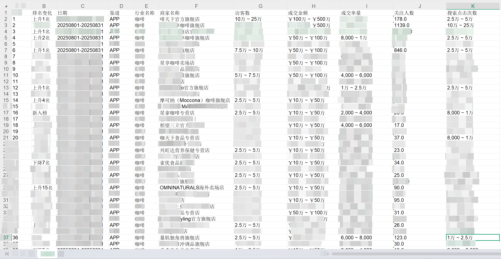

# 描述

该指令实现获取行业-商家榜单页面交易榜单、人气榜单数据，并下载数据文件到指定位置

# 配置项说明
## 指令输入
#### 网页对象：

任意一个已登录京东商智商家版后台行业-商家榜单页面的网页对象

#### 渠道：

下拉框，可选：全部渠道、APP、PC、微信、手Q、M端进行数据下载，选填，若不填则默认全部渠道

#### 商品一级分类：

填写一级分类名称，需与平台显示的名称完全一致（包含字母大小写、空格或符号中英文状态等），否则可能导致找不到选项。填写一级分类后将出现二级分类输入框，选填，若不填则使用平台默认值

#### 商品二级分类：

填写二级分类名称，需与平台显示的名称完全一致（包含字母大小写、空格或符号中英文状态等），否则可能导致找不到选项。选填，若不填则使用平台默认值

#### 时间查询方式：

下拉框，可选择：按天查询、按周查询、按月查询、近7天、近30天、近6个月，选填，若不填则使用平台默认值

#### 具体日期：

填写具体日期，格式：YYYY-MM-DD，例如：2025-08-01
#### 榜单类型：

下拉框，可选择：交易榜单、人气榜单，选填，若不填则使用平台默认值
#### 数据保存路径：

下载的文件保存的文件夹路径，支持本地文件夹预览和变量传参，必填项
#### 自定义文件名：

下载或生成文件保存的名称，选填，若不填则使用平台默认值
## 指令输出
#### 文件路径：

返回文本类型，完整的文件下载路径
# 使用示例

# 运行结果

<Info>
  使用指令过程中遇到问题？前往 [八爪鱼RPA 开发者社区问答板块](https://rpa.bazhuayu.com/community/questions) 提问，获取官方与社区帮助。
</Info>
