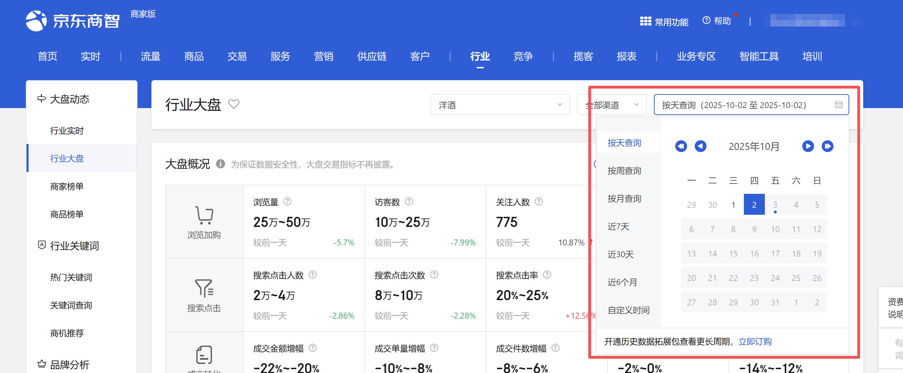

# 描述

该指令实现行业-行业大盘页面的时间选择功能

# 配置项说明
## 指令输入
#### 网页对象：

任意一个已登录京东商智商家版后台行业-行业大盘页面的网页对象
#### 时间查询方式：

下拉框，可选择：按天查询、按周查询、按月查询、近7天、近30天、近6个月，选填，若不填则使用平台默认值
#### 具体时间：

填写具体日期，格式：YYYY-MM-DD，例如：2025-08-01
#### 自定义开始日期：

填写自定义开始日期：YYYY-MM-DD，例如：2025-08-01。由于平台限制，开始日期和结束日期跨度不可超过31天
#### 自定义结束日期：

<Info>
  使用指令过程中遇到问题？前往 [八爪鱼RPA 开发者社区问答板块](https://rpa.bazhuayu.com/community/questions) 提问，获取官方与社区帮助。
</Info>
