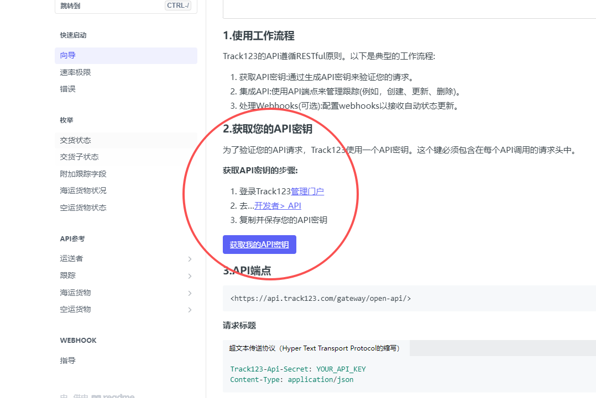
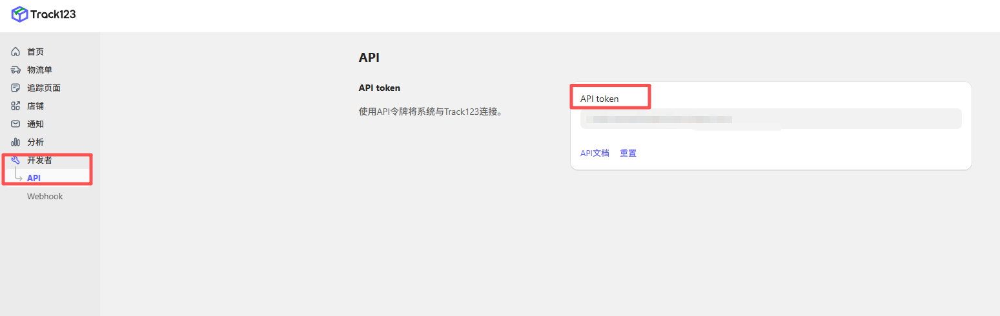
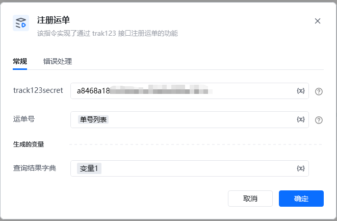
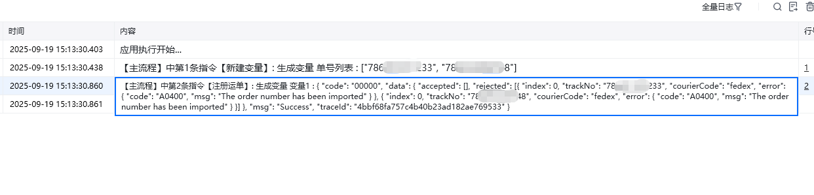

该指令实现了通过 trak123 接口注册运单的功能

trank123 Token: Token令牌

获取Token方法：

官方注册链接

https://docs.track123.com/reference/request

运单号: 填写运单号列表

运单详情字典：将结果以字典的形式展示

Track123 使用服务状态代码Status codeTypeDescription00000SUCCESSSuccessA0001USER_ERRORUser terminal error.A0200USER_LOGIN_ERRORServer error.A0201USER_NOT_EXISTAccount does not exist.A0202USER_ACCOUNT_LOCKEDThe user account is locked.A0203USER_ACCOUNT_INVALIDThe user account is invalid.A0230TOKEN_INVALID_OR_EXPIREDToken is invalid or expired.A0231TOKEN_ACCESS_FORBIDDENToken has been forbidden.A0300AUTHORIZED_ERRORAbnormal access rights.A0301ACCESS_UNAUTHORIZEDUnauthorized access.A0400PARAM_ERRORUser request parameter error.A0410PARAM_IS_NULLThe parameter for the request is null.B0001SYSTEM_EXECUTION_ERRORSystem error.B0100SYSTEM_EXECUTION_TIMEOUTSystem timeout.B0100SYSTEM_ORDER_PROCESSING_TIMEOUTSystem timeout.B0210FLOW_LIMITINGExceed flow limits.B0300SYSTEM_RESOURCE_ERRORAbnormal system resources.B0310SYSTEM_RESOURCE_EXHAUSTIONSystem resources are exhausted.C0113INTERFACE_NOT_EXISTThe interface does not exist.D0000SERVICE_DETAIL_MSG_ERROROther errors, detailed information will be returned in msg or data.

<Info>
  使用指令过程中遇到问题？前往 [八爪鱼RPA 开发者社区问答板块](https://rpa.bazhuayu.com/community/questions) 提问，获取官方与社区帮助。
</Info>
