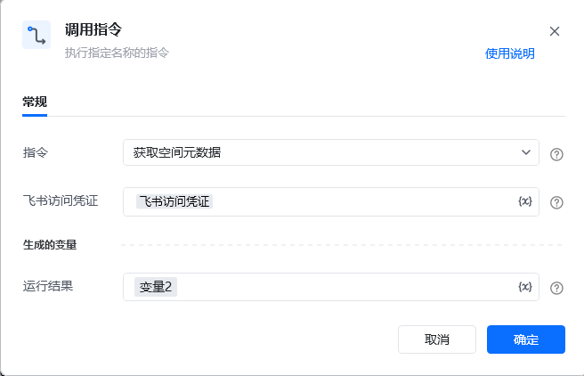

# <strong>RPA 指令文档：获取空间元数据</strong>
## <strong>一、指令概述</strong>

该 RPA 指令用于<strong>获取飞书空间的元数据</strong>，包含空间的 token、id、user_id 等关键信息，为飞书云盘空间的文件管理、文件夹操作等后续场景提供基础数据支持。

飞书官方开发文档参考：https://open.feishu.cn/document/server-docs/docs/drive-v1/folder/get-root-folder-meta
## <strong>二、调用参数配置示意</strong>

参数名称示例 / 默认值说明指令获取空间元数据固定选择 “获取空间元数据”，执行飞书空间元数据查询操作。飞书访问凭证飞书访问凭证配置飞书开放平台的访问凭证（需具备空间元数据查询权限，可通过 “获取飞书访问凭证” 指令生成），支持变量（界面显示 “\{x\}” 标识）。生成的变量 - 运行结果变量2（自定义变量名）存储空间元数据的查询结果（包含 token、id、user_id 等信息），需配置为自定义变量，后续流程可调用，支持变量。
## <strong>三、使用示例（获取企业空间元数据场景）</strong>
### <strong>场景：获取当前飞书访问凭证对应的空间元数据，用于后续云盘文件管理操作。</strong>
#### <strong>参数配置：</strong>

• 指令：获取空间元数据

• 飞书访问凭证：feishuAuthToken（通过 “获取飞书访问凭证” 指令生成的变量）

• 运行结果：spaceMetaResult（自定义变量，存储查询结果）
#### <strong>执行流程：</strong>

调用该 RPA 指令后，RPA 会通过 feishuAuthToken 完成飞书 API 认证，查询当前凭证对应的空间元数据；查询完成后，将包含 token、id、user_id 的结果存入 spaceMetaResult 变量，便于后续飞书云盘的文件上传、文件夹创建等操作引用这些元数据。
## <strong>四、返回结果说明</strong>
### <strong>1. 飞书 API 标准返回示例（成功场景）：</strong>

指令执行后，“运行结果” 变量（如spaceMetaResult）会存储包含空间元数据的 JSON 结果，格式如下：

\{ "code": 0, "msg": "Success", "data": \{ "token": "nodbcbHUdOsS613xVzTzF***", "id": "71101730134***56", "user_id": "710***21312356" \}\}
### <strong>2. 响应字段含义：</strong>

• code：状态码，0 表示查询成功，非 0 为失败（具体错误码含义参考飞书官方文档）。

• msg：提示信息，Success 表示查询成功。

• data：核心返回数据，包含空间元数据：

◦ token：空间的唯一标识 token（用于云盘相关操作的身份关联）；

◦ id：空间的 ID；

◦ user_id：关联的用户 ID。
## <strong>五、注意事项</strong>

1. <strong>访问凭证有效性</strong>：“飞书访问凭证” 需具备<strong>空间元数据查询权限</strong>且未过期（建议通过 “获取飞书访问凭证” 指令动态生成有效凭证），否则会导致 code≠0 或查询失败。

2. <strong>变量配置规范性</strong>：“飞书访问凭证” 需关联有效变量，“运行结果” 需配置为自定义变量（如spaceMetaResult），否则无法正确存储或传递元数据。

3. <strong>元数据用途</strong>：返回的 token、id、user_id 是飞书云盘空间操作的核心标识，后续涉及云盘文件、文件夹的操作需依赖这些数据，需确保变量引用准确。
## <strong>六、延伸应用</strong>

可结合 RPA 的 “创建文件夹”“上传文件” 指令，实现<strong>飞书云盘自动化管理</strong>：例如通过本指令获取空间 token 后，调用 “创建文件夹” 指令在云盘创建 “自动化报表” 文件夹，再调用 “上传文件” 指令将本地报表上传至该文件夹，替代人工手动操作云盘的重复工作，提升文件管理效率。

<Info>
  使用指令过程中遇到问题？前往 [八爪鱼RPA 开发者社区问答板块](https://rpa.bazhuayu.com/community/questions) 提问，获取官方与社区帮助。
</Info>
