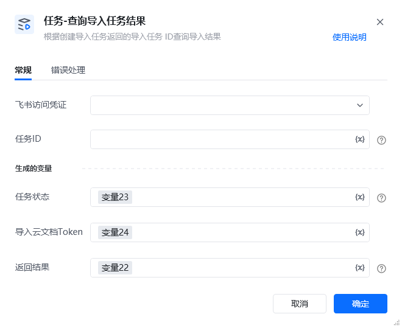

## 1. 功能说明

查询【任务 - 创建导入任务】生成的异步任务执行结果，获取文件导入状态（成功 / 处理中 / 失败）及导入后的云文档标识，底层基于飞书开放平台【查询导入任务结果】API（https://open.feishu.cn/document/server-docs/docs/drive-v1/import_task/get[https://open.feishu.cn/document/server-docs/docs/drive-v1/import_task/get](https://open.feishu.cn/document/server-docs/docs/drive-v1/import_task/get)）实现。

## 2. 配置项说明

配置项必填默认值说明<strong>飞书访问凭证</strong>是-选择与【创建导入任务】一致的飞书访问凭证，需确保权限有效。<strong>任务 ID</strong>是-填写【创建导入任务】生成的任务ID（即飞书 API 返回的ticket），通常为变量形式（如变量21）。<strong>任务状态</strong>是-存储导入任务的当前状态，可选值：导入成功、处理中、导入失败。<strong>导入云文档 Token</strong>是-若任务状态为 “导入成功”，存储生成的飞书云文档token；任务未完成时为空。<strong>返回结果</strong>是-存储查询请求的结果（字典类型），包含查询状态、错误信息等，格式参考下方 “返回结果示例”。

任务状态说明状态值含义后续操作<strong>处理中</strong>导入任务仍在执行等待一段时间后重新执行该查询指令，直到状态变为 “导入成功” 或 “导入失败”。<strong>导入成功</strong>文件已成功转为飞书云文档通过 “导入云文档 Token” 访问 / 操作生成的云文档。<strong>导入失败</strong>导入过程出错查看 “返回结果” 中的错误信息，根据提示修正问题后重新执行【创建导入任务】。

<strong>返回结果示例</strong><strong>查询成功（任务处理中）</strong>：\{
"success": true,
"data": \{
"ticket": "task_1234567890abcdef",
"status": "processing"
\},
"task_id": "task_1234567890abcdef"
\}

<strong>查询成功（导入成功）</strong>：\{
"success": true,
"data": \{
"ticket": "task_1234567890abcdef",
"status": "success",
"file_token": "doccnrHpsg1QDqXAAAyachabcef"
\},
"task_id": "task_1234567890abcdef"
\}

<strong>查询失败（任务不存在）</strong>：\{
"success": false,
"code": 1061003,
"msg": "任务不存在",
"log_id": "log_def456",
"raw_response": "\{\"code\":1061003,\"msg\":\"任务不存在\",\"log_id\":\"log_def456\"\}"
\}

3. 示例场景先执行【任务 - 创建导入任务】，生成任务ID（存储到变量：任务ID）；执行本指令：<strong>飞书访问凭证</strong>：选择与创建任务一致的凭证；<strong>任务 ID</strong>：填写变量：任务ID；<strong>任务状态</strong>：设置为变量：任务状态；<strong>导入云文档 Token</strong>：设置为变量：云文档Token；<strong>返回结果</strong>：设置为变量：返回结果；检查任务的状态：若为 “处理中”，等待 5 秒后再次执行本指令；若为 “导入成功”，则通过变量“云文档Token”获取云文档 Token。

## 4. 注意事项

常见问题错误类型可能原因解决方案<strong>任务 ID 不存在（API 错误码 1061003）</strong>任务 ID 填写错误，或任务已过期（飞书任务通常保留 7 天）核对【创建导入任务】生成的任务ID，若过期则重新创建导入任务。<strong>权限不足（API 错误码 1061005）</strong>飞书应用未开通云文档查询权限参考飞书权限配置文档，为应用添加 “云文档查看” 权限。<strong>网络请求失败</strong>网络波动或飞书 API 服务临时异常重试查询指令，若多次失败可检查网络连接或飞书服务状态。

<Info>
  使用指令过程中遇到问题？前往 [八爪鱼RPA 开发者社区问答板块](https://rpa.bazhuayu.com/community/questions) 提问，获取官方与社区帮助。
</Info>
