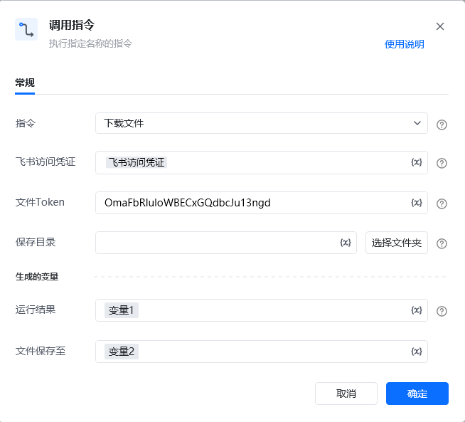

## <strong>一、指令概述</strong>

该 RPA 指令用于<strong>从飞书云盘下载指定文件到本地指定目录</strong>，需配置飞书访问凭证、文件唯一标识（文件Token）及本地保存目录，执行后返回运行结果和文件本地保存路径，适用于飞书文件的本地化备份、离线编辑等场景。

飞书官方开发文档参考：https://open.feishu.cn/document/server-docs/docs/drive-v1/download/download
## <strong>二、调用参数配置示意</strong>

参数名称示例 / 默认值说明指令下载文件固定选择 “下载文件”，执行飞书文件本地下载操作。飞书访问凭证飞书访问凭证配置飞书开放平台的访问凭证（需具备文件下载权限，可通过 “获取飞书访问凭证” 指令生成），支持变量（界面显示 “{x}” 标识）。文件 TokenOmaFb****************输入要下载文件在飞书云盘的唯一标识 Token（需为飞书合法文件的有效 Token），关键字符已打码，支持变量。保存目录（如 “C:\Downloads\”）选择本地保存文件的文件夹路径，可点击 “选择文件夹” 按钮选取，支持变量。生成的变量 - 运行结果变量1（自定义变量名）存储文件下载的执行结果（如成功状态、错误信息等），需配置为自定义变量，后续流程可调用，支持变量。生成的变量 - 文件保存至变量2（自定义变量名）存储下载后文件在本地的完整文件路径（如 “C:\Downloads\ 报表.xlsx”），需配置为自定义变量，支持变量。
## <strong>三、使用示例（下载飞书文件到本地场景）</strong>
### <strong>场景：从飞书云盘下载 文件Token 为 OmaFb**************** 的文件，保存到 “C:\Documents\” 本地目录。</strong>
#### <strong>参数配置：</strong>

• 指令：下载文件

• 飞书访问凭证：feishuAuthToken（通过 “获取飞书访问凭证” 指令生成的变量）

• 文件 Token：OmaFb****************（飞书文件唯一标识，关键字符已打码）

• 保存目录：C:\Documents\（或通过 “选择文件夹” 选取）

• 运行结果：downloadResult（自定义变量，存储下载结果）

• 文件保存至：localFilePath（自定义变量，存储本地完整路径）
#### <strong>执行流程：</strong>

调用该 RPA 指令后，RPA 会通过 feishuAuthToken 完成飞书 API 认证，根据打码后的文件Token定位飞书文件并下载到指定本地目录；下载完成后，将执行结果存入 downloadResult，并把本地完整文件路径存入 localFilePath，便于后续流程（如本地文件查看、数据提取）调用。
## <strong>四、返回结果说明</strong>
### <strong>1. 运行结果与响应头说明</strong>

• <strong>运行结果变量</strong>：存储下载操作的状态（成功 / 失败）及相关信息。

• <strong>文件保存至变量</strong>：存储下载后文件在本地的完整路径（如 “C:\Documents\ 报表.xlsx”）。

• <strong>响应头字段</strong>：

◦ Content-Type：字符串类型，标识文件的 MIME 类型（如application/vnd.openxmlformats-officedocument.wordprocessingml.document表示 Word 文档）。

◦ Content-Disposition：字符串类型，标识下载后的文件名。
## <strong>五、注意事项</strong>

1. <strong>访问凭证有效性</strong>：“飞书访问凭证” 需具备<strong>文件下载权限</strong>且未过期（建议通过 “获取飞书访问凭证” 指令动态生成有效凭证），否则会导致下载失败。

2. <strong>文件 Token 准确性</strong>：文件Token 需是飞书云盘<strong>真实存在的文件标识</strong>（打码不影响实际值校验），否则会返回 “文件不存在” 错误。

3. <strong>保存目录可写性</strong>：“保存目录” 需指向本地<strong>存在且可写入的文件夹</strong>（避免系统保护路径，如 “C:\Windows\”），否则会因 “无写入权限” 导致下载失败。

4. <strong>文件格式兼容性</strong>：飞书支持下载的文件格式需符合其 API 规范，若遇到特殊格式无法下载，需参考飞书官方文档确认兼容性。
## <strong>六、延伸应用</strong>

<Info>
  使用指令过程中遇到问题？前往 [八爪鱼RPA 开发者社区问答板块](https://rpa.bazhuayu.com/community/questions) 提问，获取官方与社区帮助。
</Info>
