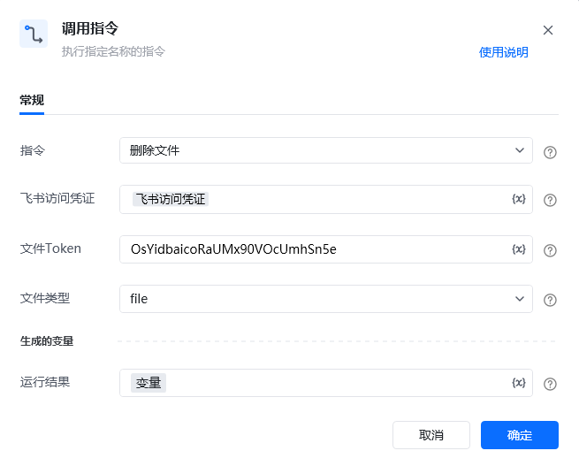

## <strong>一、指令概述</strong>

该 RPA 指令用于<strong>删除飞书云盘指定类型的文件</strong>，需配置飞书访问凭证、文件唯一标识（文件Token）及文件类型（如docx、file等），执行后返回删除任务 ID，适用于飞书文件的精准清理场景。

飞书官方开发文档参考：https://open.feishu.cn/document/server-docs/docs/drive-v1/file/delete
## <strong>二、调用参数配置示意</strong>

参数名称示例 / 默认值说明指令删除文件固定选择 “删除文件”，执行飞书文件删除操作。飞书访问凭证飞书访问凭证配置飞书开放平台的访问凭证（需具备文件删除权限，可通过 “获取飞书访问凭证” 指令生成），支持变量（界面显示 “\{x\}” 标识）。文件 TokenOsYid****************输入要删除文件的唯一标识 Token（需为飞书云盘合法文件的有效 Token），关键字符已打码，支持变量。文件类型docx / file / bitable选择待删除文件的类型（需与文件实际类型匹配，否则接口返回失败），下拉可选：- file：普通文件类型；- docx：新版文档类型；- bitable：多维表格类型；- doc：文档类型；- sheet：电子表格类型等，支持变量。生成的变量 - 运行结果变量（自定义变量名）存储文件删除操作的执行结果（包含任务 ID），需配置为自定义变量，后续流程可调用，支持变量。
## <strong>三、使用示例（删除新版文档场景）</strong>
### <strong>场景：删除飞书云盘类型为docx的文件（Token 为OsYid****************）。</strong>
#### <strong>参数配置：</strong>

• 指令：删除文件

• 飞书访问凭证：feishuAuthToken（通过 “获取飞书访问凭证” 指令生成的变量）

• 文件 Token：OsYid****************（文件唯一标识，关键字符已打码）

• 文件类型：docx

• 运行结果：deleteResult（自定义变量，存储删除结果）
#### <strong>执行流程：</strong>

调用该 RPA 指令后，RPA 会通过 feishuAuthToken 完成飞书 API 认证，根据打码后的文件 Token 和匹配的文件类型docx，执行文件删除操作；操作完成后，将包含任务 ID 的结果存入 deleteResult 变量，便于后续确认删除状态或记录操作日志。
## <strong>四、返回结果说明</strong>
### <strong>飞书 API 标准返回示例（成功场景）：</strong>

指令执行后，“运行结果” 变量（如deleteResult）会存储包含删除任务 ID 的 JSON 结果，格式如下：

\{ "code": 0, "msg": "success", "data": \{ "task_id": "7360595374803812356" \}\}
### <strong>响应字段含义：</strong>

• code：状态码，0 表示删除操作成功，非 0 为失败（具体错误码含义参考飞书官方文档）。

• msg：提示信息，success 表示删除成功。

• data.task_id：删除任务的唯一标识 ID，可用于追踪删除任务的执行状态（若需确认删除结果，可结合飞书任务查询接口使用）。
## <strong>五、注意事项</strong>

1. <strong>访问凭证权限</strong>：“飞书访问凭证” 需具备<strong>文件删除权限</strong>（如 “Delete file” 权限）且未过期，否则会返回 code=403（权限不足）错误。

2. <strong>文件类型匹配性</strong>：文件类型需与待删除文件的<strong>实际类型完全一致</strong>（如文件是新版文档则选docx，普通文件选file），否则接口会返回失败（如code=400 参数不匹配错误）。

3. <strong>文件 Token 准确性</strong>：文件Token 需为飞书云盘<strong>合法文件的有效 Token</strong>（打码不影响实际值校验），否则会返回 code=404（文件不存在）错误。

4. <strong>操作不可逆性</strong>：文件删除操作一旦执行，飞书云盘中的对应文件将被移除（若需恢复需依赖飞书回收站机制），请确保操作前确认文件无需保留。
## <strong>六、延伸应用</strong>

可结合 RPA 的 “获取文件夹中的文件清单” 指令，实现<strong>飞书云盘文件批量精准清理</strong>：例如先调用 “获取文件夹中的文件清单” 指令，筛选出类型为docx且满足清理条件的文件 Token 列表，再循环调用本 “删除文件” 指令，自动删除列表中的文件，替代人工手动逐个判断类型并删除的重复工作，提升文件清理效率。

<Info>
  使用指令过程中遇到问题？前往 [八爪鱼RPA 开发者社区问答板块](https://rpa.bazhuayu.com/community/questions) 提问，获取官方与社区帮助。
</Info>
