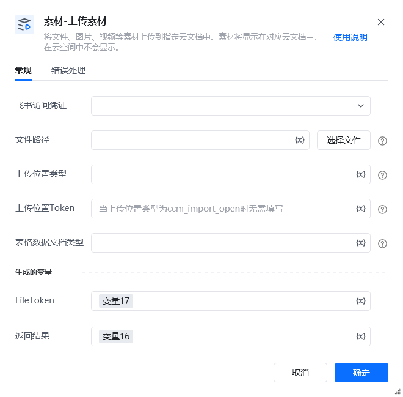

## 1. 功能说明

将文件、图片、视频等素材上传到指定飞书云文档中，素材仅在对应云文档内可见，不会在用户飞书云空间中直接展示。该指令底层基于飞书开放平台【上传素材】API（https://open.feishu.cn/document/server-docs/docs/drive-v1/media/upload_all[https://open.feishu.cn/document/server-docs/docs/drive-v1/media/upload_all](https://open.feishu.cn/document/server-docs/docs/drive-v1/media/upload_all)） 实现，支持多种上传位置类型与文档适配场景。

## 2. 配置参数

类型必填默认值说明下拉选择是-选择已配置的飞书访问凭证，用于飞书 API 身份验证。需提前在飞书开放平台创建应用，并确保应用拥有「上传图片和文件到文档」「管理云文档」等相关权限（参考飞书 API 所需 scopes）。字符串是-本地待上传文件的完整路径，可点击「选择文件」按钮直接选取，支持文件、图片、视频等素材格式。需注意文件大小不超过 20MB（超过需使用飞书分片上传 API），文件名长度不超过 250 个字符且符合合规要求。下拉选择是-对应飞书 API 的 parent_type 参数，指定素材上传的目标位置类型，可选值如下：- doc_image：旧版文档图片- docx_image：新版文档图片- sheet_image：电子表格图片- doc_file：旧版文档文件- docx_file：新版文档文件- sheet_file：电子表格文件- vc_virtual_background：VC 虚拟背景（灰度中，暂未开放）- bitable_image：多维表格图片- bitable_file：多维表格文件- moments：同事圈（灰度中，暂未开放）- ccm_import_open：云文档导入文件（适用于 CSV、XLSX 等文件导入场景）字符串否-对应飞书 API 的 parent_node 参数，即素材上传目标位置的唯一标识（云文档 / 文件夹 Token）：- 若「上传位置类型」为 doc_image/docx_image/sheet_image/doc_file/docx_file/sheet_file/bitable_image/bitable_file，需填写对应云文档的 Token（如新版文档 Token、多维表格 Token）；- 若「上传位置类型」为 ccm_import_open，该参数可不填。下拉选择否-仅当「上传位置类型」为 ccm_import_open，且待上传文件为 CSV 或 XLSX 格式时需填写，指定导入后生成的云文档类型，可选值：- sheet：电子表格- bitable：多维表格变量名是-存储上传成功后飞书返回的文件唯一标识（file_token），可作为后续指令（如任务-创建导入任务）的输入参数。变量名是-存储指令执行的完整结果（字典类型），包含执行状态、错误信息、原始响应等，具体格式可参考以下逻辑：- 成功：\{"success":true,"data":\{"file_token":"xxx"\},"file_token":"xxx"\}- 失败：\{"success":false,"code":"错误码","msg":"错误描述","raw_response":"原始响应内容"\}
## 3. 示例场景
场景 ：导入 CSV 文件为电子表格<strong>飞书访问凭证</strong>：选择已配置的飞书访问凭证；<strong>文件路径</strong>：C:/data/sales_data.csv；<strong>上传位置类型</strong>：选择 ccm_import_open；<strong>表格数据文档类型</strong>：选择 sheet；<strong>生成的变量 - FileToken</strong>：设置为 sales_file_token；<strong>返回结果</strong>：设置为 import_result。执行后，sales_file_token存储CSV文件的 file_token；import_result返回执行状态（如 \{"success":true,"data":\{"file_token":"boxcnrHpsg1QDqXAAAyachabcef"\}\}）。

## 4. 注意事项

常见错误错误类型可能原因解决方案<strong>授权失败（API 错误码 1061005）</strong>飞书访问凭证过期、无效，或应用无对应权限1. 检查并更新 tenant_access_token/user_access_token；2. 确认应用已添加「上传图片和文件到文档」「管理云文档」等 scopes；3. 参考飞书 API 权限配置文档（https://open.feishu.cn/document/server-docs/docs/drive-v1/media/upload_all[https://open.feishu.cn/document/server-docs/docs/drive-v1/media/upload_all](https://open.feishu.cn/document/server-docs/docs/drive-v1/media/upload_all)）<strong>文件不存在 / 路径错误</strong>「文件路径」配置错误，或文件已被移动 / 删除1. 核对本地文件路径是否完整（如 C:/images/demo.png）；2. 确认文件未被占用、移动或删除<strong>文件大小超限（API 错误码 1061043）</strong>上传文件超过 20MB（飞书单文件上传限制）1. 压缩文件体积至 20MB 以内；<strong>上传位置无效（API 错误码 1061044）</strong>「上传位置 Token」不存在、已删除，或与「上传位置类型」不匹配1. 核对「上传位置 Token」是否正确（如文档 Token、文件夹 Token）；2. 确认「上传位置类型」与 Token 类型匹配（如 bitable_image 对应多维表格 Token）；3. 检查目标文档 / 文件夹是否被删除<strong>表格文档类型未配置</strong>「上传位置类型」为 ccm_import_open，且文件为 CSV/XLSX，但未选择「表格数据文档类型」补充选择「表格数据文档类型」（sheet 或 bitable），确保与文件格式匹配

<Info>
  使用指令过程中遇到问题？前往 [八爪鱼RPA 开发者社区问答板块](https://rpa.bazhuayu.com/community/questions) 提问，获取官方与社区帮助。
</Info>
