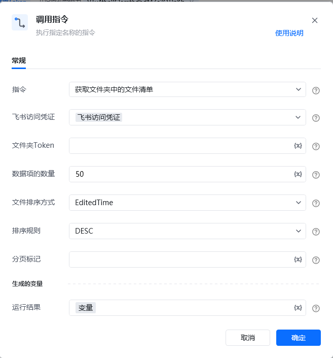
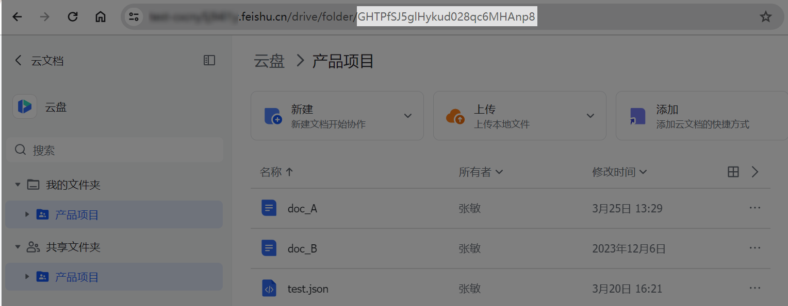

## <strong>一、指令概述</strong>

该 RPA 指令用于<strong>获取飞书指定文件夹下的文件清单</strong>，支持通过文件夹 Token、数据项数量、排序方式（编辑时间 / 创建时间）、排序规则（升序 / 降序）等条件筛选文件，返回文件列表及分页信息，适用于飞书云盘文件批量管理、内容盘点等场景。

飞书官方开发文档参考：https://open.feishu.cn/document/server-docs/docs/drive-v1/folder/list?appId=cli_a8c3f0c5070ad00d
## <strong>二、调用参数配置示意</strong>

参数名称示例 / 默认值说明指令获取文件夹中的文件清单固定选择 “获取文件夹中的文件清单”，执行飞书文件夹文件查询操作。飞书访问凭证飞书访问凭证配置飞书开放平台的访问凭证（需具备文件夹文件查询权限，可通过 “获取飞书访问凭证” 指令生成），支持变量（界面显示 “\{x\}” 标识）。文件夹 Tokenfldbc****************输入目标文件夹的唯一标识 Token（需为飞书云盘合法文件夹 Token），关键字符已打码，支持变量。数据项的数量50单次查询返回的文件数量（需为正整数，飞书有默认上限，超出需分页），支持变量。文件排序方式EditedTime / CreatedTime选择文件排序依据，下拉可选：- EditedTime：按文件编辑时间排序；- CreatedTime：按文件创建时间排序。排序规则DESC / ASC选择文件排序规则，下拉可选：- DESC：降序（时间从晚到早）；- ASC：升序（时间从早到晚）。分页标记（空 /分页标记值）分页查询时，传入上一页返回的分页标记可获取下一页数据，首次查询可留空，支持变量。生成的变量 - 运行结果变量（自定义变量名）存储文件夹文件清单的查询结果（包含文件列表、分页信息等），需配置为自定义变量，后续流程可调用，支持变量。
## <strong>三、使用示例（获取文件夹文件清单场景）</strong>
### <strong>场景：获取飞书云盘文件夹（Token 为fldbc****************）下的文件清单，按编辑时间降序排列，单次返回 50 条。</strong>
#### <strong>参数配置：</strong>

• 指令：获取文件夹中的文件清单

• 飞书访问凭证：feishuAuthToken（通过 “获取飞书访问凭证” 指令生成的变量）

• 文件夹 Token：fldbc****************（文件夹唯一标识，关键字符已打码）

在飞书云盘的文件夹页面，通过复制该文件夹的浏览器链接，链接中folder/后续的字符串，即为该文件夹对应的 token

• 数据项的数量：50

• 文件排序方式：EditedTime

• 排序规则：DESC

• 分页标记：（留空，首次查询）

• 运行结果：folderFileList（自定义变量，存储查询结果）
#### <strong>执行流程：</strong>

调用该 RPA 指令后，RPA 会通过 feishuAuthToken 完成飞书 API 认证，根据打码后的文件夹 Token 及排序条件，查询该文件夹下的文件清单；查询完成后，返回文件列表（最多 50 条，按编辑时间降序排列）及分页信息（若有更多数据），便于后续文件筛选、批量操作等流程。
## <strong>四、返回结果说明</strong>
### <strong>1. 飞书 API 标准返回示例（成功场景，关键信息已打码）：</strong>

指令执行后，“运行结果” 变量（如folderFileList）会存储包含文件清单的 JSON 结果，格式如下：

\{ "code":0, "data":\{ "files":[ \{ "name":"test pdf.pdf", "parent_token":"fldbc****************", "token":"boxbc****************", "type":"file", "created_time":"1679277808", "modified_time":"1679277808", "owner_id":"ou_****************", "url":"https://feishu.cn/file/boxbc****************" \}, \{ "name":"test file.docx", "parent_token":"fldcn****************", "shortcut_info":\{ "target_token":"boxcn****************", "target_type":"file" \}, "token":"nodcn****************", "type":"shortcut", "created_time":"1679295364", "modified_time":"1679295364", "owner_id":"ou_****************", "url":"https://feishu.cn/file/boxcn****************" \}, \{ "name":"test docx", "parent_token":"fldcn****************", "token":"doxcn****************", "type":"docx", "created_time":"1679295364", "modified_time":"1679295364", "owner_id":"ou_****************", "url":"https://feishu.cn/docx/doxcn****************" \}, \{ "name":"test sheet", "parent_token":"fldcn****************", "token":"shtcn****************", "type":"sheet", "created_time":"1679295364", "modified_time":"1679295364", "owner_id":"ou_****************", "url":"https://feishu.cn/sheets/shtcn****************" \} ], "has_more":false \}, "msg":"success"\}
### <strong>2. 响应字段含义：</strong>

• code：状态码，0 表示查询成功，非 0 为失败（具体错误码含义参考飞书官方文档）。

• msg：提示信息，success 表示查询成功。

• data：核心返回数据：

◦ files：数组，包含文件夹下的文件信息，每条文件信息包含：

▪ name：文件名；

▪ parent_token：父文件夹 Token（关键字符已打码）；

▪ token：文件唯一标识 Token（关键字符已打码）；

▪ type：文件类型（如file、shortcut、docx、sheet等）；

▪ created_time/modified_time：文件创建 / 修改时间戳；

▪ owner_id：文件所有者 ID（关键字符已打码）；

▪ url：文件访问链接（关键字符已打码）。

◦ has_more：布尔值，true 表示还有更多文件可分页查询，false 表示当前为最后一页。
## <strong>五、注意事项</strong>

1. <strong>访问凭证有效性</strong>：“飞书访问凭证” 需具备<strong>文件夹文件查询权限</strong>且未过期（建议通过 “获取飞书访问凭证” 指令动态生成有效凭证），否则会导致 code≠0 或查询失败。

2. <strong>文件夹 Token 准确性</strong>：文件夹Token 需为飞书云盘<strong>合法文件夹的有效 Token</strong>（打码不影响实际值校验），否则会返回空结果或错误。

3. <strong>分页与数据量控制</strong>：若文件夹文件数量超过 “数据项的数量”，需结合 “分页标记” 进行分页查询；建议根据实际需求合理设置 “数据项的数量”，避免单次请求数据量过大。

4. <strong>打码信息说明</strong>：返回结果中token、owner_id、url等敏感信息已打码，实际使用时会返回真实值（仅文档展示做隐私保护）。
## <strong>六、延伸应用</strong>

可结合 RPA 的 “文件下载”“数据筛选” 指令，实现<strong>飞书云盘文件自动化管理</strong>：例如定期获取指定文件夹的文件清单，筛选出更新时间在 7 天内的文件，调用 “文件下载” 指令将这些文件备份到本地，替代人工手动盘点和下载的重复工作，提升云盘文件管理效率。

<Info>
  使用指令过程中遇到问题？前往 [八爪鱼RPA 开发者社区问答板块](https://rpa.bazhuayu.com/community/questions) 提问，获取官方与社区帮助。
</Info>
