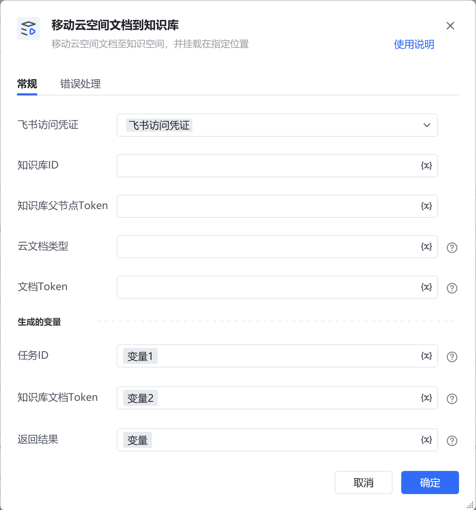

## 1. 功能说明

将飞书云空间中的文档迁移至指定知识库空间并挂载到指定位置，支持异步处理：若迁移已完成（或文档已在知识库中），直接返回知识库文档 Token；若未完成，返回任务 ID，需配合【查询移动云空间文档至知识库结果】获取最终状态。底层基于飞书 API（https://open.feishu.cn/document/server-docs/docs/wiki-v2/task/move_docs_to_wiki[https://open.feishu.cn/document/server-docs/docs/wiki-v2/task/move_docs_to_wiki](https://open.feishu.cn/document/server-docs/docs/wiki-v2/task/move_docs_to_wiki)）实现。

## 2. 配置项说明

配置项必填默认值说明<strong>飞书访问凭证</strong>是-选择已配置的飞书访问凭证（tenant_access_token/user_access_token），需具备文档管理、知识库编辑权限。<strong>知识库 ID</strong>是-目标知识库的唯一标识（对应飞书 API 的space_id）。<strong>知识库父节点 Token</strong>是-文档在知识库中挂载的父节点唯一标识（对应飞书 API 的parent_wiki_token）。<strong>云文档类型</strong>是-待迁移文档的类型，可选值：doc：旧版文档sheet：表格bitable：多维表格mindnote：思维导图docx：新版文档file：文件slides：幻灯片<strong>文档 Token</strong>是-飞书云空间中待迁移文档的唯一标识（对应飞书 API 的obj_token）。<strong>任务 ID</strong>是-存储迁移任务的唯一标识（若迁移未完成），用于后续查询任务结果。<strong>知识库文档 Token</strong>是-存储迁移完成后的知识库文档唯一标识（若迁移已完成）。<strong>返回结果</strong>是-存储完整的 API 响应结果（字典类型），包含状态、错误信息等。

<strong>返回结果逻辑</strong>若迁移已完成（或文档已在知识库）：知识库文档Token存储结果标识，任务ID为空。若迁移未完成：任务ID存储任务标识，需调用【查询移动云空间文档至知识库结果】获取状态。

## 3. 示例场景

将云空间中docx类型的文档（Token：doccaKQ1k3p******8Vabcef）迁移至知识库（ID：1565676577122621）的父节点（Token：wikcnKQ1k3p******8Vabcef）：<strong>飞书访问凭证</strong>：选择已配置的凭证；<strong>知识库 ID</strong>：填写1565676577122621；<strong>知识库父节点 Token</strong>：填写wikcnKQ1k3p******8Vabcef；<strong>云文档类型</strong>：填写docx；<strong>文档 Token</strong>：填写doccaKQ1k3p******8Vabcef；<strong>任务ID</strong>：填写变量：任务ID<strong>知识库文档Token</strong>：填写变量：知识库文档Token<strong>返回结果</strong>：填写变量：返回结果执行后，若迁移完成，变量“知识库文档Token”存储知识库文档 Token；若未完成，变量“任务ID”存储任务 ID，可根据任务 ID，配合【查询移动云空间文档至知识库结果】获取最终状态。

## 4. 注意事项

常见问题错误类型API 错误码可能原因解决方案参数错误131002文档类型填写错误（如传 “excel” 而非 “sheet”）、文档 Token 格式无效、知识库空间 ID 不存在核对文档类型是否为允许值，检查 文档Token 和 知识库ID 的准确性超出限制131003知识库节点总数 / 层级 / 单层节点数超过上限，或单次迁移节点数超 2000 个清理知识库冗余节点，拆分迁移任务（单次迁移节点数≤2000），确保目录树层级≤50 层数据不存在131005待迁移文档已删除（document not found）、知识库空间不存在（space not found）、父节点不存在（node not found）确认源文档、知识库空间、父节点的有效性，重新获取正确的 Token/ID权限不足131006无文档管理权限、无原文件夹 / 目标父节点编辑权限、应用未开通 Wiki 操作权限1. 为应用添加 “移动 Wiki 空间节点” 或 “查看、编辑和管理 Wiki” 权限；2. 将应用添加为知识库空间管理员（参考飞书权限配置文档）；3. 确保当前凭证对应的用户具备文档管理权限服务器内部错误131007飞书 API 服务临时异常提供logid，联系飞书技术支持排查，稍后重试

<Info>
  使用指令过程中遇到问题？前往 [八爪鱼RPA 开发者社区问答板块](https://rpa.bazhuayu.com/community/questions) 提问，获取官方与社区帮助。
</Info>
