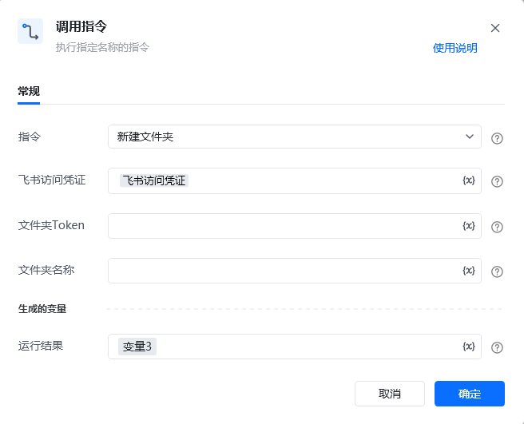

## <strong>一、指令概述</strong>

该 RPA 指令用于<strong>在飞书云盘创建新文件夹</strong>，支持在根目录或指定父文件夹下生成文件夹，返回新文件夹的唯一标识（Token）和访问链接，适用于飞书云盘文件分类管理、自动化归档等场景。

飞书官方开发文档参考：https://open.feishu.cn/document/server-docs/docs/drive-v1/folder/create_folder
## <strong>二、调用参数配置示意</strong>

参数名称示例 / 默认值说明指令新建文件夹固定选择 “新建文件夹”，执行飞书云盘文件夹创建操作。飞书访问凭证飞书访问凭证配置飞书开放平台的访问凭证（需具备文件夹创建权限，可通过 “获取飞书访问凭证” 指令生成），支持变量（界面显示 “\{x\}” 标识）。文件夹 Token（空 /fldbc****************）输入父文件夹的唯一标识 Token（可选，不填则在飞书云盘根目录创建新文件夹），关键字符已打码，支持变量。文件夹名称2025Q4报表输入新建文件夹的名称（需符合飞书云盘命名规范，支持变量）。生成的变量 - 运行结果变量3（自定义变量名）存储新建文件夹操作的执行结果（包含新文件夹的 Token 和访问链接），需配置为自定义变量，后续流程可调用，支持变量。
## <strong>三、使用示例（在指定父文件夹下新建文件夹场景）</strong>
### <strong>场景：在飞书云盘父文件夹（Token：fldbc****************）下，创建名为 “2025Q4 报表” 的新文件夹。</strong>
#### <strong>参数配置：</strong>

• 指令：新建文件夹

• 飞书访问凭证：feishuAuthToken（通过 “获取飞书访问凭证” 指令生成的变量）

• 文件夹 Token：fldbc****************（父文件夹唯一标识，关键字符已打码）

• 文件夹名称：2025Q4报表

• 运行结果：createFolderResult（自定义变量，存储创建结果）
#### <strong>执行流程：</strong>

调用该 RPA 指令后，RPA 会通过 feishuAuthToken 完成飞书 API 认证，根据打码后的父文件夹 Token 和文件夹名称，在指定位置创建新文件夹；创建完成后，将包含新文件夹 Token 和访问链接的结果存入 createFolderResult 变量，便于后续文件移动、分类管理等操作引用该文件夹。
## <strong>四、返回结果说明</strong>
### <strong>飞书 API 标准返回示例（成功场景）：</strong>

指令执行后，“运行结果” 变量（如createFolderResult）会存储包含新文件夹信息的 JSON 结果，格式如下：

\{ "code": 0, "msg": "success", "data": \{ "token": "fldbcddUuPz8VwnpPx5oc2abcef", "url": "https://feishu.cn/drive/folder/fldbcddUuPz8VwnpPx5oc2abcef" \}\}
### <strong>响应字段含义：</strong>

• code：状态码，0 表示文件夹创建成功，非 0 为失败（具体错误码含义参考飞书官方文档）。

• msg：提示信息，success 表示创建成功。

• data：核心返回数据：

◦ token：新文件夹的唯一标识 Token（用于后续文件夹操作的身份关联，如移动文件、创建子文件夹等）；

◦ url：新文件夹的飞书云盘访问链接，可直接跳转至该文件夹页面。
## <strong>五、注意事项</strong>

1. <strong>访问凭证权限</strong>：“飞书访问凭证” 需具备<strong>文件夹创建权限</strong>（如 “Create folder” 权限）且未过期，否则会返回 code=403（权限不足）错误。

2. <strong>文件夹名称规范性</strong>：文件夹名称需符合飞书云盘命名规则（不可包含非法字符、长度需在限制范围内），否则会返回创建失败（如code=1062501 名称无效错误）。

3. <strong>父文件夹 Token 有效性</strong>：若填写 “文件夹 Token”，需确保其为飞书云盘<strong>合法存在的文件夹 Token</strong>（打码不影响实际值校验），否则会返回 code=404（父文件夹不存在）错误。

4. <strong>创建频率限制</strong>：飞书 API 对文件夹创建操作有频率限制，避免短时间内批量创建过多文件夹，否则可能触发限流（code=1061045），需合理控制调用节奏。
## <strong>六、延伸应用</strong>

可结合 RPA 的 “移动文件”“新建文件夹” 指令，实现<strong>飞书云盘自动化分类归档</strong>：例如根据业务周期（如季度、月份）自动创建 “2025Q4 报表”“2025Q4 素材” 等文件夹，再调用 “移动文件” 指令将对应周期的文件自动移动到新建文件夹中，替代人工手动创建和整理文件夹的重复工作，提升云盘管理效率。

<Info>
  使用指令过程中遇到问题？前往 [八爪鱼RPA 开发者社区问答板块](https://rpa.bazhuayu.com/community/questions) 提问，获取官方与社区帮助。
</Info>
