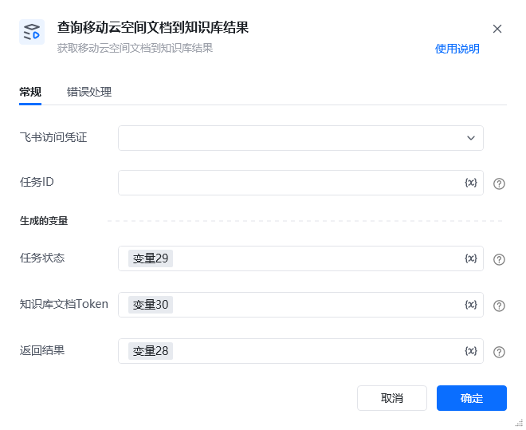

## 1. 功能说明

查询【移动云空间文档到知识库】异步任务的执行结果，获取任务的最终状态及生成的知识库文档标识。该指令底层基于飞书开放平台【获取 Wiki异步任务结果】API 实现（https://open.feishu.cn/document/server-docs/docs/wiki-v2/task/get[https://open.feishu.cn/document/server-docs/docs/wiki-v2/task/get](https://open.feishu.cn/document/server-docs/docs/wiki-v2/task/get)），仅支持查询任务类型为move的文档迁移任务，且仅限任务创建者发起查询。

## 2. 配置项说明

<strong>飞书访问凭证</strong>是-选择已配置的飞书访问凭证，需确保对应应用已开通 Wiki 相关权限，且为任务创建者。<strong>任务 ID</strong>是-填写【移动云空间文档到知识库】指令返回的任务唯一标识，示例值：7037044037068177428-075c9481e6a0007c1df689dfbe5b55a08b6b06f7<strong>任务状态</strong>是-存储迁移任务的当前状态，可选值：移动成功、处理中、移动失败<strong>知识库文档 Token</strong>是-若任务状态为 “移动成功”，存储生成的知识库文档token；任务未完成或失败时为空<strong>返回结果</strong>是-存储查询请求的完整结果（字典类型），包含状态码、错误信息等，格式参考下方示例

<strong>底层飞书 API 依赖</strong>

该指令基于飞书【获取 Wiki异步任务结果】API 实现，需要满足以下条件：应用需开通以下任一权限：查看 Wiki 空间信息、查看编辑管理 Wiki、查看所有 Wiki仅任务创建者（用户或应用）可发起查询应用需被授权为目标 Wiki 空间的管理员或成员

<strong>返回结果示例</strong><strong>查询成功（任务处理中）</strong>\{
"success": true,
"code": 0,
"msg": "success",
"data": \{
"task": \{
"task_id": "7037044037068177428-075c9481e6a0007c1df689dfbe5b55a08b6b06f7",
"move_result": [],
"status": 1,
"status_msg": "processing"
\}
\},
"task_id": "7037044037068177428-075c9481e6a0007c1df689dfbe5b55a08b6b06f7"
\}<strong>查询成功（迁移成功，单文档）</strong>\{
"success": true,
"code": 0,
"msg": "success",
"data": \{
"task": \{
"task_id": "7037044037068177428-075c9481e6a0007c1df689dfbe5b55a08b6b06f7",
"move_result": [
\{
"node": \{
"space_id": "6946843325487912356",
"node_token": "wikcnKQ1k3p******8Vabcef",
"obj_token": "doccnzAaOD******8g9hprd",
"obj_type": "doc",
"title": "项目需求文档"
\},
"status": 0,
"status_msg": "success"
\}
],
"status": 0,
"status_msg": "success"
\}
\},
"task_id": "7037044037068177428-075c9481e6a0007c1df689dfbe5b55a08b6b06f7"
\}<strong>查询失败（权限不足）</strong>\{
"success": false,
"code": 131006,
"msg": "permission denied",
"log_id": "log_def456",
"raw_response": "\{\"code\":131006,\"msg\":\"permission denied\",\"data\":\{\}\}"
\}

3. 示例场景先执行【移动云空间文档到知识库】，生成任务ID（存储到变量：任务ID）。执行本指令：<strong>飞书访问凭证</strong>：选择与迁移任务一致的凭证。<strong>任务 ID</strong>：填写变量：任务ID。<strong>任务状态</strong>：设置为变量：任务ID。<strong>知识库文档 Token</strong>：设置为变量：知识库文档Token。<strong>返回结果</strong>：设置为变量：返回结果。

检查变量“任务状态”：若为 “处理中”，等待 5 秒后再次执行本指令；若为 “移动成功”，则通过变量“知识库文档 Token”的内容访问知识库文档。

## 4.  注意事项

常见问题错误类型API 错误码可能原因解决方案参数错误131002任务 ID 格式错误核对任务 ID 准确性数据不存在131005任务 ID 不存在、Wiki 空间或文档不存在确认任务 ID 是否有效，检查源文档和目标 Wiki 空间状态权限不足131006非任务创建者查询、应用无 Wiki 权限、无文档资源权限确保由任务创建者发起查询；为应用开通 Wiki 权限；将应用添加为 Wiki 空间管理员服务器内部错误131007飞书 API 服务异常根据logid，联系飞书技术支持排查网络异常-网络波动导致请求失败检查网络连接，重试查询指令

<Info>
  使用指令过程中遇到问题？前往 [八爪鱼RPA 开发者社区问答板块](https://rpa.bazhuayu.com/community/questions) 提问，获取官方与社区帮助。
</Info>
