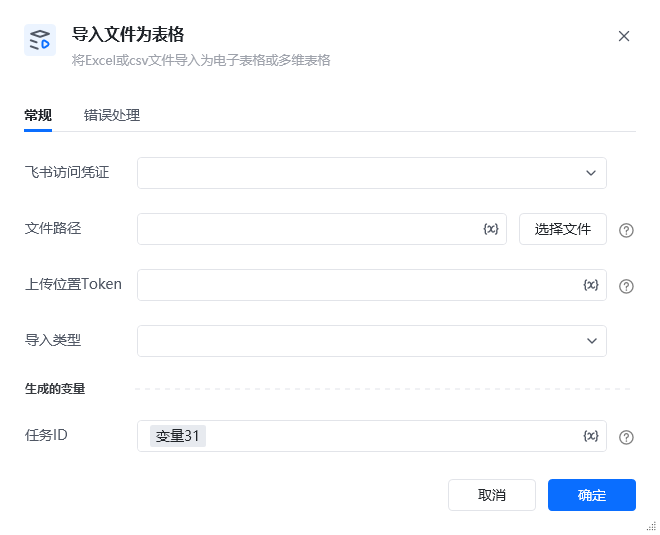

## 1. 功能说明

将本地的 Excel（.xlsx/.xls）或 CSV（.csv）文件，导入为飞书在线电子表格或多维表格。该指令内部封装了 “上传文件至飞书素材库→创建导入任务” 的完整流程，为异步任务，需配合【任务 - 查询导入任务结果】指令获取最终导入状态。

## 2. 配置项说明

配置项必填默认值说明<strong>飞书访问凭证</strong>是-选择已配置的飞书访问凭证，需确保对应应用已开通云文档 “导入” 和 “上传” 相关权限。<strong>文件路径</strong>是-填写本地待导入文件的完整路径（如 C:\data\销售数据.xlsx），或点击「选择文件」按钮直接选取文件。支持格式：.xlsx、.xls、.csv。<strong>上传位置 Token</strong>是-飞书云空间中目标文件夹的 token，导入后的表格将存放在此文件夹下。<strong>导入类型</strong>是-选择导入后生成的表格类型，可选值：• 电子表格：生成飞书在线表格• 多维表格：生成飞书多维表格<strong>任务 ID</strong>是-存储内部生成的导入任务唯一标识（ticket），用于后续【查询导入任务结果】的入参。

<strong>底层逻辑与依赖</strong>

该指令封装了飞书两个核心 API 的调用：<strong>上传素材 API</strong>：将本地表格文件上传至飞书素材库，获取 file_token。<strong>创建导入任务 API</strong>：使用 file_token 和指定的导入类型，创建异步表格导入任务，返回 task_id。

<strong> 返回结果说明</strong>

指令执行后，主要通过<strong>生成的变量</strong>返回关键信息：<strong>任务 ID</strong>：存储导入任务的唯一标识（如 task_9876543210fedcba），用于后续查询任务结果。

## 3. 示例场景

将本地 CSV 销售数据导入为飞书多维表格：<strong>飞书访问凭证</strong>：选择已配置的飞书凭证。<strong>文件路径</strong>：填写 C:\data\2026销售数据.csv（或点击「选择文件」选取该文件）。<strong>上传位置 Token</strong>：填写目标文件夹的 token（如 fldcnabcdef1234567890）。<strong>导入类型</strong>：选择「多维表格」。<strong>生成的变量 - 任务 ID</strong>：设置为 import_table_task_id。执行指令后，import_table_task_id 存储任务 ID，后续通过【查询导入任务结果】获取最终状态
## 4. 注意事项

常见问题错误类型可能原因解决方案<strong>文件不存在或无权限</strong>填写的文件路径错误，或 RPA 机器人无文件读取权限核对文件路径准确性，确保机器人对目标文件有读权限。<strong>文件格式不支持</strong>上传的文件不在 Excel/CSV 格式列表中仅上传 .xlsx、.xls、.csv 格式的文件。<strong>上传位置 Token 无效</strong>目标文件夹 token 不存在或已被删除重新获取目标文件夹的有效 token。<strong>导入类型选择错误</strong>选择了不支持的导入类型从下拉选项中选择「电子表格」或「多维表格」。<strong>权限不足</strong>飞书应用未开通云文档上传 / 导入权限参考飞书权限配置文档，为应用添加对应权限。<strong>网络异常</strong>网络波动导致文件上传或任务创建失败检查网络连接，并重试指令。

<Info>
  使用指令过程中遇到问题？前往 [八爪鱼RPA 开发者社区问答板块](https://rpa.bazhuayu.com/community/questions) 提问，获取官方与社区帮助。
</Info>
