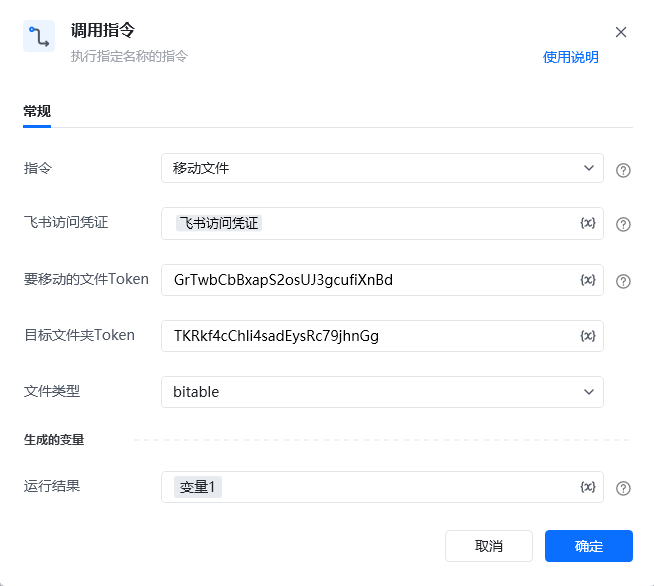

## <strong>一、指令概述</strong>

该 RPA 指令用于<strong>将飞书云盘指定类型的文件移动到目标文件夹</strong>，需配置飞书访问凭证、待移动文件的唯一标识（文件 Token）、目标文件夹的唯一标识（文件夹 Token）及文件类型（如bitable、docx等），执行后返回移动任务 ID，适用于飞书文件的精准分类整理场景。

飞书官方开发文档参考：https://open.feishu.cn/document/server-docs/docs/drive-v1/file/move
## <strong>二、调用参数配置示意</strong>

参数名称示例 / 默认值说明指令移动文件固定选择 “移动文件”，执行飞书文件移动操作。飞书访问凭证飞书访问凭证配置飞书开放平台的访问凭证（需具备文件移动权限，可通过 “获取飞书访问凭证” 指令生成），支持变量（界面显示 “\{x\}” 标识）。要移动的文件 TokenGrTwb****************输入待移动文件的唯一标识 Token（需为飞书云盘合法文件的有效 Token），关键字符已打码，支持变量。目标文件夹 TokenTKRkf****************输入目标文件夹的唯一标识 Token（需为飞书云盘合法文件夹的有效 Token），关键字符已打码，支持变量。文件类型bitable / docx / file选择待移动文件的类型（需与文件实际类型匹配，否则接口返回失败），下拉可选：- file：普通文件类型；- docx：新版文档类型；- bitable：多维表格类型；- doc：文档类型；- sheet：电子表格类型等，支持变量。生成的变量 - 运行结果变量1（自定义变量名）存储文件移动操作的执行结果（包含任务 ID），需配置为自定义变量，后续流程可调用，支持变量。
## <strong>三、使用示例（移动多维表格场景）</strong>
### <strong>场景：将飞书云盘类型为bitable的文件（Token 为GrTwb****************）移动到目标文件夹（Token 为TKRkf****************）。</strong>
#### <strong>参数配置：</strong>

• 指令：移动文件

• 飞书访问凭证：feishuAuthToken（通过 “获取飞书访问凭证” 指令生成的变量）

• 要移动的文件 Token：GrTwb****************（文件唯一标识，关键字符已打码）

• 目标文件夹 Token：TKRkf****************（文件夹唯一标识，关键字符已打码）

• 文件类型：bitable

• 运行结果：moveResult（自定义变量，存储移动结果）
#### <strong>执行流程：</strong>

调用该 RPA 指令后，RPA 会通过 feishuAuthToken 完成飞书 API 认证，根据打码后的文件 Token、目标文件夹 Token 及匹配的文件类型bitable，执行文件移动操作；操作完成后，将包含任务 ID 的结果存入 moveResult 变量，便于后续确认移动状态或记录操作日志。
## <strong>四、返回结果说明</strong>
### <strong>飞书 API 标准返回示例（成功场景）：</strong>

指令执行后，“运行结果” 变量（如moveResult）会存储包含移动任务 ID 的 JSON 结果，格式如下：

\{ "code": 0, "msg": "success", "data": \{ "task_id": "7360595374803812356" \}\}
### <strong>响应字段含义：</strong>

• code：状态码，0 表示移动操作成功，非 0 为失败（具体错误码含义参考飞书官方文档）。

• msg：提示信息，success 表示移动成功。

• data.task_id：移动任务的唯一标识 ID，可用于追踪移动任务的执行状态（若需确认移动结果，可结合飞书任务查询接口使用）。
## <strong>五、注意事项</strong>

1. <strong>访问凭证权限</strong>：“飞书访问凭证” 需具备<strong>文件移动权限</strong>（如 “Move file” 权限）且未过期，否则会返回 code=403（权限不足）错误。

2. <strong>文件类型匹配性</strong>：文件类型需与待移动文件的<strong>实际类型完全一致</strong>（如文件是多维表格则选bitable，普通文件选file），否则接口会返回失败（如code=400 参数不匹配错误）。

3. <strong>Token 准确性</strong>：要移动的文件Token 和 目标文件夹Token 需为飞书云盘<strong>合法有效 Token</strong>（打码不影响实际值校验），否则会返回 code=404（资源不存在）错误。

4. <strong>操作影响</strong>：文件移动后，原路径将不再保留该文件，仅存于目标文件夹中，请确保目标文件夹正确且操作前确认文件移动的必要性。
## <strong>六、延伸应用</strong>

可结合 RPA 的 “获取文件夹中的文件清单” 指令，实现<strong>飞书云盘文件批量精准移动</strong>：例如先调用 “获取文件夹中的文件清单” 指令，筛选出类型为bitable且满足移动条件的文件 Token 列表，再循环调用本 “移动文件” 指令，将这些文件自动移动到指定目标文件夹，替代人工手动逐个判断类型并移动的重复工作，提升文件整理效率。

<Info>
  使用指令过程中遇到问题？前往 [八爪鱼RPA 开发者社区问答板块](https://rpa.bazhuayu.com/community/questions) 提问，获取官方与社区帮助。
</Info>
