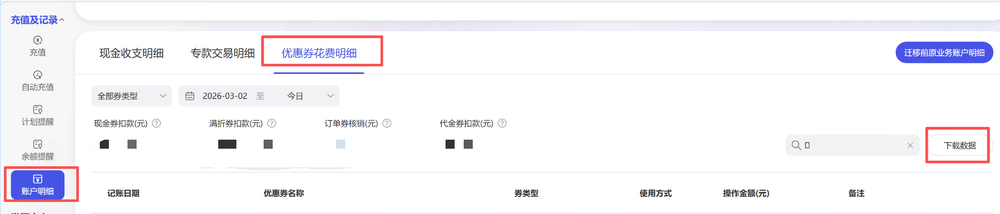
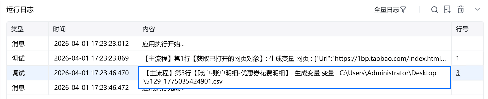

# 描述

获取账户-账户明细-优惠券花费明细数据，保存到指定位置

# 配置说明
## 输入

<strong>网页对象:</strong>

任意一个已登录万象台无界版的网页对象

<strong>券类型:</strong>

选择券类型

<strong>自定义开始日期:</strong>

最少选择 1 天，格式必须为：格式：YYYY-MM-DD，选填，若不填则使用默认日期

<strong>自定义结束日期:</strong>

最少选择 1 天，格式必须为：格式：YYYY-MM-DD，选填，若不填则使用默认日期

<strong>优惠券的ID/名称:</strong>

填写优惠券的ID/名称，选填，若不填则默认全部数据

<strong>保存文件夹：</strong>

选择文件保存路径

<strong>自定义文件名称：</strong>

自定义文件名称，若不填则使用默认文件名
## 输出

<strong>文件路径：</strong>

输出完整的文件路径，文本类型
# 使用示例

# 运行结果

<Info>
  使用指令过程中遇到问题？前往 [八爪鱼RPA 开发者社区问答板块](https://rpa.bazhuayu.com/community/questions) 提问，获取官方与社区帮助。
</Info>
