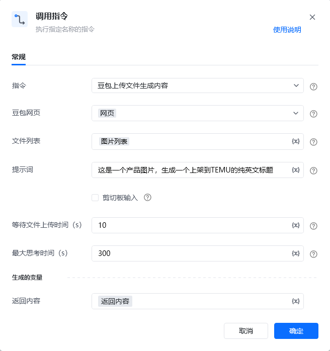

## <strong>一、指令概述</strong>

该 RPA 指令用于通过<strong>豆包网页端</strong>，上传指定文件（如图片列表）并结合自定义提示词，让豆包生成目标内容（如本例中 “上架到 TEMU 的纯英文标题”），最终将生成结果存储到指定变量，为后续业务流程（如电商平台商品上架）提供内容支持。
## <strong>二、调用参数配置示意</strong>

参数名称示例 / 默认值说明指令豆包上传文件生成内容固定选择 “豆包上传文件生成内容”，表示执行该指令。豆包网页网页选择豆包的访问载体（当前仅支持 “网页” 选项）。文件列表图片列表（自定义变量）输入存储待上传文件（如图片）的列表变量，支持提前定义的变量（界面显示 “{x}” 标识）。提示词这是一组产品图片，生成一个上架到TEMU的纯英文标题输入引导豆包生成内容的提示文本，需清晰描述生成需求，支持变量。剪切板输入（未勾选，可选）勾选后可从剪切板获取输入内容（本例未使用，依场景选择）。等待文件上传时间 (s)10输入等待文件上传完成的时长（单位：秒），需根据文件大小、网络情况合理设置，支持变量。最大思考时间 (s)300输入豆包生成内容的最长等待时长（单位：秒），超时则指令可能中断，支持变量。生成的变量 - 返回内容返回内容（自定义变量）存储豆包生成的最终内容，需配置为自定义变量，后续流程可调用该变量，支持变量。
## <strong>三、使用示例（TEMU 产品纯英文标题生成场景）</strong>
### <strong>场景：上传产品图片列表，让豆包生成适合上架到 TEMU 的纯英文产品标题。</strong>
#### <strong>参数配置：</strong>

• 指令：豆包上传文件生成内容

• 豆包网页：网页

• 文件列表：productImages（提前定义的 “图片列表” 变量，存储待上传的产品图片路径集合）

• 提示词：This is a set of product images, generate a pure English title for TEMU listing.（或中文提示词 “这是一组产品图片，生成一个上架到 TEMU 的纯英文标题”）

• 等待文件上传时间 (s)：15（因图片较多，适当延长上传等待时间）

• 最大思考时间 (s)：300

• 返回内容：temuEnglishTitle（自定义变量，用于存储生成的英文标题）
#### <strong>执行流程：</strong>

调用该 RPA 指令，按上述参数配置后执行，RPA 会自动打开豆包网页，上传productImages变量对应的图片列表，发送提示词，等待豆包生成内容后，将结果存入temuEnglishTitle变量。
## <strong>四、运行效果</strong>

豆包网页会完成文件上传与内容生成，“返回内容” 变量（如temuEnglishTitle）会被赋值为豆包生成的纯英文标题（如Fashion Women's Casual Loose Crew Neck T-Shirt）。
## <strong>五、注意事项</strong>

1. <strong>网页环境有效性</strong>：需确保 RPA 能正常访问豆包网页（网络通畅、登录状态有效），否则文件上传或内容生成会失败。

2. <strong>文件列表合法性</strong>：“文件列表” 变量需存储<strong>有效且可访问的文件路径</strong>（如图片需存在于本地 / 可被 RPA 读取），否则上传会报错。

3. <strong>提示词清晰性</strong>：提示词需明确生成需求（如 “纯英文”“TEMU 上架标题”），否则豆包生成的内容可能不符合预期。

4. <strong>时间参数合理性</strong>：“等待文件上传时间” 需匹配文件大小与网络速度（大文件 / 慢网络需延长）；“最大思考时间” 需考虑豆包生成复杂内容的耗时，避免过早中断。

5. <strong>变量配置规范性</strong>：“文件列表” 和 “返回内容” 需配置为合法变量（如提前定义变量名、确保变量类型匹配），否则无法正确传递 / 存储数据。
## <strong>六、延伸应用</strong>

可结合 RPA 的「电商平台操作」指令（如 TEMU 商品上架），将 “返回内容” 变量中的英文标题直接填入上架表单；或结合「文本处理」指令，对生成的标题进一步优化（如长度裁剪、关键词强化），实现 “内容生成 - 自动化上架” 的全流程闭环。

<Info>
  使用指令过程中遇到问题？前往 [八爪鱼RPA 开发者社区问答板块](https://rpa.bazhuayu.com/community/questions) 提问，获取官方与社区帮助。
</Info>
