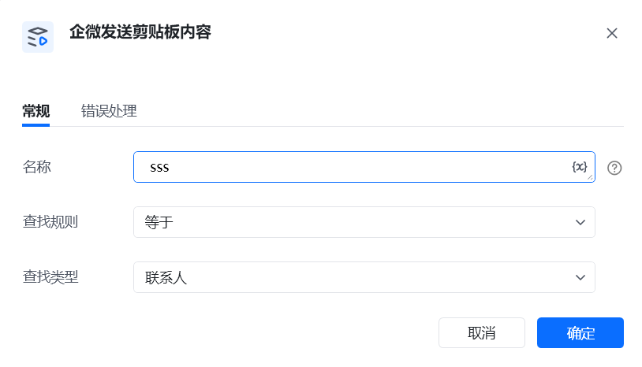
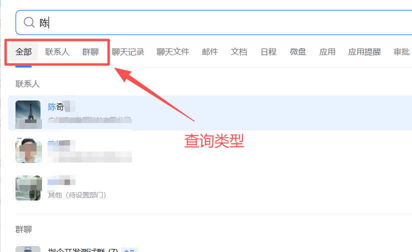
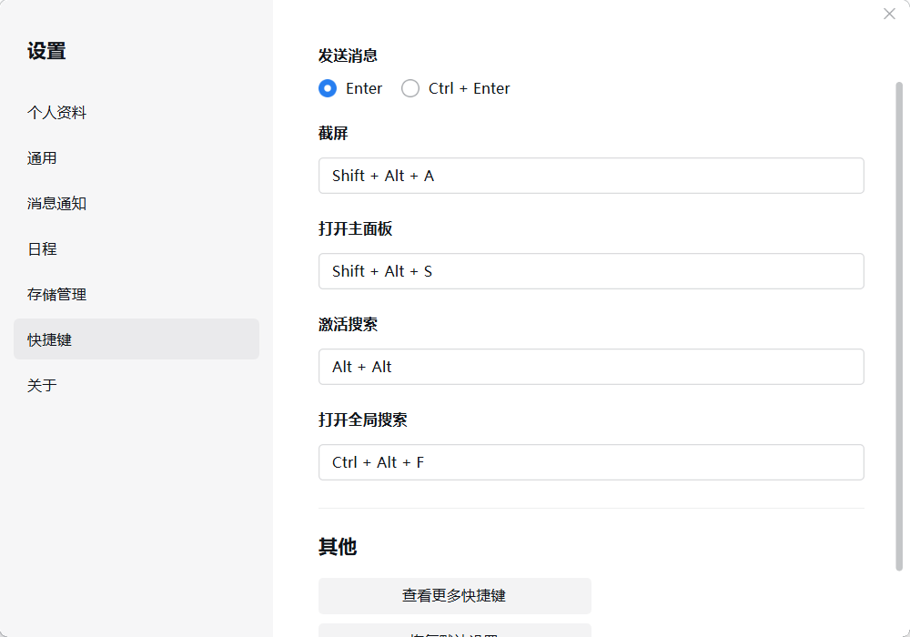

# 描述

该指令实现了在企业微信查找联系人并发送剪贴板内容的操作

# 参数配置
## 指令输入
### 常规

<strong>剪贴板内容：</strong> 提前复制。

<strong>名称</strong>：搜索关键词，联系人名称或者群聊名称。

<strong>查找规则</strong>：下拉框等于（规则：通过企业微信模糊搜索，然后对比首行结果联系人名称和搜索关键词是否一致，如果一致则打开窗口，不一致则返回）包含（规则：通过企业微信模糊搜索，直接获取首行结果并打开聊天窗口）

<strong>查找类型</strong>：下拉框<strong>查找类型</strong>：下拉框(指定微信查找类型）全部 （搜索范围指定全部）联系人（搜索范围指定联系人）群聊（搜索范围指定群聊）

### 高级

无
## 指令输出

无
# 注意事项

无
# 常见问题
## 1.不能打开搜索窗口

在查找联系人的时候, RPA会通过快捷键Ctrl+Alt+F打开全局搜索窗口，然后进行自动搜索。 如果窗口不能正常打开，检查一下企业微信的快捷键是支持打开全局搜索窗口。

## 2.打开搜索窗口，程序不能自动搜索联系人

解决方案：

2.1、 RPA使用最新版本

2.2、企业微信升级到4.0以上

2.2、更新默认输入法（微信输入法有兼容问题，要删除）

2.3、360杀毒软件等，把RPA加入白名单

# 使用案例：
## 1、企业微信发剪贴板内容给个人

实现逻辑及步骤：根据企微名称信息Ctrl+Alt+F找到对应联系人，打开联系人，输入对应发送的消息内容并进行发送。

1.1 提前复制文本内容到剪贴板（作为发送内容），名称输入框输入联系人昵称 。

1.2 查找规则选择“等于”或者“包含”， 如果需要精确名称匹配，选择“等于”； 如果智能模糊查询，选择“包含”。

1.3 查找类型选择“联系人”。

1.4 执行程序，RPA自动搜索，如果匹配到结果（只对首条结果做匹配），打开窗口发送内容； 如果没有匹配到，则终止。
## 2、企业微信发剪贴板内容给群聊

实现逻辑及步骤：根据企微名称信息Ctrl+Alt+F找到对应群聊，打开对应企微群，输入对应发送的消息内容并进行发送。

1.1 提前复制文本内容到剪贴板（作为发送内容），名称输入框输入联系人昵称 。

1.2 查找规则选择“等于”或者“包含”， 如果需要精确名称匹配，选择“等于”； 如果智能模糊查询，选择“包含”。

1.3 查找类型选择“群聊”。

1.4 执行程序，RPA自动搜索，如果匹配到结果（只对首条结果做匹配），打开窗口发送内容； 如果没有匹配到，则终止。

## 3、企业微信发剪贴板内容（不限对象）

实现逻辑及步骤：根据企微名称信息Ctrl+Alt+F找到对应群聊，打开对应企微群，输入对应发送的消息内容并进行发送。

1.1 提前复制文本内容到剪贴板（作为发送内容），名称输入框输入联系人昵称 。

1.2 查找规则选择“等于”或者“包含”， 如果需要精确名称匹配，选择“等于”； 如果智能模糊查询，选择“包含”。

1.3 查找类型选择“全部”。

<Info>
  使用指令过程中遇到问题？前往 [八爪鱼RPA 开发者社区问答板块](https://rpa.bazhuayu.com/community/questions) 提问，获取官方与社区帮助。
</Info>
