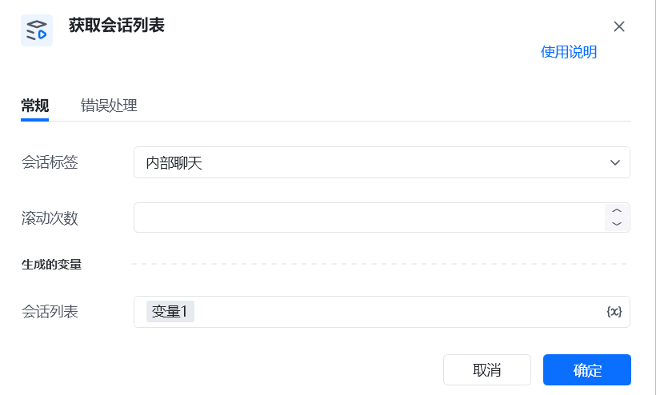

# 描述

该指令实现了在企业微信根据会话标签获取会话列表的操作

# 参数配置
## 指令输入
### 常规

<strong>会话标签</strong>：下拉框｛即企业微信分组会话列表｝未读@我单聊群聊内部聊天外部聊天标记<strong>滚动次数</strong>: 整数, 每次滚动鼠标的次数,用于滚动会话列表. 请根据实际情况调整大小,避免滚动太多导致抓漏的情况。｛当分组的会话列表过多的时候，需要做混动操作。｝
### 高级

<strong>无</strong>
## 指令输出

<strong>会话列表:</strong> 列表, 抓取到的会话名称列表。

['指令开发测试群', '陈奇志', '萝卜哥哥、陈进连、罗波']
# 注意事项

请确保左侧导航栏有 <strong>分组 </strong>按钮, 如果没有,可以尝试升级企业微信

<Info>
  使用指令过程中遇到问题？前往 [八爪鱼RPA 开发者社区问答板块](https://rpa.bazhuayu.com/community/questions) 提问，获取官方与社区帮助。
</Info>
