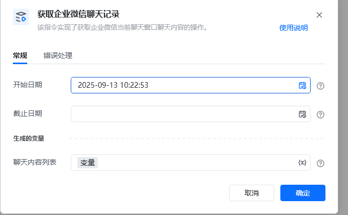

# 描述

该指令实现了获取企业微信当前聊天窗口聊天内容的操作。

# 参数配置
## 指令输入
### 常规

开始日期：聊天记录最早开始日期（必填）。 格式：YYYY-MM-DD HH:mm:ss。

结束日期：聊天记录截止日期（选填）, 默认为当前日期。格式：YYYY-MM-DD HH:mm:ss。
## 指令输出

<strong>聊天内容列表</strong>：当前聊天窗口的聊天内容

# 使用示例

运行的结果

### 消息文本

<Info>
  使用指令过程中遇到问题？前往 [八爪鱼RPA 开发者社区问答板块](https://rpa.bazhuayu.com/community/questions) 提问，获取官方与社区帮助。
</Info>
