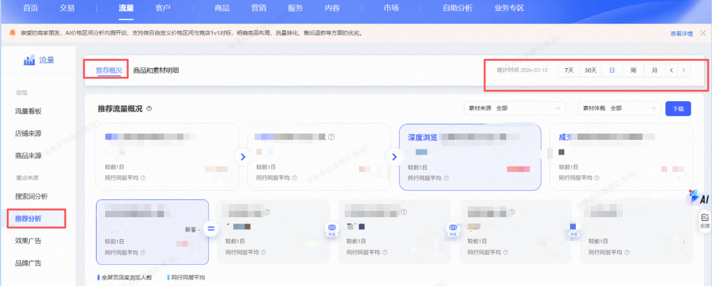
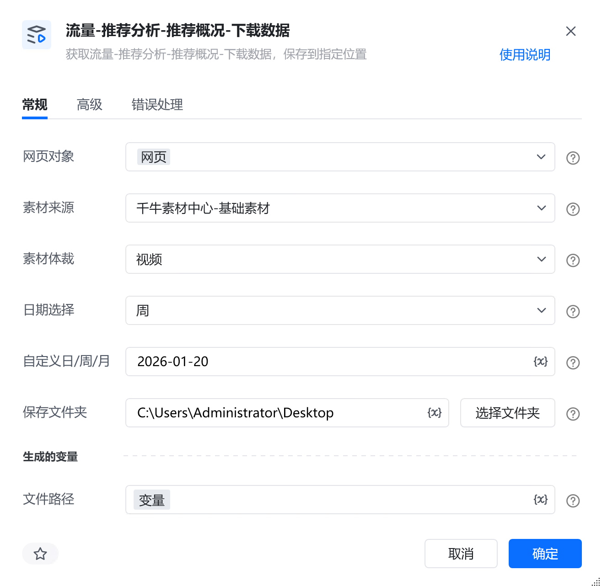
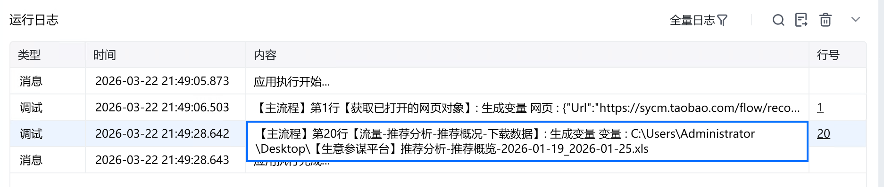

# 描述

获取流量-推荐分析-推荐概况-下载数据，保存到指定位置

# 配置说明
## 输入

<strong>网页对象:</strong>

任意一个已登录生意参谋的网页对象

<strong>素材来源:</strong>

选择素材来源

<strong>素材体裁:</strong>

选择素材体裁

<strong>日期选择:</strong>

选择日期范围

<strong>自定义日/周/月:</strong>

自定义日/周/月，若为日/周，格式必须为：YYYY-MM-DD，若为月，格式必须为：YYYY-MM

<strong>保存文件夹：</strong>

选择文件保存路径

<strong>自定义文件名称：</strong>

自定义文件名称，若不填则使用默认文件名
## 输出

<strong>文件路径：</strong>

输出完整的文件路径，文本类型
# 使用示例

# 运行结果

<Info>
  使用指令过程中遇到问题？前往 [八爪鱼RPA 开发者社区问答板块](https://rpa.bazhuayu.com/community/questions) 提问，获取官方与社区帮助。
</Info>
