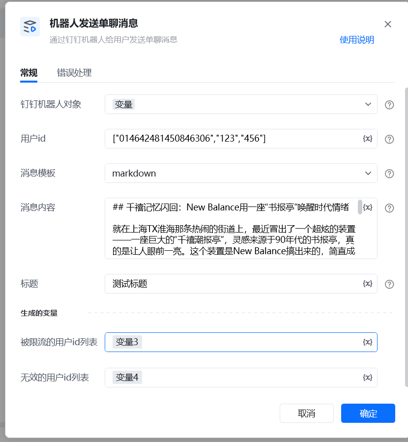
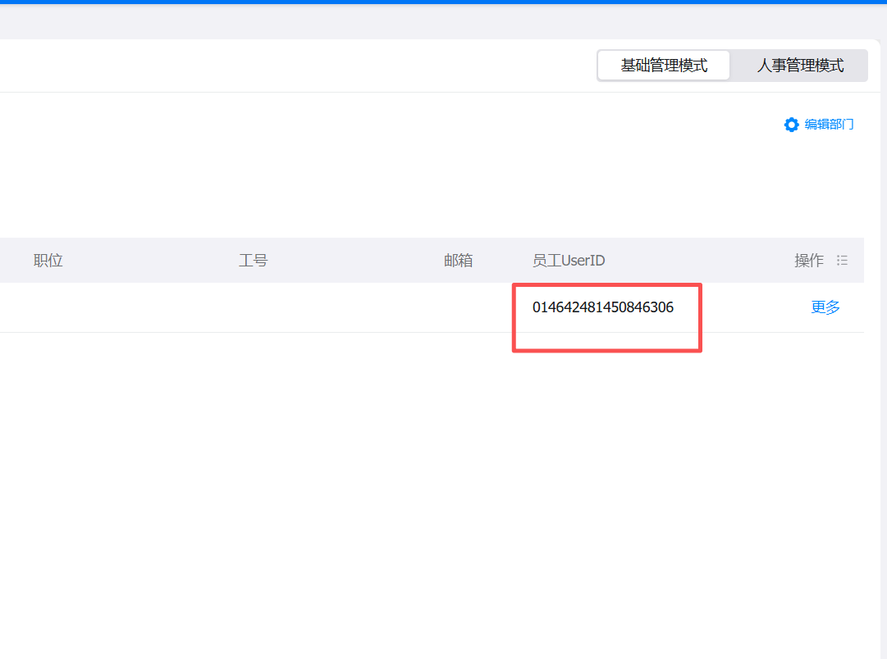
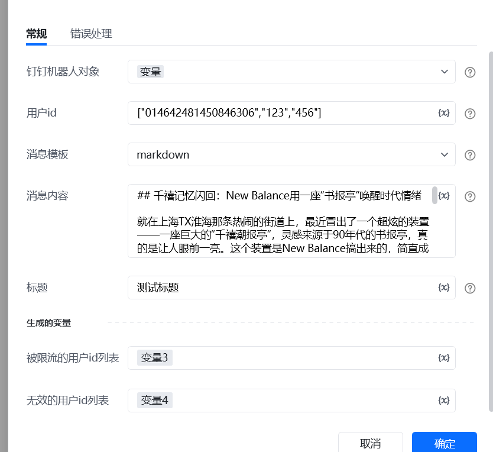
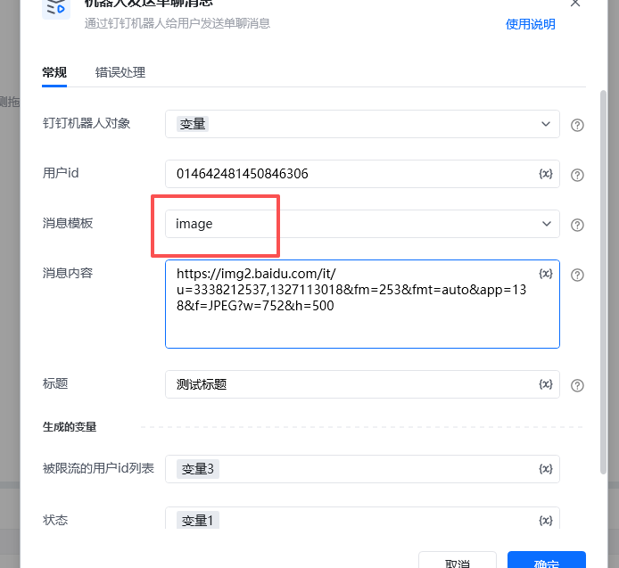
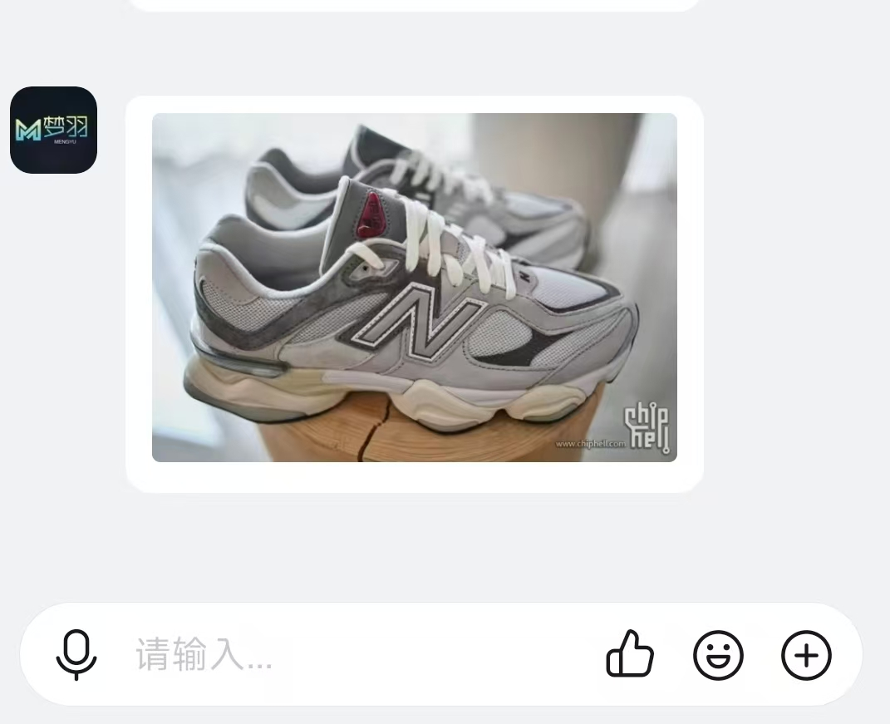
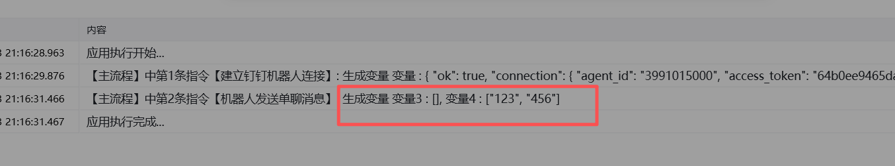

# 机器人发送单聊消息
## 描述

通过钉钉机器人发送单聊消息

## 参数配置
### 指令输入
#### 常规

钉钉机器人对象：通过【建立钉钉机器人连接】指令获取

用户ID：接受消息的用户ID，多个用户用列表形式:["id1", "id2"]。
用户id获取地址： https://oa.dingtalk.com/contacts.htm#/contacts[https://oa.dingtalk.com/contacts.htm#/contacts](https://oa.dingtalk.com/contacts.htm#/contacts) 

消息模板：发送的消息模板

●text：发送文本类型消息

●Markdown：发送Markdown类型消息，可以设置标题

●image：在线图片地址

消息内容：发送的消息内容

消息标题：选择消息模板为Markdown类型，此参数才会生效。会在钉钉消息列表显示title

消息模板示范说明

1.text

这里发送的是纯文本消息
例如：

2.Markdown

此类型支持识别markdown格式文本并渲染，例如我们传入下面文本，并且支持设置标题，标题我们这里暂时写测试标题看下效果

## 千禧记忆闪回：New Balance用一座“书报亭”唤醒时代情绪

就在上海TX淮海那条热闹的街道上，最近冒出了一个超炫的装置——一座巨大的“千禧潮报亭”，灵感来源于90年代的书报亭，真的是让人眼前一亮。这个装置是New Balance搞出来的，简直成了新文化地标，把复古和未来主义的风格完美融合在一起，火花四溅。

### 小象蹄鞋款掀热潮，脏脏粉/紫配色成焦点

不得不提的是，那款以9060为基础的“小象蹄”鞋子，超夸张的中底和那分叉鞋跟，瞬间成为了潮流的标志。脏脏粉和脏脏紫的配色刚一上市，就迅速售罄，大家都在那儿戏称“穿上它，腿长瞬间+5cm！”真的是太搞笑啦！

### 《NB TIMES》杂志：一本杂志穿越千禧年

在这个潮报亭里，还有一本叫《NB TIMES》的定制杂志，简直就是打卡神器。翻开杂志，里面关于90年代到2000年代的时尚穿搭和科技音乐的内容，简直像是穿越时空，时间一下子就在指尖流淌。现场还有60位90年代的潮流媒体人，纷纷书写明信片，和“过去的

3.image

此类型支持直接将图片链接转为图片进行发送

例如：

### 指令输出

无效的用户ID列表：无效的用户ID列表，可以检查一下ID是否输入正确，不要有多余空格

被限流的用户ID列表：被限流的用户ID列表

如果有无效的用户或者被限流的用户 这里会输出

<Info>
  使用指令过程中遇到问题？前往 [八爪鱼RPA 开发者社区问答板块](https://rpa.bazhuayu.com/community/questions) 提问，获取官方与社区帮助。
</Info>
