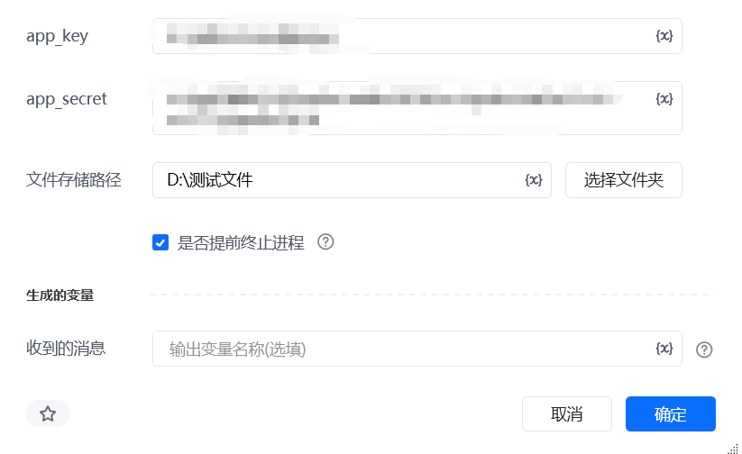
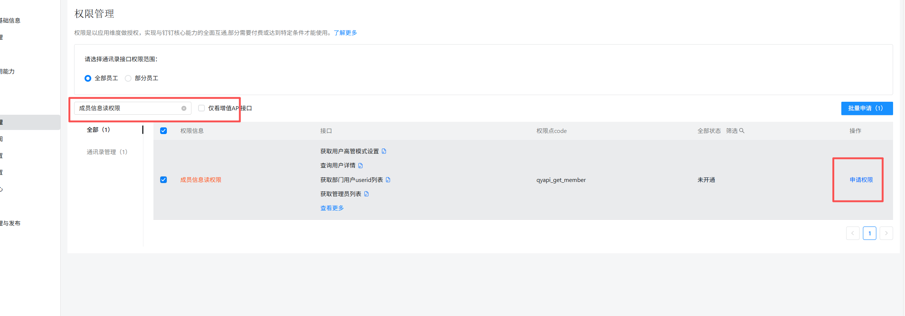
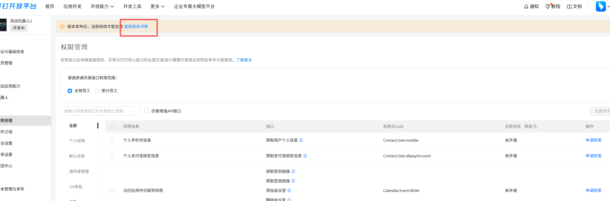
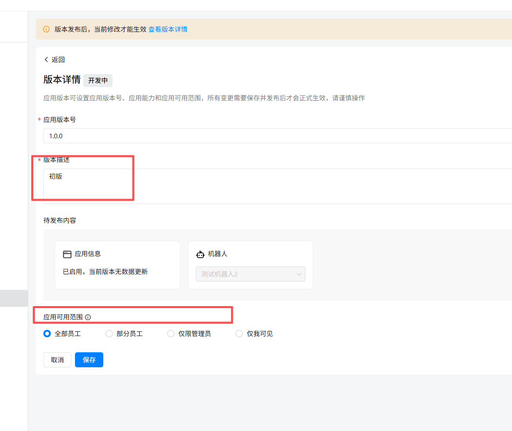
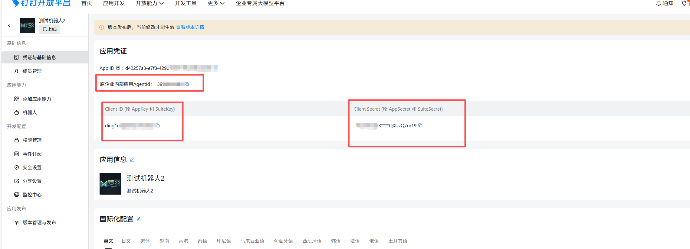
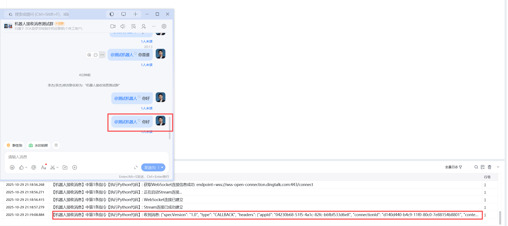

# 指令输入

<strong>app_key：获取方式如下</strong>

<strong>app_secret: 获取方式如下</strong>

<strong>文件存储路径：用来存放输出消息文件的路径。</strong>

<strong>是否提前终止进程：布尔值类型</strong>

<strong>收到的消息：当选择提前终止进程时，会返回当前收到的消息</strong>

<strong>当是否提前终止进程为false：机器人会持续监听钉钉消息，并将接收到的消息数据写入日志文件；日志文件按自然日划分，每日生成一个独立文件，存储路径格式为：文件夹路径\YYYYMMDD.txt（例如：D:\ 测试文件 \20260228.txt）。</strong>

<strong>当是否提前终止进程为True：</strong>机器人仅监听一条钉钉消息，收到消息后立即停止监听；监听到的消息数据会写入按自然日划分的日志文件（路径格式：文件夹路径\YYYYMMDD.txt，示例：D:\ 测试文件 \20260228.txt，每日生成一个独立文件），同时返回该条消息的文本内容。

企业内部应用获取 AppKey 和 AppSecret，开通机器人

打开网址https://open-dev.dingtalk.com/fe/app 登录钉钉开发者后台

1.创建企业内部应用

2.填写创建应用相关信息：

3.添加机器人

4.机器人配置并发布机器人

5.需开通一下权限: 成员信息读权限，调用企业API基础权限，企业内机器人发送消息权限，3个权限都需要开通

6.应用发布：

点击查看版本详情

点击编辑标志，把版本信息补充完整

### 获取 AppKey 和 AppSecret

## 应用功能介绍：

开发完成后，你需要添加机器人入群[添加机器人入群](https://open.dingtalk.com/document/dingstart/add-robot-to-group#)，当你@机器人发送“你好”，服务端接收消息格式如下：

\{

"specVersion": "1.0",

"type": "CALLBACK",

"headers": \{

"appId": "04230b68-51f5-4a1c-82fc-b6fbf533d6e8",

"connectionId": "d140d440-b4c9-11f0-80c0-7e88154b8801",

"contentType": "application/json",

"messageId": "bf8fbd2_cb7_19a253627d1_be1219",

"time": "1761743946669",

"topic": "/v1.0/im/bot/messages/get"

\},

"data": "\{\"senderPlatform\":\"Win\",\"conversationId\":\"cidOiieLDYJxHfrB1hBWzQpEQ==\",\"atUsers\":[\{\"dingtalkId\":\"$:LWCP_v1:$8DTBn0eia1aGdGgC6f7xwcA7d/J5O826\"\}],\"chatbotCorpId\":\"dingd8b60689774870bd4ac5d6980864d335\",\"chatbotUserId\":\"$:LWCP_v1:$8DTBn0eia1aGdGgC6f7xwcA7d/J5O826\",\"openThreadId\":\"cidOiieLDYJxHfrB1hBWzQpEQ==\",\"msgId\":\"msg7P5xLAscj5F9hsF92D5fxA==\",\"senderNick\":\"李杰\",\"isAdmin\":true,\"senderStaffId\":\"014642481450846306\",\"sessionWebhookExpiredTime\":1761749346646,\"createAt\":1761743946379,\"senderCorpId\":\"dingd8b60689774870bd4ac5d6980864d335\",\"conversationType\":\"2\",\"senderId\":\"$:LWCP_v1:$50JPibHrGYbxrBSiKEjpeeugJTCEnq7v\",\"conversationTitle\":\"机器人接收消息测试群\",\"isInAtList\":true,\"sessionWebhook\":\"https://oapi.dingtalk.com/robot/sendBySession?session=42aaaa8895a53636c7cda100a5cb22ef\",\"senderUnionId\":\"XiSYLMsEjy52jBIYfHHiiIgwiEiE\",\"text\":\{\"content\":\" 你好\"\},\"robotCode\":\"dingbkjzpxkfcjlhfsat\",\"msgtype\":\"text\"\}"

<Info>
  使用指令过程中遇到问题？前往 [八爪鱼RPA 开发者社区问答板块](https://rpa.bazhuayu.com/community/questions) 提问，获取官方与社区帮助。
</Info>
