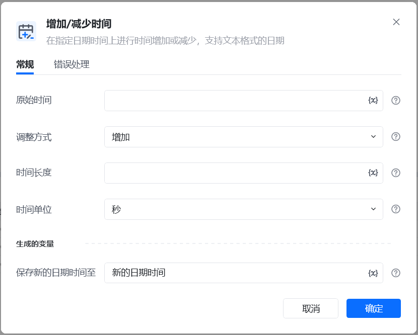
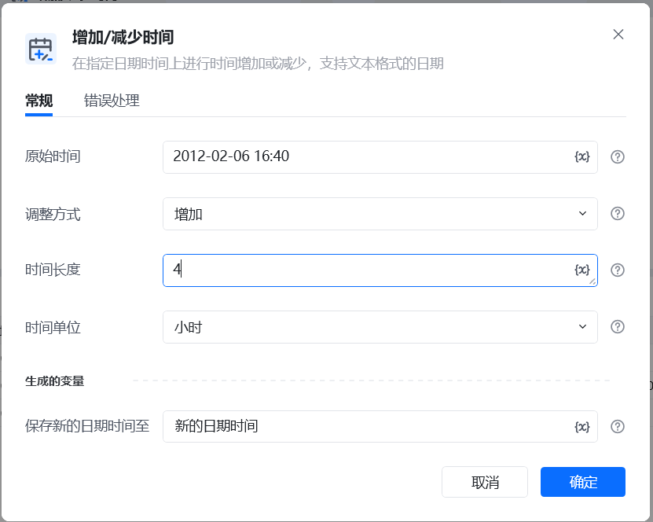
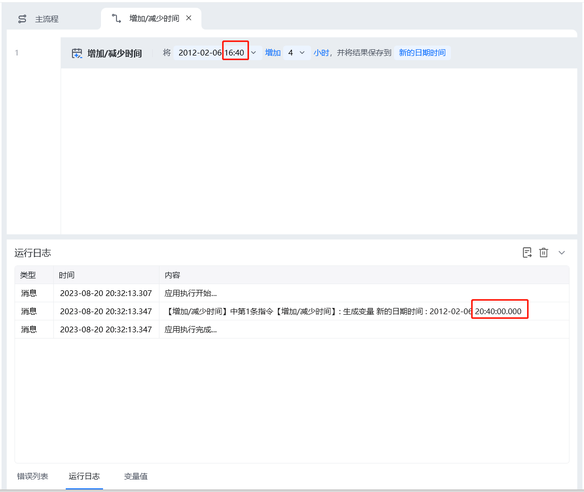

## 指令说明

**描述：** 在指定日期时间上进行时间增加或减少，支持文本格式的日期

## 参数说明

<Tabs>
  <Tab title="常规">
    

    | 参数 | 说明 |
    | --- | --- |
    | **原始时间** | 输入调整前的时间，支持文本或常用时间格式，如：2010-03-25 00:00:00 或者2010-03-25 |
    | **调整方式** | 增加或减少 |
    | **时间长度** | 输入时间长度（数值） |
    | **时间单位** | 秒、分钟、小时、天、月、年 |
    | **保存新的日期时间至** | 指定一个变量保存增加/减少后的时间 |
  </Tab>
  <Tab title="高级">
    本指令暂无高级参数。
  </Tab>
</Tabs>

## 使用示例

**该流程执行逻辑：**

### 运行结果

<Info>
  使用指令过程中遇到问题？前往 [八爪鱼RPA 开发者社区问答板块](https://rpa.bazhuayu.com/community/questions) 提问，获取官方与社区帮助。
</Info>
