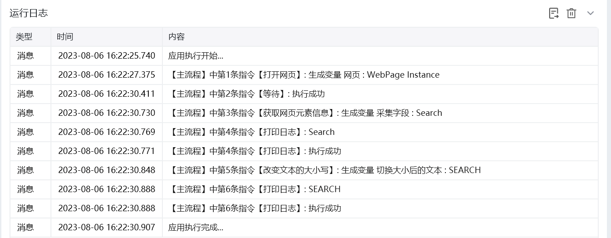

## 指令说明

**描述：**

## 参数说明

<Tabs>
  <Tab title="常规">
    

    | 参数 | 说明 |
    | --- | --- |
    | **原始文本** | 输入文本字符串或者选择一个包含字符串的变量 |
    | **转换成** | 全部大写/全部小写/首字母大写/句首字母大写 |
    | **生成的变量** | 保存改变后的文本为变量 |
  </Tab>
  <Tab title="高级">
    本指令暂无高级参数。
  </Tab>
</Tabs>

## 使用示例

**该流程执行逻辑：**

打开网页，获得一个网页元素变量：Search

使用【改变文本的大小写】指令将原始文本转换成词全部大写并保存结果

执行【打印日志】指令打印结果

### 运行结果

<Info>
  使用指令过程中遇到问题？前往 [八爪鱼RPA 开发者社区问答板块](https://rpa.bazhuayu.com/community/questions) 提问，获取官方与社区帮助。
</Info>
