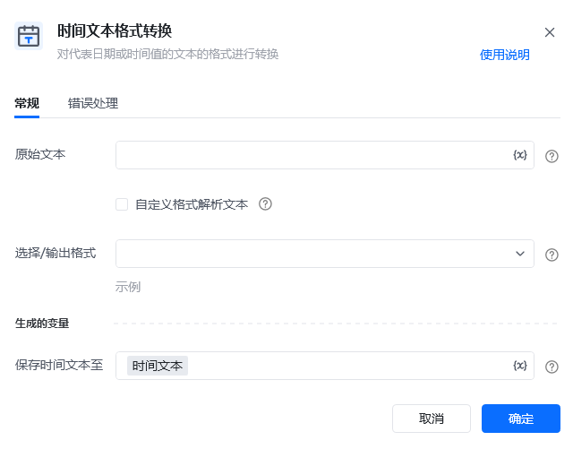
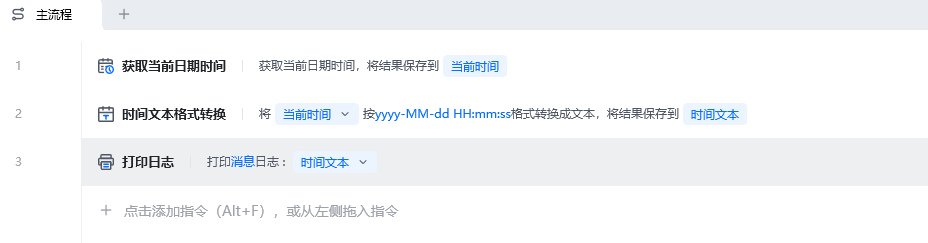
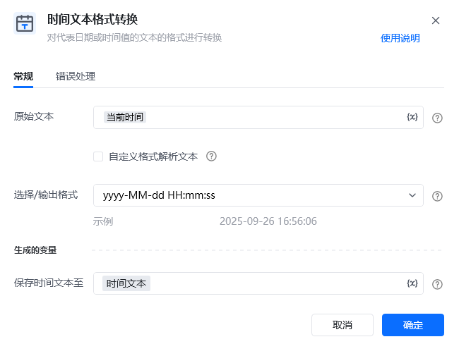
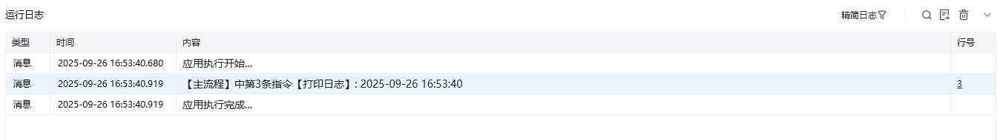

## 指令说明

**描述：** 对代表日期或时间值的文本的格式进行转换

## 参数说明

<Tabs>
  <Tab title="常规">
    

    | 参数 | 说明 |
    | --- | --- |
    | **原始文本** | 输入时间格式的文本字符串； 支持常用日期时间格式，如："2023-08-08"、"2023/08/08"、"2023年8月8日 00时00分00秒"等；格式可参考【选择/输出格式】的下拉时间格式； |
    | **自定义格式解析文本** | 勾选是否使用自定义解析原始文本的格式 |
    | **自定义解析格式** | 输入自定义解析原始文本的格式 |
    | **选择/输出格式** | 设置输出的日期时间格式 |
    | **保存时间文本至** | 指定一个变量名称，该变量用于保存转换后的时间文本 |
  </Tab>
  <Tab title="高级">
    本指令暂无高级参数。
  </Tab>
</Tabs>

## 使用示例

**该流程执行逻辑：**

使用【获取当前日期时间】把当前时间保存至变量

使用【时间文本格式转换】指令将当前日期时间按指定格式转换成文本并保存结果

### 运行结果

<Info>
  使用指令过程中遇到问题？前往 [八爪鱼RPA 开发者社区问答板块](https://rpa.bazhuayu.com/community/questions) 提问，获取官方与社区帮助。
</Info>
