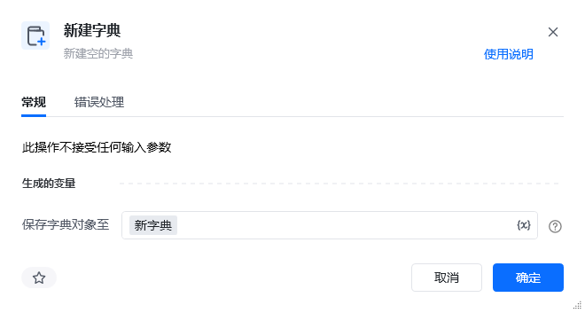
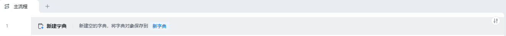
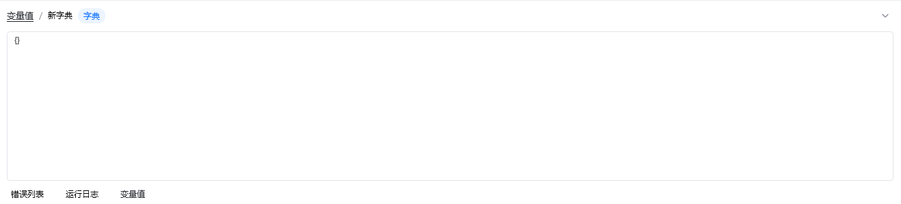

## 指令说明

**描述：** 新建空的字典

## 参数说明

<Tabs>
  <Tab title="常规">
    

    本指令暂无常规参数。
  </Tab>
  <Tab title="高级">
    本指令暂无高级参数。
  </Tab>
</Tabs>

## 使用示例

**该流程执行逻辑：**

使用【新建字典】新建了字典对象，并命名为“新字典”

### 效果展示

<Info>
  使用指令过程中遇到问题？前往 [八爪鱼RPA 开发者社区问答板块](https://rpa.bazhuayu.com/community/questions) 提问，获取官方与社区帮助。
</Info>
