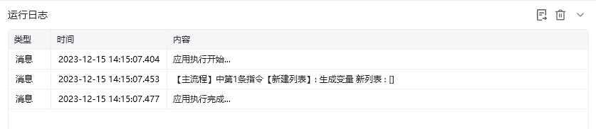

## 指令说明

**描述：** 创建一个不包含数据项的空列表，并将该列表保存到指定变量中供后续指令使用。

## 参数说明

<Tabs>
  <Tab title="常规">

    

    | 参数 | 说明 |
    | --- | --- |
    | **项类型** | 指令列表项类型，选项含任意值/文本值/数值/布尔值/日期时间 |
  </Tab>
  <Tab title="高级">
    本指令暂无高级参数。
  </Tab>
</Tabs>

## 使用示例

**该流程执行逻辑：**

本例演示【新建列表】指令的配置与执行：

1. 选择新列表中项目的数据类型。
2. 新建空列表，并将其保存为流程变量供后续步骤使用。

### 效果展示

<Info>
  使用指令过程中遇到问题？前往 [八爪鱼RPA 开发者社区问答板块](https://rpa.bazhuayu.com/community/questions) 提问，获取官方与社区帮助。
</Info>
