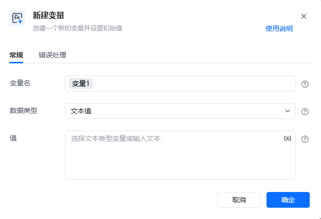
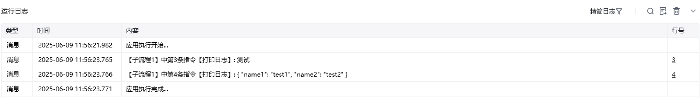

## 指令说明

**描述：** 创建一个新的变量并设置初始值

## 参数说明

<Tabs>
  <Tab title="常规">
    

    | 参数 | 说明 |
    | --- | --- |
    | **变量名** | 请为变量命名，用于在流程中引用。命名规则：建议简洁、清晰，2-32个字符，如username |
    | **数据类型** | 请选择要存储的数据类型 |
    | **值** | 请设置暂存数据的初始值，为空时的默认值： |
  </Tab>
  <Tab title="高级">
    本指令暂无高级参数。
  </Tab>
</Tabs>

## 使用示例

**该流程执行逻辑：**

使用【新建变量】新建文本类型的变量“文本变量”，并设置初始值为“测试”

使用【新建变量】新建字典类型的变量“字典变量”，并设置初始值为`{“name1”:“test1”,“name2”:“test2”}`

使用【打印日志】将“文本变量”的值输出至控制台

使用【打印日志】将“字典变量”的值输出至控制台

### 运行结果

<Info>
  使用指令过程中遇到问题？前往 [八爪鱼RPA 开发者社区问答板块](https://rpa.bazhuayu.com/community/questions) 提问，获取官方与社区帮助。
</Info>
