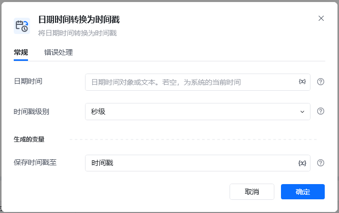
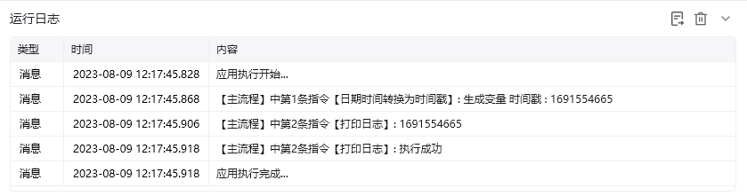

## 指令说明

**描述：** 将日期时间转换为时间戳

## 参数说明

<Tabs>
  <Tab title="常规">
    

    | 参数 | 说明 |
    | --- | --- |
    | **日期时间** | 输入日期时间，若日期是文本，只支持常用格式。若保留为空，则默认系统当前时间 |
    | **时间戳级别** | 选择时间戳级别，分别为秒级、毫秒级、微秒级 |
    | **生成的变量** | 保存时间戳变量 |
  </Tab>
  <Tab title="高级">
    本指令暂无高级参数。
  </Tab>
</Tabs>

## 使用示例

**该流程执行逻辑：**

使用【日期时间转换为时间戳】命令将系统默认时间转换为时间戳

使用【打印日志】打印时间戳消息日志

### 效果展示

<Info>
  使用指令过程中遇到问题？前往 [八爪鱼RPA 开发者社区问答板块](https://rpa.bazhuayu.com/community/questions) 提问，获取官方与社区帮助。
</Info>
