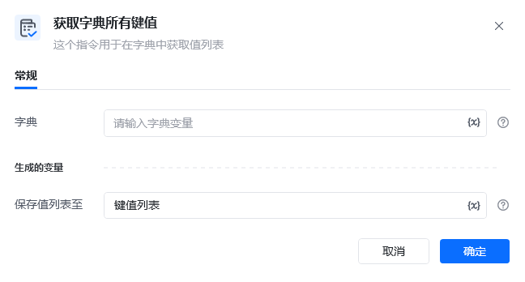
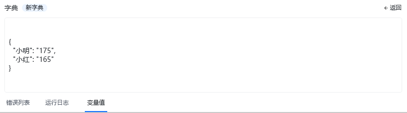
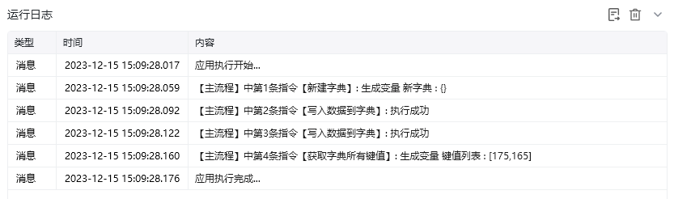

## 指令说明

**描述：** 在字典中获取所有键值列表

## 参数说明

<Tabs>
  <Tab title="常规">

    

    | 参数 | 说明 |
    | --- | --- |
    | **字典** | 输入字典变量 |
  </Tab>
  <Tab title="高级">
    本指令暂无高级参数。
  </Tab>
</Tabs>

## 使用示例

**该流程执行逻辑：**

本例演示【获取字典所有键值】指令的配置与执行：

1. 选择需要读取的字典变量。
2. 获取该字典的全部键值，并将结果保存为列表。

### 效果展示

<Info>
  使用指令过程中遇到问题？前往 [八爪鱼RPA 开发者社区问答板块](https://rpa.bazhuayu.com/community/questions) 提问，获取官方与社区帮助。
</Info>
