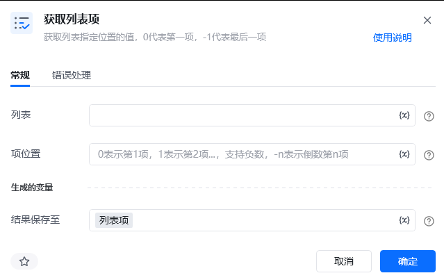
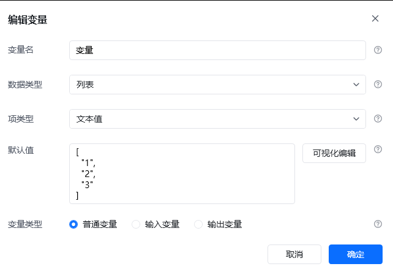
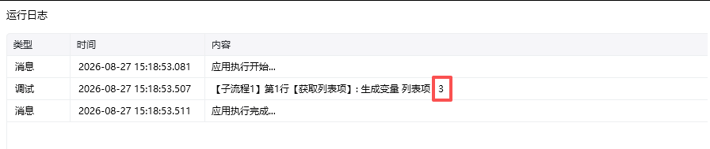

## 指令说明

**描述：** 获取列表指定位置的值。

## 参数说明

<Tabs>
  <Tab title="常规">
    

    | 参数 | 说明 |
    | --- | --- |
    | **列表** | 输入要获取数据的列表变量。 |
    | **项位置** | 输入要获取的列表项位置。`0` 表示第 1 项，`1` 表示第 2 项；支持负数，`-n` 表示倒数第 n 项。 |
  </Tab>
  <Tab title="高级">
    本指令暂无高级参数。
  </Tab>
</Tabs>

## 使用示例

**该流程执行逻辑：**

1. 编辑列表变量，将列表内容设置为 `1, 2, 3`。
2. 执行【获取列表项】，将项位置设置为第 3 项。
3. 指令返回数值 `3` 并保存到“列表项”变量，供后续判断或数据处理使用。

### 效果展示

第 3 项的结果为 `3`。

<Info>
  使用指令过程中遇到问题？前往 [八爪鱼RPA 开发者社区问答板块](https://rpa.bazhuayu.com/community/questions) 提问，获取官方与社区帮助。
</Info>
