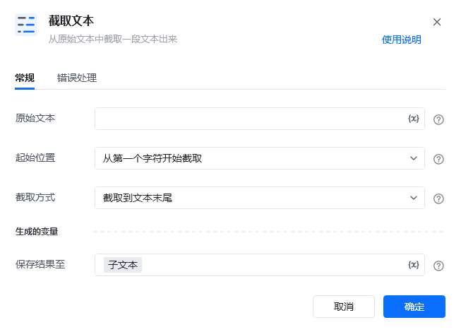
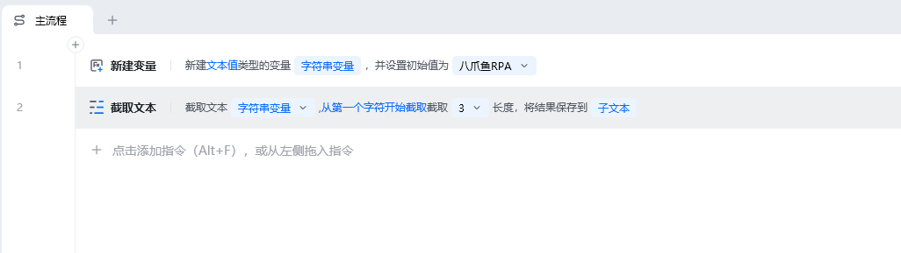
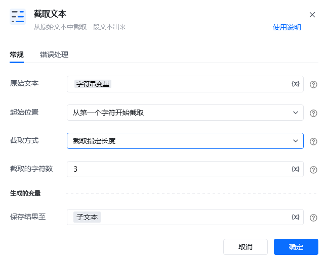
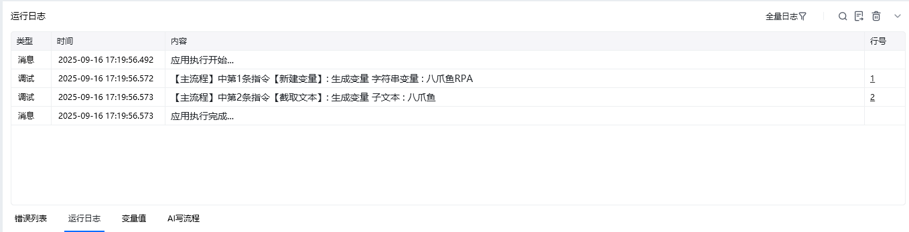

## 指令说明

**描述：** 用于从原始文本中截取一段文本

## 参数说明

<Tabs>
  <Tab title="常规">
    

    | 参数 | 说明 |
    | --- | --- |
    | **原始文本** | 输入待截取的文本内容或字符串变量 |
    | **截取方式** | 截取到文本末尾 、 截取指定长度：输入你要截取的字符数量 |
    | **保存结果至** | 保存截取到的文本为变量。即指定一个变量名称，该变量用于保存截取到的文本内容 |
  </Tab>
  <Tab title="高级">
    本指令暂无高级参数。
  </Tab>
</Tabs>

## 使用示例

**该流程执行逻辑：**

执行【新建变量】指令新建一个变量：八爪鱼rpa

使用【截取文本】指令从第一个字符开始截取3个字符串长度的文本并保存结果

### 运行结果

<Info>
  使用指令过程中遇到问题？前往 [八爪鱼RPA 开发者社区问答板块](https://rpa.bazhuayu.com/community/questions) 提问，获取官方与社区帮助。
</Info>
