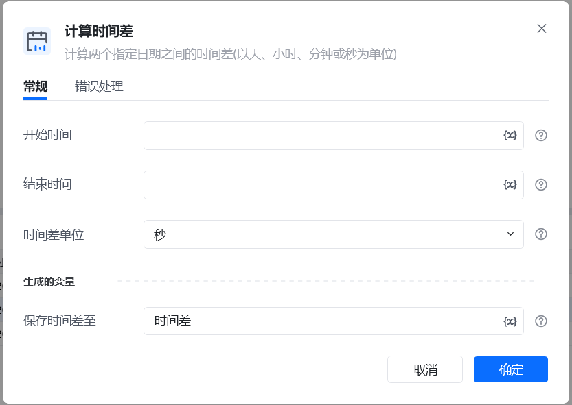
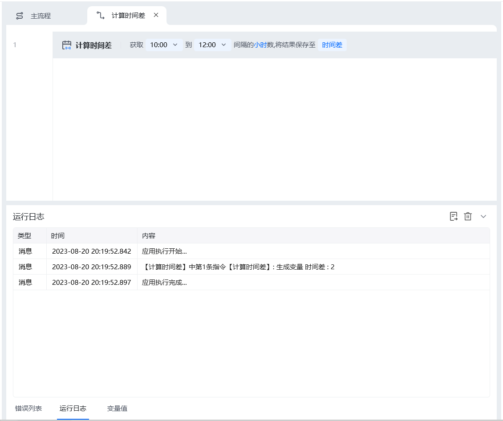

## 指令说明

**描述：** 计算两个指定日期之间的时间差(以天、小时、分钟或秒为单位)

## 参数说明

<Tabs>
  <Tab title="常规">
    

    | 参数 | 说明 |
    | --- | --- |
    | **开始时间** | 输入开始时间。若日期是文本，只支持常用格式。 |
    | **结束时间** | 输入结束时间。若日期是文本，只支持常用格式。 |
    | **时间差单位** | 选择时间差的时间单位（天、小时、分钟、秒） |
    | **保存时间差至** | 指定一个变量名称，该变量用于保存时间差 |
  </Tab>
  <Tab title="高级">
    本指令暂无高级参数。
  </Tab>
</Tabs>

## 使用示例

**该流程执行逻辑：**

<Info>
  使用指令过程中遇到问题？前往 [八爪鱼RPA 开发者社区问答板块](https://rpa.bazhuayu.com/community/questions) 提问，获取官方与社区帮助。
</Info>
