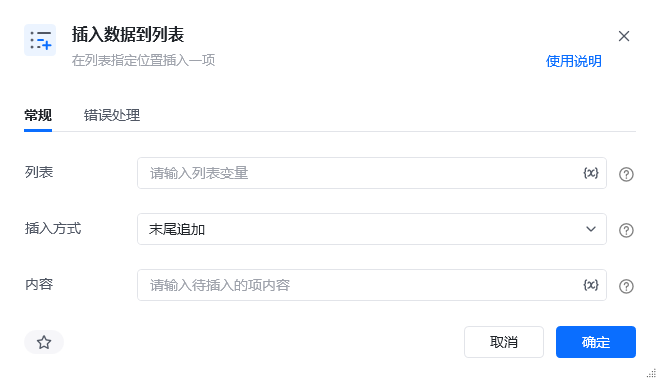
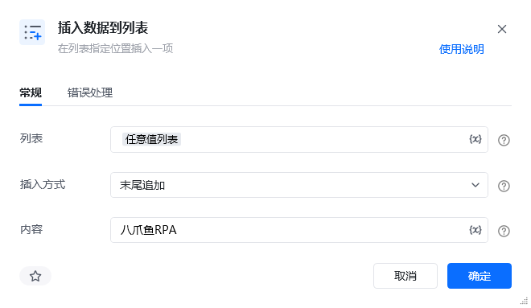
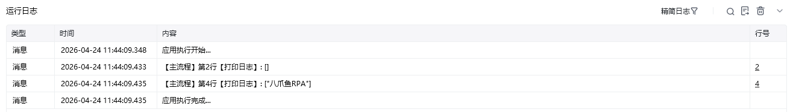

## 指令说明

**描述：** 在列表中插入一项数据，可选直接末尾追加或指定位置插入

## 参数说明

<Tabs>
  <Tab title="常规">
    

    | 参数 | 说明 |
    | --- | --- |
    | **列表** | 请输入需要操作的列表变量，如：账号列表 |
    | **插入方式** | 可选项，末尾追加或指定位置 |
    | **插入到** | 插入方式选择“指定位置”时需要填写，0表示第1项，1表示第2项....，支持负数，-n表示倒数第n项 |
    | **内容** | 请输入待插入的项内容 |
  </Tab>
  <Tab title="高级">
    本指令暂无高级参数。
  </Tab>
</Tabs>

## 使用示例

**该流程执行逻辑：**

新建列表变量“任意值列表” ---> 将当前的任意值列表打印在控制台，后续可以作对比 ---> 使用【插入数据到列表】在列表对象“任意值列表”的末尾处插入 “八爪鱼RPA” ---> 将插入数据后的任意值列表打印在控制台

效果展示：

### 运行结果

<Info>
  使用指令过程中遇到问题？前往 [八爪鱼RPA 开发者社区问答板块](https://rpa.bazhuayu.com/community/questions) 提问，获取官方与社区帮助。
</Info>
