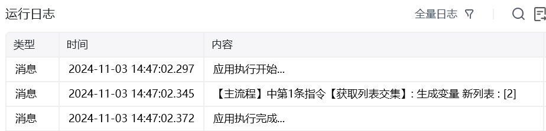
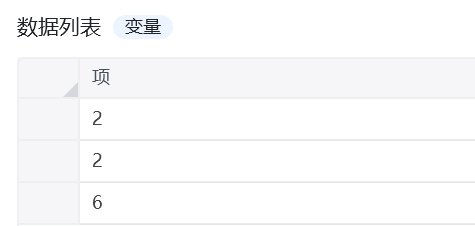
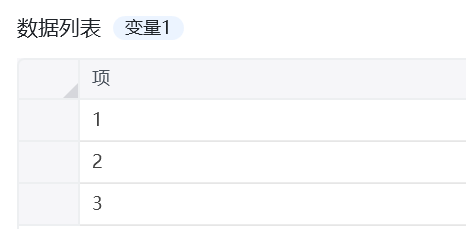
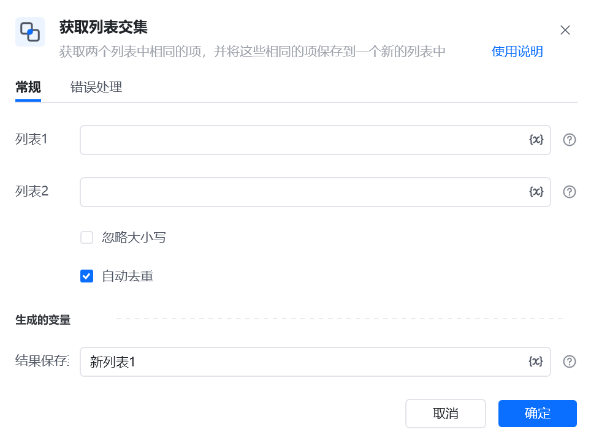

## 指令说明

**描述：** 获取两个列表中相同的项，并将这些相同的项保存到一个新的列表中

## 参数说明

<Tabs>
  <Tab title="常规">
    

    | 参数 | 说明 |
    | --- | --- |
    | **列表1** | 要比较的第1个列表 |
    | **列表12** | 要比较的第2个列表 |
    | **忽略大小写** | 勾选之后忽略大小写再获取交集 自动去重 |
  </Tab>
  <Tab title="高级">
    本指令暂无高级参数。
  </Tab>
</Tabs>

## 使用示例

**该流程执行逻辑：**

### 运行结果

<Info>
  使用指令过程中遇到问题？前往 [八爪鱼RPA 开发者社区问答板块](https://rpa.bazhuayu.com/community/questions) 提问，获取官方与社区帮助。
</Info>
